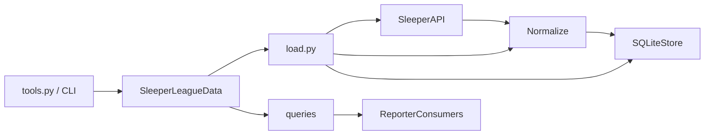

# Datalayer Architecture

## Purpose

This datalayer provides a clean, queryable view of a Sleeper fantasy football league.
It is built to serve downstream consumers such as an AI fantasy football reporter, while
remaining a developer-friendly system for extension and analysis.

Persistent reporter narrative memory lives in `reporter_memory/`, not here.

## High-Level Architecture

The system follows a layered pipeline that converts raw API responses into a stable,
relational model and exposes curated query methods.

1. Fetch raw JSON from the Sleeper API.
2. Normalize raw data into canonical row dataclasses.
3. Load normalized rows into an in-memory SQLite schema (SQLAlchemy Core).
4. Expose queries that return enriched, reporter-ready data shapes.

## Layer Contracts

| Layer | May depend on | Must not |
|-------|---------------|----------|
| `sleeper_api/` | HTTP/cache only | schema, store, queries |
| `normalize/` | `schema` row types | SQL, engine, tools |
| `schema/` | SQLAlchemy Core + dataclasses | fetch, queries, tools |
| `store/` | `schema.metadata`, row types | API, normalize, tools |
| `load.py` | api, normalize, store | curated queries, tools |
| `queries/` | Connection + SQL + resolvers | API, normalize, tools |
| `SleeperLeagueData` | load + queries | raw business SQL |
| `tools.py` / CLI | facade only | SQL, normalize, store |

## Core Entry Point

`SleeperLeagueData` is the facade that:

- Resolves config (`league_id`, week override).
- Delegates fetch → normalize → store to `load.load_league`.
- Owns engine / long-lived query connection lifecycle.
- Exposes high-level query methods and guarded SQL access.

## Design Rationale

- **In-memory SQLite** keeps loads fast and enables rich joins without persistence
  complexity during early iteration.
- **One module per table** co-locates the insert DTO and SQLAlchemy Core `Table`,
  avoiding dual-file schema drift.
- **SQLAlchemy Core (not ORM)** matches dict-shaped query outputs without Session/mapped-class overhead.
- **Query-time joins** avoid denormalized name fields and keep identities current
  without write-time maintenance.
- **Name resolution** allows inputs by name or ID, producing human-readable outputs
  that are suitable for narrative generation.
- **Guarded SQL access** supports exploration while preventing writes and unbounded
  queries in agent workflows.

## Key Modules

- Facade: `datalayer/sleeper_data/sleeper_league_data.py`
- Load pipeline: `datalayer/sleeper_data/load.py`
- API client and endpoints: `datalayer/sleeper_data/sleeper_api/`
- Normalization: `datalayer/sleeper_data/normalize/`
- Schema (one file per table): `datalayer/sleeper_data/schema/`
- SQLite store: `datalayer/sleeper_data/store/sqlite_store.py`
- Queries: `datalayer/sleeper_data/queries/` (`league`, `team`, `player`, `transactions`, `playoffs`, `sql_tool`)
- Configuration: `datalayer/sleeper_data/config.py`
- Tools: `datalayer/tools.py`
- CLI: `datalayer/cli/main.py`

## Related Design Docs

- `docs/01_datalayer.md` — Core data layer design (historical; paths may be stale)
- `docs/02_surfacing_names.md` — Name resolution strategy (historical)
- `docs/03_picks.md` — Draft pick ownership tracking (historical)
- `docs/04_transactions.md` — Transaction + pick metadata design
- `docs/05_player_performances.md` — Player-level scoring extraction (historical)
- `docs/06_sqlalchemy_migration.md` — SQLAlchemy Core migration (**complete**)
- `docs/07_persistent_context.md` — Memory ownership boundary → `reporter_memory/`
- `docs/08_aidam_skills.md` — AIda skill workflow with snapshot + memory split
