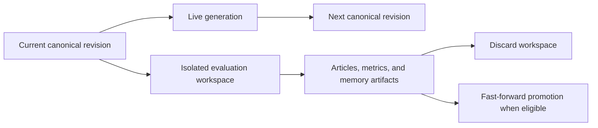

# Memory Namespace Schema

**Status:** Simplified hardened design  
**PostgreSQL namespace:** `memory`  
**Compatibility:** Clean replacement; current memory concepts are preserved

## Validation Ownership

DB-028 and DB-031 govern implementation. PostgreSQL enforces stable identity,
revision/current-pointer uniqueness, relational provenance, and sealed canonical
history. Pydantic objects and the canonical mutation transaction validate
status/type values, typed payloads, entity and memory references, target kinds,
competition scope, evidence policy, and resulting-state hashes. Canonical
participant and narrative references intentionally do not depend on a universal
database graph.

## Purpose

Memory stores the reporter's canonical narrative understanding: storylines,
facts, events, triggers, and team/league context. It is not canonical football
truth; a generation must still verify remembered claims against its cutoff-safe
Sleeper data snapshot.

Canonical memory is strictly linear. It has no branches, sibling states,
snapshot-membership copies, merge operation, or alternative-history heads.
Historical and rolling evaluations use an isolated serialized workspace owned by
`reporting`, not another persistent memory lineage.

## Why Canonical History Is Linear

Most useful evaluations compare articles, model behavior, retrieval, tool use,
tokens, or proposed memory mutations against the same frozen inputs. They do not
need to mutate durable memory.

Only a longitudinal week-by-week simulation needs evolving alternative memory.
That state is temporary and limited to one active evaluation workspace per
competition. Keeping it outside this namespace means canonical history remains
easy to query, explain, and display.

## Canonical Revision Tables

### `memory.memory_revisions`

One atomic canonical memory mutation batch:

- `id uuid` primary key;
- `competition_id`;
- non-negative `sequence_number bigint`;
- nullable previous revision ID;
- nullable unique producing generation ID;
- optional competition season, week, and knowledge-cutoff timestamp;
- deterministic content hash of the resulting visible state;
- database-generated `created_at`.

Constraints:

- unique `(competition_id, sequence_number)`;
- unique `(id, competition_id)` for composite scope checks;
- sequence zero is the empty root created during competition setup;
- every later revision references the immediately preceding revision in the same
  competition;
- a producing generation belongs to the same competition;
- an ordinary live generation pins the previous revision as its canonical input;
- a promoted revision is instead linked from exactly one eligible reporting
  workspace whose base is the previous canonical revision;
- revision rows are immutable.

A generation that makes no accepted memory changes creates no new revision. It
retains its input revision as the canonical state.

### `memory.current_revisions`

One mutable current-state pointer per competition:

- `competition_id` primary key;
- `current_revision_id` referencing the same competition;
- integer lock version;
- `updated_at`.

Competition setup creates revision zero and this pointer atomically. The table is
an implementation pointer, not a product-visible branch or “head” system. There
is exactly one canonical current revision for a competition.

## Items and Versions

### `memory.memory_items`

Stable logical identity:

- `id uuid` primary key;
- `competition_id`;
- `kind`: `storyline`, `fact`, `event`, `trigger`, or `context_note`;
- optional agent-facing key/label, indexed but not globally unique;
- `created_at`.

Unique `(id, competition_id)` supports composite scope checks. An item remains
stable while its content or status changes.

### `memory.memory_versions`

One complete content version:

- `id uuid` primary key;
- item ID and denormalized competition ID;
- positive item-local revision number;
- positive application `content_schema_version` used to decode the typed row;
- `introduced_revision_id`;
- nullable `retired_revision_id`;
- nullable competition season and non-negative football week;
- nullable exact `occurred_at`;
- required creating generation ID and optional creating tool-call ID;
- optional change reason;
- database-generated `recorded_at`.

Constraints:

- unique `(item_id, revision_number)`;
- item, canonical revisions, season, generation, and tool-call scope agree on
  competition;
- exactly one typed content row matches the item kind;
- content and introduction fields are immutable;
- `retired_revision_id` may change from null exactly once and must be a later
  canonical revision in the same competition;
- at most one version of an item is visible at any canonical revision.

A version is visible at revision `R` when its introduced sequence is at or before
`R` and its retired sequence is either null or after `R`. This supports exact
same-week reruns and historical reads without snapshot-membership tables.

The time vocabulary stays concrete: `week` is the football week described,
`occurred_at` is the exact domain time when known, and `recorded_at` is when AIdam
wrote the version. There is no fantasy phase column.

## Typed Memory Responsibilities

Each typed table uses `version_id` as both primary key and foreign key to
`memory_versions`.

### `memory.storyline_versions`

A long-running narrative arc:

- headline and summary;
- status: `active`, `dormant`, `resolved`, or `archived`;
- optional arc type;
- `salience` from 1 through 5;
- tags;
- Pydantic-backed typed subjects;
- exact fact/event version evidence with role metadata;
- stable related-storyline item references with role metadata;
- optional callback condition and resolution summary.

The former priority and importance fields collapse into one higher-is-more-
important `salience` value. Run-specific ranking remains a retrieval concern.

### `memory.fact_versions`

A reusable remembered claim:

- claim text and category;
- structured numbers JSONB;
- confidence: `unverified`, `inferred`, or `source_backed`;
- Pydantic-backed typed subjects;
- optional exact originating-event version IDs;
- optional typed primary reporting tool-call ID;
- optional typed primary Sleeper API-request ID;
- optional additional source-hints JSONB;
- status: `active`, `superseded`, `rejected`, or `archived`.

Only typed tool-call/API-request references are enforceable receipts. JSON hints
are non-authoritative and cannot independently make a fact `source_backed`.
Referenced tool results and raw payloads remain retention-pinned while cited.

### `memory.event_versions`

A narrative receipt for a trade, matchup outcome, waiver decision, standings
swing, or similar moment:

- event type, headline, and summary;
- salience from 1 through 5;
- confidence and status;
- event-type-discriminated `details` JSONB and optional source hints;
- optional typed primary tool-call and API-request receipts.

Season, week, and occurrence time come from the common version envelope. The
same typed-receipt and retention rules as facts apply.

`details` describes this event; it is not a bag of related events. Application
models distinguish trade, matchup, waiver, standings, and future event payloads
with discriminated unions, so adding an event type does not weaken the shapes of
existing types.

### `memory.trigger_versions`

A future callback condition:

- trigger type;
- status: `open`, `fired`, `satisfied`, `expired`, or `archived`;
- fire policy: `one_shot`, `recurring`, or `until_resolved`;
- optional stable target storyline item ID;
- optional stable origin event item ID;
- nullable target season/week/time;
- trigger-type-discriminated condition JSONB;
- optional resolution reason.

The physical row also carries the version's `competition_id` so both the parent
version and optional target season use composite same-competition foreign keys.
This is a relational scope key under DB-029, not duplicate product identity.

Trigger evaluation attempts remain ordinary reporting tool calls. A durable
state change creates a new canonical trigger version.

### `memory.context_notes` and `context_note_versions`

`context_notes` supplies stable scope and key:

- item ID;
- scope: `competition`, `competition_season`, or `franchise`;
- the matching optional season/franchise foreign key;
- note key.

Exactly one scope shape is valid. Scope plus `note_key` is unique. The version
contains narrative text, optional outlook, status, and tags. This unifies the
current team and league context responsibilities without introducing manager or
roster-churn history.

## Typed References

Participants and relationships belong to the typed source version that gives
them meaning. Storyline `subjects`, `evidence`, and `related_storylines`; fact
`subjects` and `originating_event_version_ids`; event `details`; and trigger
target/origin fields are complete versioned content.

Nested roles and event-specific structures use Pydantic-backed JSONB. Homogeneous
exact IDs may use PostgreSQL UUID arrays. These physical choices do not make the
payload untyped: the application resource model is the public mutation contract.

References intentionally distinguish two meanings:

| Meaning | Stored target |
| --- | --- |
| Exact evidence or historical origin | Immutable `memory_versions.id` |
| Relationship to an evolving narrative object | Stable `memory_items.id` |

The manager validates reference existence, legal target kind, same competition,
duplicates, and same-batch references before committing. A change to any owned
reference creates a complete replacement source version. There is no separately
versioned link subsystem and no canonical `version_entities` or
`version_relationships` table.

## Search Projection

### `memory.memory_search_documents`

One mutable, rebuildable row per exact memory version provides a uniform
candidate space across different canonical types:

- version, stable item, competition, and memory kind;
- optional status, salience, season, and week filters;
- flattened entity keys;
- exact evidence-version and stable related-item ID arrays;
- tags and deterministic document text;
- a stored PostgreSQL `tsvector`;
- builder version, content hash, and indexed time.

GIN indexes cover entity, evidence, relationship, tag, and full-text lookup. The
row is a custom index, not memory content: it may be updated, deleted, or rebuilt
without creating a canonical revision. Search returns candidate version IDs;
the application hydrates the authoritative typed rows before returning memory to
the reporter. See [`../memory/retrieval.md`](../memory/retrieval.md).

## Canonical Mutation Transaction

A live generation applies accepted memory changes in one short transaction:

1. Lock the competition's `current_revisions` row.
2. Require the generation's input revision to equal the current revision.
3. Allocate the next sequence and insert its immutable revision row.
4. Insert new items and complete versions.
5. Set replaced visible versions' `retired_revision_id` to the new revision.
6. Insert deterministic search documents for the new versions.
7. Validate typed content, reference scope, and the resulting hash.
8. Advance `current_revision_id` and its lock version.

External API/model calls never occur inside this transaction. A stale writer
does not create a sibling canonical state; it fails cleanly and must rerun from
the now-current revision.

## Historical Reads and Search

Every live generation pins its exact input canonical revision. Historical
retrieval filters versions by that revision's sequence, so memories introduced
later cannot leak into a replay.

Retrieval queries `memory_search_documents`, joins to `memory_versions` and
`memory_revisions`, and applies competition plus pinned-revision visibility
before ranking. It then hydrates candidate IDs from the canonical typed tables.
The projection is generated once when a version is accepted and reused by later
articles; it is not regenerated per article. Candidate-level RAG telemetry,
access counters, and embeddings are deferred; the exact memory-search tool call
and result remain in reporting.

## Evaluation Workspaces

Alternative memory is not stored in canonical memory tables. A rolling
evaluation:

1. Materializes a selected canonical revision into an isolated temporary SQLite
   store or deterministic JSON workspace.
2. Runs simulated weeks sequentially using frozen Sleeper data snapshots,
   including matchup data for historical starter/bench roster reconstruction.
3. Saves articles, metrics, memory diffs, and optional full memory checkpoints as
   versioned reporting artifacts.
4. Advances only the workspace artifact; it never changes `current_revisions`.

Only one active evaluation workspace per competition is allowed. Multiple model
or prompt variants run sequentially from the same canonical base and are compared
through their generation/tool/artifact history rather than simultaneous memory
branches.

Discarding a workspace closes it without any canonical mutation. Its reporting
artifacts may remain for audit or be removed under the evaluation-retention
policy.

### Promotion Rule

Promotion is fast-forward only:

- the workspace must have started from the competition's still-current canonical
  revision;
- promotion computes the final workspace diff and applies it as one new canonical
  revision;
- the source workspace and final generation are recorded for audit;
- promotion fails if canonical memory advanced after the workspace started.

There is no rebase, three-way merge, conflict resolution, or automatic
replacement of canonical history. A historical simulation begun midway through a
season is evaluation-only and must be discarded. If AIdam ever needs to replace
canonical history, that is a separately reviewed full rebuild operation, not
ordinary promotion.

## Git Evaluation

Git is not a source of truth. Database relationships, scoped search, transactional
promotion, and reporting provenance would otherwise require a second index and
write path.

Canonical revisions or workspace artifacts may later be exported as deterministic
JSON and committed asynchronously for human review. Git does not write back into
PostgreSQL automatically.

## Required Persistence Tests

- Application/manager tests — linear visibility: an item introduced at revision 3 and retired at revision 6
  is absent at 2, visible at 3 through 5, and absent at 6.
- Application/manager tests — atomic replacement: a revision cannot expose both the retired and replacement
  version or neither version after commit.
- Scope isolation: no revision, item, version, generation, or workspace can
  combine relational IDs from different competitions; application tests cover
  typed payload references.
- Stale live writer: two generations reading revision 8 cannot both advance
  canonical memory; the loser creates no partial revision.
- Application/manager tests — temporal leakage: a generation pinned to revision 8 cannot search or hydrate
  content introduced at revision 9.
- Projection rebuild: search documents can be replaced without mutating or
  advancing canonical memory.
- Workspace isolation: evaluation generations never change
  `memory.current_revisions`.
- Single alternative: a second active workspace for the same competition is
  rejected.
- Application/manager tests — discard: closing a workspace creates no canonical revision.
- Application/manager tests — promotion: a workspace based on the current revision fast-forwards exactly
  once; the same operation is idempotent, while a stale-base promotion is
  rejected with no partial writes.

## Indexing and Retention

Baseline indexes:

- revisions by `(competition_id, sequence_number desc)` and producing generation;
- items by `(competition_id, kind)`;
- versions by item/revision number, introduced/retired revision, generation, and
  season/week;
- search documents by competition/kind/status and item;
- GIN indexes on flattened entity keys, exact evidence versions, stable related
  items, tags, and full-text vectors.

Canonical revisions, items, versions, and cited source records use restrictive
deletion. Archival is represented by a new content version. Only rebuildable
search indexes and unretained reporting workspace artifacts are routine garbage-
collection candidates.

## Deferred Seams

Explicitly deferred:

- multiple or named evaluation workspaces;
- persistent memory branches, sibling canonical states, merges, and rebases;
- arbitrary promotion from a historical base;
- full canonical-history replacement;
- manager/person and name-history targets;
- candidate-level RAG telemetry, access counters, and vector embeddings;
- a fully normalized evidence graph beyond typed primary receipts;
- Git persistence, automated Git export, or Git restoration.

The linear canonical revision and serialized workspace boundaries are sufficient
for current reporting, auditing, and longitudinal agent evaluation.
