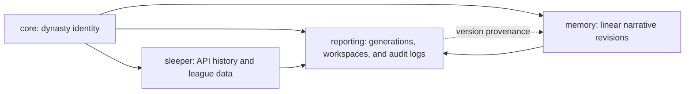

# Database Schema Overview

**Status:** Simplified hardened contract  
**Database:** Supabase-hosted PostgreSQL  
**Compatibility:** Clean replacement

## Design Principle

The baseline stores only what the current platform needs:

- dynasty identity across Sleeper league IDs;
- persistent request-level Sleeper data and cutoff-safe backtests;
- the existing narrative memory concepts with exact versioned state;
- generations, AI/token logs, full tool calls, versioned artifacts, and one
  constrained evaluation workspace.

Future seams are left open, but their tables are not created until a product
workflow needs them. This explicitly excludes provider abstraction, manager
churn, memory branches, durable job orchestration, pricing catalogs, presets,
and generalized experiment infrastructure from the initial migration stack.

## Physical and Code Organization

One PostgreSQL database contains four private schemas:



All SQLAlchemy ORM/table definitions live together under:

```text
backend/database/models/
├── core/
├── sleeper/
├── memory/
└── reporting/
```

Resource objects and managers remain together under
`backend/resources/<resource>/`. This makes database discovery and migration
registration straightforward without allowing ORM rows to leak into services or
routes.

## Namespace Baselines

### `core`

Only four durable identity resources:

| Table | Responsibility |
| --- | --- |
| `competitions` | One league/dynasty across its lifetime |
| `competition_seasons` | Ordered season and Sleeper league ID |
| `franchises` | Durable team identity |
| `season_rosters` | One season's Sleeper roster mapped to a franchise |

Competition seasons keep `season_year` and `sequence_number`, but not start/end
dates or lifecycle history. Franchises have no merge state. Sleeper users provide
manager display data; there is no core manager table. Sleeper is explicit in the
column names rather than represented by provider registry tables.

### `sleeper`

Three layers, kept close to the current datalayer:

| Layer | Tables | Rule |
| --- | --- | --- |
| Fetch audit | `refresh_runs`, `api_requests`, `api_payloads` | Every request retained; payloads hash-deduplicated |
| Current-scope ownership | `normalized_scopes` | One concurrency-safe head per complete endpoint scope, including empty results |
| Current normalized view | leagues, users/league users, players, rosters/managers/players, matchups/performances, transactions/moves, picks, brackets | Full endpoint scope replaced/upserted idempotently |
| Generation input | `data_snapshots`, `data_snapshot_requests` | Exact selected requests and frozen SQLite artifact |

Raw requests are the historical record. Normalized PostgreSQL tables may show
the latest successful response. Historical snapshot creation selects eligible
old requests and runs them through the existing normalizers, so every normalized
resource does not need its own version system.

The reporter-facing SQLite database retains familiar derived `games`,
`standings`, `team_profiles`, and `season_context` tables. They are materialized
for a snapshot, not persisted as another PostgreSQL projection framework.

### `memory`

The current concepts remain distinct:

- storyline: long-running arc;
- fact: reusable remembered claim;
- event: historical narrative receipt;
- trigger: future callback condition;
- context note: team, season, or league narrative context.

Stable items have complete typed versions arranged on one linear canonical
revision history. Subjects, exact evidence, thematic relationships, and
event-specific details are owned by those kind-specific versions and validated
through application resource models.
`priority` and `importance` become one higher-is-more-important `salience`.
Season/week/occurrence time remain explicit; there is no phase column.
Facts and events retain typed primary tool-call/API-request receipts; any extra
JSON source hints are non-authoritative. A full evidence graph remains deferred.

Canonical memory uses:

| Table | Responsibility |
| --- | --- |
| `memory_revisions` / `current_revisions` | Ordered mutation batches and the one current canonical revision |
| `memory_items` / `memory_versions` | Stable identity and content versions with introduced/retired revisions |
| typed version tables | Storyline, fact, event, trigger, context content |
| `memory_search_documents` | Rebuildable entity/reference/full-text candidate index keyed by exact version |

There are no memory branches, sibling canonical states, or membership snapshots.
A generation pins one revision; visibility comes from each version's introduced/
retired revision range. Live mutations append the next revision and build search
documents for new versions in the same transaction. Search documents return
candidate IDs only; callers hydrate typed canonical versions before use.
Historical and rolling evaluations operate on serialized reporting artifacts,
not alternative rows in canonical memory.

### `reporting`

Everything is keyed from one `generations` aggregate:

| Table | Responsibility |
| --- | --- |
| `generations` | Request, status/progress, typed data/memory inputs, and JSONB manifest |
| `ai_calls` | Every actual provider call, retry/fallback, response, and tokens |
| `tool_calls` | Exact arguments, full results, errors, and timing |
| `artifacts` | Stable named artifact within a generation |
| `artifact_versions` | Complete immutable Markdown/JSON/text revisions |
| `evaluation_workspaces` | At most one active rolling alternative history per competition |

The article is an artifact of kind `article`. Briefs are not specialized tables;
the reporter can optionally persist a final brief through the same artifact
interface. The frontend polls generation status and child rows. Jobs, leases,
event streams, and automatic resume are deferred.

A generation is inserted as `pending` before its data and memory inputs are
resolved. The transition to `running` atomically freezes the ready data snapshot,
either a canonical memory revision or workspace artifact, cutoffs, and manifest.
Live memory output is the next canonical revision; evaluation output is a generic
workspace artifact.

Token categories and actual model identity are persisted. Dollar prices are
calculated against a selected current or projected pricing configuration and are
not stored as historical truth.

## Backtest Contract

A generation always pins:

1. one immutable Sleeper data snapshot;
2. either one canonical memory revision or one immutable evaluation-workspace
   artifact;
3. domain/week and knowledge cutoffs;
4. the exact resolved JSONB input manifest.

Historical Sleeper selection uses API requests completed before the knowledge
cutoff and excludes future-week endpoints. Matchup payloads reconstruct the
weekly lineup and starter/bench roster; they do not claim exact taxi/IR or
intra-week ownership.

The initial reporter SQLite artifact contains one competition season because
the current curated SQL assumes one league. Cross-season identity and narrative
memory are supported immediately; multi-season factual agent tools are deferred
until their queries are explicitly season-scoped.

Historical canonical memory selection uses the explicit revision ID, not the
latest rows. A rolling backtest materializes that revision into an isolated
workspace and passes each full JSON workspace artifact to the next simulated
generation without writing canonical memory.

The agent's SQL tool reads only the frozen SQLite artifact, so excluded future
PostgreSQL rows are physically unavailable.

Ready data snapshots, request membership, canonical revision identity, workspace
artifacts, content hashes, and artifact locators are immutable. Composite foreign
keys prevent relational competition, season, snapshot, generation, franchise,
roster, and provenance IDs from being combined across competitions. Typed memory
payload references are validated by the application mutation boundary.
PostgreSQL owns relational, concurrency, and sealed-history guarantees; Pydantic
objects and manager/service transactions own product-semantic validation under
DB-028 and DB-031.

## Shared Conventions

- application-generated UUIDv4 internal IDs;
- explicit Sleeper identifiers stored as text;
- database-generated UTC `timestamptz` record times;
- smallint football weeks, validated as non-negative by application objects,
  with no separate phase dimension;
- `numeric(12,4)` fantasy scores normalized through `Decimal`;
- bigint token/byte/duration counts validated as non-negative by application
  objects;
- text statuses validated through Pydantic enums and workflow policy;
- JSONB for request payloads, resolved settings, provider metadata, flexible
  receipts, and Pydantic-backed kind-specific memory structures; common memory
  query fields are flattened into a rebuildable projection;
- schema-qualified foreign keys and indexes;
- `ON DELETE RESTRICT` for durable history;
- logical archival and immutable revisions rather than broad cascades.

## Intentional Pushback on Simplification

Three seemingly simpler alternatives are rejected:

1. **Fake competition IDs for backtests.** They corrupt domain identity and make
   one dynasty appear as unrelated leagues. A reporting workspace provides
   isolation without changing competition identity.
2. **One AI row per successful turn only.** The existing client retries and falls
   back. Recording each actual call is necessary for accurate model/token audit.
   These are still one `ai_calls` concept, differentiated by turn and attempt.
3. **Promoting an alternative history from an old revision.** That requires a
   three-way merge and policies for memories changed on both paths. Promotion is
   fast-forward only; historical simulations are evaluation-only.

`numeric(12,4)` is preferred over integer hundredths because Sleeper documents
decimal score components but does not guarantee that every custom scoring result
will always fit two decimal places. Exact decimal storage keeps natural units and
avoids float drift.

## Deferred Features

Deferred until a concrete workflow requires them:

- manager/person identity, franchise churn, aliases, and name history;
- provider registries and provider migration;
- memory branches, sibling canonical states, merges/rebases, access telemetry,
  and Git persistence;
- fully normalized evidence graphs and RAG candidate logs;
- presets and preset versions;
- durable jobs, leases, retries, Pub/Sub, and automatic resume;
- pricing catalogs and stored costs;
- specialized brief/article resources;
- multiple evaluation workspaces, experiment variants, comparison records,
  evaluation definitions, and ratings;
- persistent game/standings projection builds;
- complete intra-week roster ownership history.

## Database-Only PR Stack

1. Database foundation, centralized model registry, private schemas, and local
   PostgreSQL tests.
2. Minimal core identity models and migrations.
3. Sleeper request/payload persistence, normalized current tables, and snapshot
   materializer contract.
4. Linear canonical memory revisions, version visibility, and current pointer.
5. Generations, one evaluation workspace, AI/token logs, tool calls, and
   versioned artifacts.
6. Cross-namespace foreign keys, immutability/snapshot invariants, and leakage
   tests.
7. Supabase staging/deployment verification, roles, TLS, backup, and restore
   runbooks.

No manager, service, API, worker, or frontend implementation belongs in this
stack.
