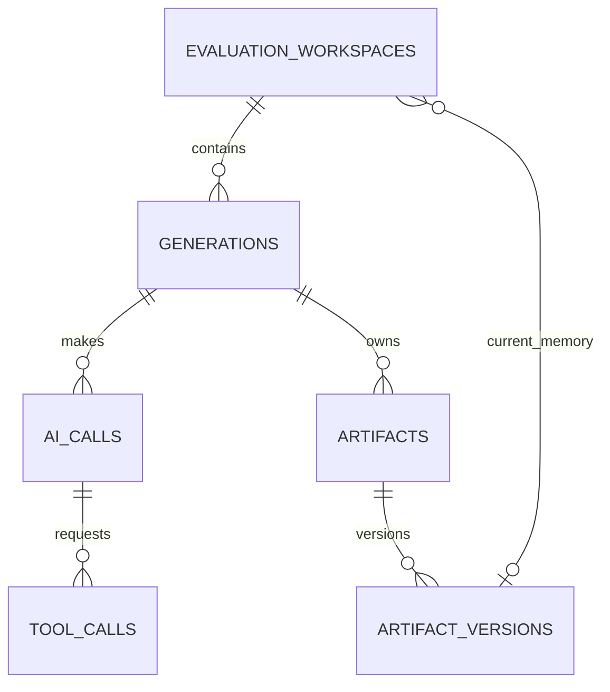

# Reporting Namespace Schema

**Status:** Simplified hardened design  
**PostgreSQL namespace:** `reporting`  
**Compatibility:** Clean replacement

## Validation Ownership

DB-028 governs implementation. PostgreSQL enforces generation identity and
scope, essential natural/partial uniqueness, exactly one resolved memory-input
shape, selected artifact-version finality, and terminal history immutability.
Pydantic objects and generation workflows validate status/type values, ranges,
JSON shapes, timestamps, lifecycle transitions, snapshot readiness, required
reporter outputs, and fast-forward promotion.

## Purpose

`reporting` is organized around one resource: a **generation**. A generation is
the submitted request, its resolved inputs, its live status, the model and tool
activity it produced, and its versioned artifacts.

The baseline must support:

- triggering and polling a generation from the UI;
- viewing every model call and full tool result;
- tracking token usage by model;
- retaining articles and intermediate artifacts across reruns;
- comparing arbitrary generations against their exact data and memory inputs;
- running one isolated longitudinal evaluation workspace per competition.

It does not implement a durable workflow engine, general experiment/variant
framework, pricing catalog, or specialized brief schema.

## Aggregate Shape

## Tables

### `reporting.generations`

One row represents one submitted execution:

- `id uuid` primary key, generated by the caller before submission;
- `competition_id` and `competition_season_id`;
- nullable `sleeper.data_snapshot_id` while pending;
- nullable canonical `input_memory_revision_id` while pending;
- nullable `input_memory_artifact_version_id` for a continuing evaluation;
- nullable `evaluation_workspace_id` and workspace sequence number;
- nullable `rerun_of_generation_id` self-reference;
- `kind`: initially `live` or `backtest`;
- `status`: `pending`, `running`, `succeeded`, `failed`, or `cancelled`;
- original `request_text`;
- optional coverage `week_start` and `week_end`;
- nullable resolved domain cutoff week/time and knowledge cutoff time;
- requested primary model;
- complete resolved `settings_jsonb`;
- nullable `input_manifest_jsonb`, manifest schema version, and manifest hash;
- `current_turn`, `current_stage`, and `progress_updated_at` for polling;
- sanitized failure category/summary;
- `created_at`, `started_at`, and `completed_at`.

Frequently queried identity, cutoff, status, and model fields remain columns.
The JSON manifest contains the exact prompt/procedure/tool bundle hashes, runner
settings, fallback policy, code revision, dependency version, and any less
frequently filtered configuration.

A pending row durably captures the submitted request before snapshot resolution.
The resolver builds/selects the factual snapshot, reads the canonical memory
current revision or active workspace artifact, and then transitions the
generation to `running` in one transaction that sets the data snapshot, exactly
one memory input, all resolved cutoffs, and the complete manifest/hash.
Database checks or a transition trigger require those fields for `running` and
`succeeded`. A request that fails or is cancelled during input resolution may be
terminal without resolved snapshots; its failure stage makes that explicit.
Once running, the request, settings, input IDs, cutoffs, and manifest are
immutable. The status and progress fields remain mutable. A terminal generation
never reopens; a retry initiated by the user creates another generation linked
by `rerun_of_generation_id`.

There is deliberately no output-memory pointer on the generation. An accepted
live mutation produces the unique next `memory.memory_revisions` row associated
with that generation. An evaluation mutation produces a generic
`memory/workspace.json` artifact version and advances only its workspace
pointer.

The frontend polls this row and then fetches newly created AI calls, tool calls,
and artifact versions. No jobs, leases, heartbeat protocol, event stream, or SSE
sequence is required in the baseline.

Unique `(id, competition_id)` and composite foreign keys to competition season,
data snapshot, canonical memory revision, and evaluation workspace prevent a
generation from mixing resources from different competitions. The data snapshot
must be ready before running. Exactly one of canonical memory revision or
workspace artifact is the resolved memory input. A workspace artifact must equal
that active workspace's current artifact when the generation starts.

### `reporting.evaluation_workspaces`

One constrained longitudinal alternative history:

- `id uuid` primary key;
- `competition_id`;
- immutable `base_memory_revision_id`;
- nullable mutable `current_memory_artifact_version_id`;
- status: `active`, `discarded`, or `promoted`;
- nullable `promoted_memory_revision_id`;
- created/completed timestamps.

A partial unique index permits at most one active workspace per competition.
Generations inside it have unique positive workspace sequence numbers. The first
generation materializes the base revision; each later generation consumes the
previous current memory artifact and emits a new deterministic full workspace
artifact plus any human-readable memory-diff artifact.

Composite foreign keys require the base/promoted revisions, generations, and
current artifact to belong to the same competition. The current artifact must be
owned by a succeeded generation in this workspace. Status-shape checks require:

- `active`: no promoted revision or completion time;
- `discarded`: completion time, no promoted revision;
- `promoted`: completion time and promoted revision.

The base revision is immutable. After a workspace becomes discarded or promoted,
its status, current artifact, and generation membership are immutable.

Discarding a workspace makes no canonical memory change. Promotion is allowed
only when `memory.current_revisions` still equals the workspace base. It applies
the final artifact's diff as one new canonical revision, records that revision,
uses the final workspace generation as its provenance, and marks the workspace
promoted in the same transaction. The final artifact must be complete and
content-hash verified. If canonical memory advanced, promotion fails; there is no
merge or rebase. Historical workspaces started from an old revision are therefore
evaluation-only.

This table is not a generic experiments system. It exists solely to give one
rolling alternative history a clear lifecycle and a simple UI surface.

### `reporting.ai_calls`

One row is one actual provider request—the single AI log concept. Retries and
fallbacks create additional rows for the same agent turn rather than being
hidden or split into model-request/attempt abstractions.

Fields:

- `id uuid` primary key;
- `generation_id`;
- positive `turn_number` and non-negative `attempt_number`;
- requested and actual provider/model identifiers;
- exact input messages, tool definitions, and request parameters as JSONB;
- exact sanitized provider response JSONB;
- status: `started`, `succeeded`, `retryable_error`, `fatal_error`,
  `cancelled`, or `unknown_outcome`;
- sanitized error JSONB and finish reason;
- nullable provider request/response IDs;
- `input_tokens`, `cached_input_tokens`, `output_tokens`, `reasoning_tokens`,
  `total_tokens`, and raw provider usage JSONB;
- started/completed timestamps and latency milliseconds.

Constraints:

- unique `(generation_id, turn_number, attempt_number)`;
- at most one successful AI call per generation turn;
- token counts and latency are non-negative when present;
- a successful row requires an actual model and response;
- terminal AI-call rows are immutable.

Repeating the input messages on retry is acceptable at this scale and makes each
row independently auditable. If payload volume later warrants content-addressed
deduplication, it can be added without changing the logical call identity.

### `reporting.tool_calls`

One row records one tool execution requested by a successful AI call:

- `id uuid` primary key, created before invoking the handler;
- `generation_id` and `ai_call_id`;
- tool ordinal within the AI call and provider tool-call ID;
- tool name and implementation version;
- exact arguments JSONB;
- status: `requested`, `running`, `succeeded`, `failed`, or `cancelled`;
- exact full result text and optional structured result JSONB;
- sanitized error text/JSONB;
- started/completed timestamps and duration milliseconds.

The full result is retained; the current truncated `RunLog` summary is not
sufficient for auditing. Parallel calls have distinct ordinals but do not need
a fabricated global order. Tool-call UUIDs provide provenance for memory writes
and artifact versions.

Memory searches remain ordinary tool calls in the baseline. If evaluating RAG
ranking later requires candidate-level telemetry, add it then rather than
duplicating today's nearly one-to-one tool history.

### `reporting.artifacts`

A stable path-addressed artifact inside a generation:

- `id uuid` primary key;
- `generation_id`;
- normalized relative `path`;
- IANA `media_type` such as `text/markdown` or `application/json`;
- nullable `finalized_version_id` selecting one existing immutable version;
- `created_at` and nullable `finalized_at`.

Unique `(generation_id, path)`. Paths use `/` separators, cannot be absolute,
cannot contain empty, `.` or `..` segments, and are the programmatic identity of
an output rather than an operating-system filesystem location. `media_type`
describes representation and is immutable after creation; semantic categories
do not belong in a closed artifact-kind enum.

The reporter's required Markdown artifacts are `research/brief.md` and
`article.md`, both with `media_type = 'text/markdown'`. Outlines, diagnostics,
or future editorial products use additional paths without requiring schema or
enum changes. A separate article table is unnecessary; the API can expose the
finalized `article.md` version as an article-specific resource or view.

An evaluation memory checkpoint uses `memory/workspace.json` with
`media_type = 'application/json'`. Its deterministic full content allows the
next simulated week to resume without querying alternative versions from the
canonical memory schema.

### `reporting.artifact_versions`

One complete immutable artifact revision:

- `id uuid` primary key;
- `artifact_id`;
- positive revision number;
- complete content text;
- SHA-256 content hash;
- nullable source AI call and tool call;
- `created_at`.

Constraints:

- unique `(artifact_id, revision_number)`;
- revisions are append-only;
- `finalized_version_id`, when present, belongs to the same artifact;
- finalization selects the latest existing version and never duplicates or
  mutates its content; and
- no new version may be appended after an artifact is finalized.

Persisting complete UTF-8 Markdown after each successful mutation is
intentionally simple and makes rendering, auditing, and comparison
straightforward. The reporter uses the same version model for
`research/brief.md` and `article.md`. `submit_artifact` selects an existing
revision of `article.md`; generation finalization pins that version and the
current brief version supplied in `ReporterOutput` rather than appending
content-identical final copies.

## Token Analytics, Not Stored Pricing

The database records actual model/provider identity, call time, and provider
token categories. It does not store pricing catalogs, calculated dollar cost, or
historical cost summaries.

Dashboards calculate current or projected cost by joining token usage to a
versioned pricing configuration in application code. This supports the desired
question—“what would these generations cost under this model/pricing plan?”—and
avoids freezing a historical dollar calculation that is not useful to the
product. Raw usage remains available if a provider adds token categories later.

## Polling and Failure Behavior

The initial process updates `generations.current_turn`, `current_stage`, and
`progress_updated_at`, while inserting AI calls, tool calls, and artifact
versions as work completes. The frontend polls by generation ID.

If the process crashes, a stale `running` generation is marked failed by a
simple reconciliation command/startup check. It is not automatically resumed.
The user can start a linked rerun. This leaves a clean seam for a future queue or
Pub/Sub worker without building a DBOS-style scheduler now.

## Indexing

Baseline indexes support the actual product queries:

- generations by `(competition_id, created_at desc)`;
- generations by `(status, progress_updated_at)` for polling/stale detection;
- generations by competition season, data snapshot, canonical memory revision,
  evaluation workspace/sequence, and requested model;
- AI calls by `(generation_id, turn_number, attempt_number)` and
  `(actual_model, completed_at)`;
- tool calls by generation/AI call/ordinal and by `(tool_name, started_at)`;
- artifacts by `(generation_id, path)` and finalized version;
- artifact versions by `(artifact_id, revision_number desc)`.
- evaluation workspaces by competition/status and base revision.

These indexes support browsing history, live progress, model-token aggregation,
tool auditing, and article comparison. No partitioning is required initially.

## Retention and Privacy

- Generations, AI-call token metadata, tool-call metadata, final articles, and
  exact data/memory input references are durable.
- Secrets, authorization headers, environment dumps, and unsanitized exceptions
  are never persisted.
- Exact request/response and tool payload retention can be shortened later, but
  a tombstone/hash must make that loss visible.
- Normal product actions archive or hide generations; they do not cascade-delete
  evidence referenced by memory.

## Deferred Seams

Explicitly deferred:

- request resources and idempotency infrastructure;
- presets and preset versions;
- jobs, leases, heartbeats, worker attempts, and dead-letter queues;
- event streams, SSE sequence tables, and Supabase Realtime;
- separate logical model-request rows;
- content-addressed object registries;
- pricing catalogs and stored costs;
- normalized memory-search/RAG telemetry;
- specialized briefs, facts, articles, and render tables;
- memory mutation-batch ledgers;
- multiple concurrent workspaces, experiment variants, comparison records,
  evaluation definitions, and ratings;
- complex concurrency and automatic-resume rules.

The exact generation inputs, AI calls, tool calls, tokens, and versioned artifacts
provide enough durable history to add those features when the UI actually needs
them.
