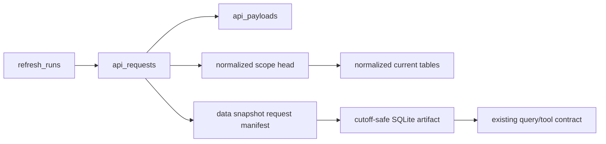

# Sleeper Namespace Schema

**Status:** Simplified hardened design  
**PostgreSQL namespace:** `sleeper`  
**Compatibility:** Clean replacement; reporter-facing behavior is preserved

## Validation Ownership

DB-028 governs implementation. PostgreSQL enforces request/payload identity,
scope-safe foreign keys, endpoint natural uniqueness, concurrency heads,
unambiguous inline-versus-object storage, and sealed snapshot immutability.
Pydantic objects and ingestion/snapshot transactions validate statuses, ranges,
JSON shapes, timestamps, request completeness, source eligibility, hashes, and
normalization transition policy. In this document, other uses of “requires” or
“constraints” describe the persistence contract, not necessarily a DDL check.

## Purpose

The Sleeper namespace has three jobs:

1. record each API request and its raw response;
2. maintain a convenient persistent normalized view close to the current
   datalayer schema;
3. build immutable, cutoff-safe SQLite inputs for a generation.

The raw request history is the source for historically faithful replay. The
normalized PostgreSQL rows are the latest convenient representation for the UI,
cross-season queries, and current tools; they do not need a version table for
every endpoint because earlier responses remain available for re-normalization.

## Data Flow

This is intentionally request-oriented. There is no hierarchy of generic
observations, endpoint-specific snapshot parents, fact-version stores, and
projection builds.

## Request and Payload Tables

### `sleeper.refresh_runs`

One explicit refresh operation:

- `id uuid` primary key;
- optional `competition_id` and `competition_season_id`;
- requested through-week and endpoint scope JSONB;
- trigger source: `manual`, `generation`, `scheduled`, or `backfill`;
- status: `running`, `succeeded`, `partial`, `failed`, or `cancelled`;
- code/normalizer version;
- started/completed timestamps;
- sanitized error summary and request counts.

The refresh can succeed partially. A failed Week 8 transaction request does not
invalidate successful matchup or league requests and does not erase their prior
normalized state.

### `sleeper.api_payloads`

Content-addressed raw response content:

- `id uuid` primary key;
- unique SHA-256 hash;
- byte length and media type;
- `storage_kind`: `inline_json` or `object`;
- nullable JSONB payload and nullable private object-storage key;
- `created_at`.

Repeated unchanged player catalogs or season responses reuse one payload. The
payload boundary exists only to avoid duplicating multi-megabyte responses; all
request timing and scope remains on `api_requests`.

Exactly one content location is required: `inline_json` requires JSONB and no
object key; `object` requires an object key and no JSONB. The recorded byte
length and SHA-256 are verified before the payload can back a complete request.

### `sleeper.api_requests`

One actual Sleeper endpoint call:

- `id uuid` primary key and `refresh_run_id`;
- nullable `competition_season_id` for global endpoints;
- endpoint kind;
- deterministic `scope_key` such as `matchups:<season-id>:8`;
- sanitized request path and parameters JSONB;
- nullable week or bracket kind;
- requested/completed timestamps and latency;
- status: `succeeded`, `http_error`, `transport_error`, or `invalid_payload`;
- HTTP status and sanitized error JSONB;
- `is_complete` plus optional completeness reason;
- nullable `payload_id` and response hash;
- normalization status/version and completion time.

Indexes prioritize `(scope_key, completed_at desc)` filtered to successful,
complete requests, and `refresh_run_id`.

Every attempt is retained. An unchanged successful response still creates an
API-request row proving that AIdam checked at that time, while payload
deduplication avoids copying its contents.

A succeeded complete request requires a verified payload. Failed requests
cannot be marked complete. An error response body may be retained as sanitized
error JSON, but it is not an eligible source payload for normalization or a data
snapshot.

### `sleeper.normalized_scopes`

One authoritative head per deterministic endpoint scope:

- `scope_key text` primary key;
- unique `source_api_request_id`;
- response hash and normalized row count;
- `applied_at timestamptz`.

This small table makes the empty set representable and prevents an older request
that finishes late from overwriting newer normalized state. Normalization locks
the scope row (or inserts it with compare-and-swap semantics), replaces/upserts
that scope, and advances the head in one transaction. Only a succeeded, complete,
verified request newer than the current head is eligible. Ties use request ID as
a deterministic final order. “Newer” is ordered by request start time, not finish
time, so an earlier request that completes late cannot roll the scope backward.
Reapplying the head request is a no-op.

## Request-Level Merge Contract

Each endpoint response is a complete set for its scope. Normalization therefore
uses a simple request-level transaction:

1. Insert the API request and content-addressed payload.
2. Validate that the response matches the requested league/week and is complete.
3. If it failed or is incomplete, retain it for audit but leave normalized rows
   unchanged.
4. Lock/read `normalized_scopes`; if the request is older than its head, retain
   the request but do not apply it.
5. If its response hash equals the scope head, mark normalization complete
   without rewriting rows, but advance the scope head to this newer observation.
   Existing rows may continue to cite the older request that supplied identical
   content.
6. Otherwise normalize the full response and replace/upsert only that scope.
7. Record `source_api_request_id` on every affected normalized row and advance
   the scope head in the same transaction.

This avoids a generalized diff engine. Empty successful responses replace the
scope with an empty set; failures do not. Natural unique keys make retrying
normalization idempotent.

## Persistent Normalized Tables

These tables intentionally resemble the current datalayer, with internal core
IDs replacing bare league/roster scope and JSONB replacing JSON text.

### `sleeper.leagues`

One latest normalized row per `core.competition_seasons` record:

- competition season ID and source API request;
- Sleeper-reported name, status, season, previous league ID, and draft ID;
- scoring settings, roster positions, and provider settings JSONB;
- playoff start week/team count and other existing query fields.

Core owns season identity and sequence. Sleeper owns the currently observed
league configuration.

### `sleeper.users`

One latest row per `sleeper_user_id`, using the provider text ID as its primary
key rather than an internal UUID:

- user ID primary/natural key;
- display name, username, avatar, and metadata JSONB;
- source API request and updated time.

This is the displayed manager identity for now. A future core manager table can
map one or more Sleeper user IDs without changing these rows.

### `sleeper.league_users`

League-specific user state from the users endpoint:

- competition season and Sleeper user ID;
- league-local metadata such as team name/nickname and commissioner flag;
- source API request.

Unique `(competition_season_id, sleeper_user_id)`. This prevents one user's
team metadata in League A from overwriting their metadata in League B while
keeping the global profile fields in `sleeper.users`.

### `sleeper.players`

One latest row per Sleeper player ID, also intentionally using the provider text
ID as its primary key:

- name, position, NFL team, active/injury status, age/experience;
- metadata JSONB;
- source API request and updated time.

Player rows are never deleted merely because a later catalog omits them. The raw
catalog requests retain prior metadata for historical snapshot builds.

### `sleeper.rosters`

One latest row per `core.season_rosters` record:

- season-roster ID, competition-season ID, and source API request;
- settings, metadata, and record string;
- observed current totals needed by existing queries.

Observed ownership uses `sleeper.roster_managers`, with
`(season_roster_id, sleeper_user_id)` as its primary key, a checked role of
`owner` or `co_owner`, and provider source order. Exactly one `owner` is allowed
per roster scope; co-owners are relational rows rather than an array. The frozen
SQLite exporter can project the primary owner back into the current shape.
These fields describe the current roster response, not historical Week N truth.

### `sleeper.roster_players`

The latest current roster membership from the rosters endpoint:

- season-roster ID and player ID;
- role (`starter`, `bench`, `taxi`, `reserve`, `ir`, or `unknown`);
- source API request.

Unique `(season_roster_id, player_id)`. Snapshot creation for an older week does
not use a later current-roster response.

### `sleeper.matchups`

The latest normalized response for each season/week/roster matchup entry:

- competition season, week, season roster, and provider matchup ID;
- exact team fantasy points;
- source API request.

Uniqueness is `(competition_season_id, week, season_roster_id)`. Persistence does
not assume exactly two rows per matchup ID.

### `sleeper.player_performances`

The current normalized player rows from each weekly matchup response:

- competition season, week, season roster, matchup ID, and player ID;
- exact points and role (`starter` or `bench`);
- source API request.

These rows are the historical-roster workaround: they show who Sleeper reported
for that week's lineup. They do not claim taxi/IR membership or exact ownership
at every instant during the week.

The natural key is `(competition_season_id, week, season_roster_id, player_id)`.
`matchup_id` is descriptive and may be nullable; it is not the row identity.

### `sleeper.transactions` and `transaction_moves`

`transactions` retains the existing stable Sleeper transaction identity scoped
to a competition season. Its natural key is
`(competition_season_id, sleeper_transaction_id)`; it also stores week, type,
status, provider-created timestamp, settings/metadata JSONB, and source request.

`transaction_moves` uses a UUID primary key plus unique
`(transaction_id, move_index)`. Each application record is one `player` or
`pick` transfer with optional from/to season-roster IDs. It references exactly
one player or canonical normalized draft pick, and may carry the transaction's
non-negative waiver/budget amount. A corrected complete request replaces the
normalized week scope; the old raw request remains available for historical
replay.

### `sleeper.draft_picks`

The latest derived pick-ownership view used by current tools:

- UUID primary key;
- competition ID, draft season year, round, original franchise, and current
  franchise;
- optional qualified Sleeper pick ID;
- source (`seeded` or `traded_pick`);
- source API request where observed.

Unique `(competition_id, draft_season_year, round, original_franchise_id)`.
This preserves the current feature without introducing a generalized asset or
ownership-history subsystem.

### `sleeper.playoff_matchups`

The latest normalized winners/losers bracket nodes, keyed by
`(competition_season_id, bracket_kind, node_key)`, retaining the current bracket
fields and source API request. `node_key` uses Sleeper's node/matchup identifier
when present and otherwise a deterministic provider-array position within that
exact response scope. Historical snapshot construction may use a later recorded
bracket response, but projection policy must not present nodes beyond
`through_week` as historical results.

## Existing Derived Tables

The current datalayer already derives `games`, `standings`, `team_profiles`, and
`season_context`. They remain part of the reporter-facing SQLite schema because
existing tools query them, but they do not need persistent PostgreSQL tables.

The snapshot materializer derives them from its selected request set:

- pair ordinary matchup entries into games where valid;
- compute standings through the requested week;
- resolve team/manager display profiles from selected roster/user responses;
- record the requested cutoff as season context.

This is preservation of current behavior, not a new projection framework.

## Data Snapshots

### `sleeper.data_snapshots`

One immutable factual input to one or more generations:

- `id uuid` primary key;
- competition and primary competition-season IDs;
- canonical daily reuse `build_key`;
- populated domain cutoff week, nullable reserved cutoff-time seam, and the
  `as_of_date` daily reuse label;
- status: `building`, `ready`, `failed`, or `expired`;
- one snapshot-projection version plus audit-only code version;
- completeness warnings JSONB;
- sanitized failure summary for failed builds;
- exact SQLite artifact hash, byte size, and private storage key/path;
- created/completed timestamps.

Only `building` and `ready` rows participate in the partial unique build-key
index. Failed and expired attempts remain auditable but release the key so a
later request can build a replacement. Generation intent such as live,
historical, or retrospective is not factual snapshot identity and remains on
the generation workflow.

### `sleeper.data_snapshot_requests`

The exact successful API requests selected for the snapshot:

- data snapshot ID;
- API request ID;
- scope key;
- response SHA-256;
- selection role.

Unique `(data_snapshot_id, scope_key)`. The baseline artifact contains one
primary competition season plus global resources such as the player catalog.
Several existing curated queries assume a single league, so older seasons are
not silently mixed into the current agent SQL surface.

Snapshot selection rules:

- selection chooses the latest complete request available per required scope;
- an earlier `through_week` may use a later recorded correction specifically
  scoped to that earlier week;
- future-week matchup/transaction requests are excluded;
- later roster/player/user/bracket payloads may supply current reference data,
  while the SQLite projection suppresses later-week state fields;
- missing required requests fail the ordinary snapshot workflow;
- v1 retains ready SQLite artifacts and does not proactively delete benign
  unreferenced content-addressed files.

The existing normalizers build the artifact from the selected raw payloads.
This both preserves the familiar SQLite query schema and physically prevents
the reporter's guarded SQL tool from seeing post-`through_week` week-scoped and
volatile state from primary-database rows.

The SQLite tables retain the existing provider-facing `league_id`, `roster_id`,
and season columns expected by current query/tool code. They may add internal
competition/franchise IDs as non-breaking columns for future tools. Cross-season
factual tools should be introduced deliberately after their SQL is scoped and
tested; dynasty continuity initially comes from core identity and memory.

Once a snapshot is `ready`, its cutoff fields, exact request membership,
artifact locator/hash/size, and projection version are immutable. A
snapshot becomes ready only after verifying that its selected API requests are
succeeded and complete and that the stored artifact matches its hash. Expiration
may change retention state but never rewrites what the snapshot meant; expired
is terminal.

Tables that carry both `competition_id` and `competition_season_id` use a
composite foreign key to prevent cross-competition combinations. A data snapshot
has unique `(id, competition_id)` and `(id, competition_season_id)` keys for the
same reason. Each competition-scoped request selected into a snapshot must belong
to that snapshot's competition; only explicitly global endpoint kinds, such as
the player catalog, may omit competition scope.

## Exact Values

Fantasy points use PostgreSQL `numeric(12,4)`, normalized through `Decimal` from
the source value. Integer hundredths would also avoid floating-point drift, but
Sleeper does not document a two-decimal maximum for every custom scoring rule.
`numeric` keeps units natural for SQL and tools without silently rounding a
future fractional score. The frozen SQLite exporter may emit ordinary numeric
values for compatibility.

## Indexing

In addition to request indexes and natural uniqueness:

- seasons and rosters by their core IDs;
- users and players by Sleeper ID, with normalized-name lookup indexes;
- league users by `(competition_season_id, sleeper_user_id)`;
- matchups by `(competition_season_id, week, season_roster_id)` and matchup ID;
- player performances by player/season/week and roster/week;
- transactions by season/week/type/status and provider transaction ID;
- transaction moves by player, pick coordinates, and involved roster;
- draft picks by competition/draft season/current franchise;
- snapshots by active build key and by competition season, `as_of_date`,
  and creation time;
- snapshot-request membership by snapshot and API request.

JSONB receives no general GIN indexes until a real query requires one.

## Deferred Seams

Explicitly deferred:

- generic provider registries and provider-neutral normalized facts;
- version tables for every normalized resource;
- endpoint-specific observation/snapshot parent tables;
- projection-build tables and persistent game/standings projections;
- complete historical taxi/IR/intra-week ownership reconstruction;
- player projections or other new factual feeds absent from the current
  datalayer;
- multi-season factual SQL/tools inside one reporter snapshot;
- draft-pick asset/event sourcing;
- ownership reconciliation diagnostics;
- partitioning and broad JSONB indexing.

The retained raw requests make richer normalization possible later without
having to predict every future table today.
