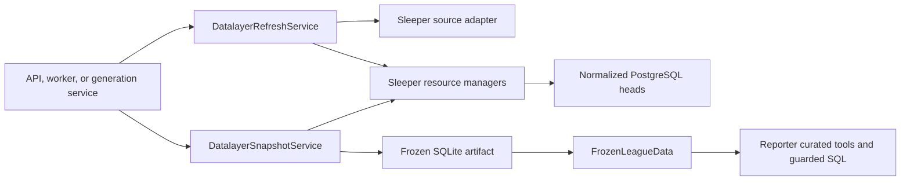

# Datalayer Architecture Plan

**Status:** Architecture contract for the foundational PR

**Scope:** `backend/services/datalayer`, its resource-manager dependencies, the
HTTP boundary, and the frozen reporter data runtime

**Authoritative schema baseline:** [`docs/database/sleeper.md`](../database/sleeper.md)

The service review requires focused pre-implementation snapshot refinements:
active-build identity, one projection version, failure metadata, exact
request-hash membership, and corrected sealed transitions. They are called out
in
[`application-contracts.md`](application-contracts.md#persistence-alignment-before-implementation).

## Purpose

The platform datalayer turns Sleeper observations into two products with
different guarantees:

1. a durable, current PostgreSQL view for the product and cross-season reads;
2. an immutable, cutoff-safe SQLite view for reporter generations.

It preserves the strongest parts of the legacy datalayer—explicit endpoint
helpers, pure normalization, derived fantasy-football facts, curated queries,
name resolution, and guarded SQL—without retaining the assumption that every
run begins by downloading one league into a new in-memory database.

The target is a clean platform baseline with minimal factual-logic churn and
minimal final-system complexity. Reuse means preserving proven behavior and
tests, not forcing old row types or module boundaries through new adapter
layers. Code moves unchanged when it still fits; otherwise its calculation is
extracted or rewritten behind golden tests. Old persistence APIs do not receive
compatibility shims.

## Documents

| Document | Owns |
| --- | --- |
| [`architecture.md`](architecture.md) | Boundaries, components, dependencies, package structure, and core abstractions |
| [`application-contracts.md`](application-contracts.md) | HTTP, service, manager, and reporter-facing interfaces |
| [`ingestion.md`](ingestion.md) | Refresh planning, request capture, normalization, merge policy, and failure behavior |
| [`snapshots-and-query-runtime.md`](snapshots-and-query-runtime.md) | Cutoff selection, SQLite materialization, artifact verification, and query execution |
| [`transition.md`](transition.md) | Legacy reuse map, implementation slices, test strategy, and exit criteria |

Mutable implementation status, verification logs, and the detailed PR-stack
plan are intentionally kept in the repository-local, gitignored
`.context/datalayer/` workspace. Only durable architecture decisions belong in
these tracked documents.

## One-Sentence Model

Sleeper responses are recorded first, normalized into a convenient current
view second, and independently selected and re-normalized into an immutable
generation snapshot when the reporter needs data.



## Which Database Answers Which Query?

There are two query surfaces, not one:

| Query | Reads from | Examples |
| --- | --- | --- |
| Product/current-state query | PostgreSQL normalized current view | UI league overview, current rosters, refresh audit, cross-season browsing |
| Reporter/generation query | Frozen SQLite snapshot | Curated reporter tools, name resolution, standings/games analysis, guarded SQL |

PostgreSQL therefore still contains projections: its normalized tables are the
latest convenient projection of durable raw Sleeper observations. The initial
architecture does not persist the legacy derived `games`, `standings`,
`team_profiles`, and `season_context` projections in PostgreSQL. Those are built
inside the SQLite reporter read model because they are already coupled to the
curated query contract and must be cutoff-safe.

The SQLite artifact is not necessarily unique to a generation. Several
generations may reference the same ready snapshot when their competition
season, `through_week`, `as_of_date`, and snapshot projection version match.
Exact selected API requests are sealed audit membership, not reuse identity.

## Settled Decisions

- The service package is `backend/services/datalayer/`. Sleeper-specific code
  lives under `backend/services/datalayer/sleeper/`; the service is not a
  generic provider framework.
- Refresh, snapshot construction, and query execution are separate entry
  points. There is no platform equivalent of `SleeperLeagueData.load()`.
- PostgreSQL is the durable source of truth. SQLite is a sealed generation
  artifact and local test format only.
- Every external attempt is recorded, including failures and unchanged
  responses. The filesystem response cache is removed.
- Reuse is behavioral, not type-preserving. Existing endpoint logic,
  normalization calculations, derivations, queries, and fixtures move forward
  when they simplify the new design. SQLite-coupled DTOs are changed or
  replaced when adapting around them would add more layers than rewriting them.
- Current normalized tables are convenient heads, not historical truth.
  Historical snapshots select raw request history and normalize it again.
- V1 treats structural league settings as stable for one competition season.
  Requirement planning may read the season's current normalized settings; it
  does not reconstruct historical settings changes within that season.
- The reporter never receives a PostgreSQL connection. Curated queries and
  free-form SQL execute only against a verified frozen SQLite artifact.
- V1 stores frozen SQLite artifacts on the local filesystem under a configured
  datalayer directory. No external object-storage service is required.
- Retained projection-version-2 snapshots contain one primary season. New
  projection-version-3 snapshots contain the complete ordered competition
  lineage through the primary season and use durable franchise identity for
  cross-season history.
- Existing query return shapes and expected `{"found": false}` lookup behavior
  are preserved where practical. Platform resource and workflow failures use
  typed exceptions instead of tool-shaped dictionaries.
- Routes are thin. They parse HTTP input, establish manager context, call a
  service, and translate errors. They do not fetch, normalize, select requests,
  or open database sessions.
- Snapshot callers supply a required `through_week` and plain `as_of_date`.
  Live/backtest/retrospective labels belong to generation policy, not snapshot
  identity. `as_of_date` is a coarse daily reuse label, not a timestamp or
  request-eligibility cutoff.
- `DatalayerSnapshotService.get_or_create()` remains the isolated compatibility
  path for pending settings-version-1 generations. New settings-version-2
  generation and operator calls use `DatalayerSnapshotPreparationService`,
  which resolves exact inputs, coordinates bounded refresh, and delegates to
  the resolved-input version-3 builder.

## Primary Public Capabilities

The component has four caller-facing Python entry points during the explicit
version-2/version-3 compatibility window:

```python
refresh = DatalayerRefreshService(...)
legacy_snapshots = DatalayerSnapshotService(...)
snapshots = DatalayerSnapshotPreparationService(...)
data = FrozenLeagueData.open(ready_snapshot)
```

- `DatalayerRefreshService` records a refresh and updates eligible current
  normalized scopes.
- `DatalayerSnapshotService.get_or_create()` preserves reproducible version-2
  execution for already-pending policy-version-1 generations.
- `DatalayerSnapshotPreparationService.get_or_create()` resolves every prior
  season, refreshes at most one returned season per resolution step, and builds
  or reuses an immutable version-3 snapshot keyed by factual `input_revision`.
- `FrozenLeagueData` exposes curated factual queries and guarded SQL to the
  reporter without exposing persistence or source-fetch behavior. Opening
  dispatches once to the version-2 or version-3 reader.

The exact contracts are specified in
[`application-contracts.md`](application-contracts.md).

## Simplicity Budget

The baseline intentionally pays for only these deep boundaries:

- refresh service for external fetch/retry/orchestration;
- snapshot service for selection, atomic reuse/build, and artifact sealing;
- resource-specific Sleeper managers, with `NormalizedScopeManager` owning the
  complete ingestion persistence transaction;
- `DataSnapshotManager` for canonical snapshot lifecycle;
- SQLite projection plus `FrozenLeagueData` for cutoff-safe reporter execution;
- local file storage for atomic, hash-verified artifacts.

There is no normalization registry, adapter registry, one-implementation reporter
protocol, cross-resource write-helper layer, public snapshot build bypass, or
ordinary incomplete-snapshot flag. New layers require a second caller or a new
invariant that cannot live clearly in an existing module.

## Ownership Boundary

The datalayer owns:

- Sleeper endpoint planning and HTTP execution;
- complete request/payload audit capture;
- payload completeness and normalization validation;
- current normalized Sleeper heads;
- request selection from available complete observations plus an explicit
  `through_week` domain boundary;
- frozen SQLite schema/materialization;
- curated factual query functions and guarded SQL runtime.

It does not own:

- creation or reconciliation of competition, season, franchise, or season
  roster identities;
- generation lifecycle and manifest persistence;
- reporter memory;
- reporter prompts, tool presentation, or agent-loop policy;
- model calls;
- article persistence;
- a general provider plugin system.

Those boundaries keep factual data semantics reusable without turning the
datalayer into the product's workflow coordinator.
