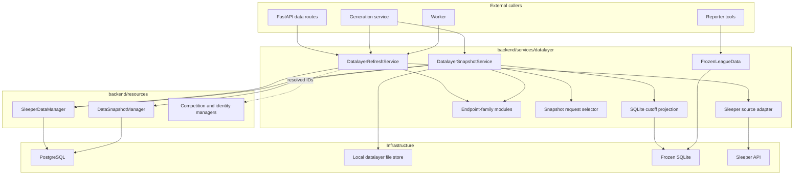

# Datalayer Component Architecture

## Goals

The new component must:

1. preserve every source observation needed to explain current facts and build
   historical inputs;
2. maintain a convenient, competition-scoped current view in PostgreSQL;
3. produce physically cutoff-safe reporter inputs;
4. preserve proven legacy behavior without preserving types or wrappers that
   make the target design harder to understand;
5. support partial refreshes, retries, empty endpoint results, and concurrent
   request completion without rolling current state backward;
6. keep ORM rows and SQLAlchemy sessions out of services, routes, workers, and
   reporter tools;
7. make cutoff semantics explicit rather than overloading a football week.

## Architectural Shape



`SleeperDataManager` owns the whole ingestion write aggregate, including the
atomic “apply request and advance scope head” transaction. No manager reaches
through another resource with session-bound write helpers.

## Projection and Query Boundaries

“Projection” refers to two related but separate things:

| Projection | Lifetime | Consumers | Contents |
| --- | --- | --- | --- |
| PostgreSQL normalized current view | Durable and updated by refresh | Product UI, current-state APIs, cross-season application reads | Latest normalized league, user, player, roster, matchup, transaction, pick, and bracket heads |
| SQLite reporter read model | Immutable and reusable | One or more reporter generations | One cutoff-safe season plus legacy derived/query tables and snapshot metadata |

The PostgreSQL view is not bypassed by the application. Resource managers query
it for current product behavior. The reporter intentionally does not query it,
because guarded SQL against a database containing later observations would
defeat the snapshot boundary.

The initial baseline keeps `games`, `standings`, `team_profiles`, and
`season_context` as SQLite-only derivations. A future UI feature may justify a
durable PostgreSQL read model, but that is independent of the reporter snapshot
and should be added for a demonstrated product query rather than preemptively.

## Proposed Package Layout

```text
backend/
├── sleeper.py
├── services/
│   └── datalayer/
│       ├── __init__.py
│       ├── contracts.py
│       ├── errors.py
│       ├── local_files.py
│       ├── refresh_service.py
│       ├── snapshot_service.py
│       ├── sleeper/
│       │   ├── client.py
│       │   ├── responses.py
│       │   ├── dispatch.py
│       │   └── endpoints/
│       │       ├── league.py
│       │       ├── rosters.py
│       │       ├── weekly.py
│       │       ├── players.py
│       │       └── brackets.py
│       ├── snapshots/
│       │   ├── selection.py
│       │   ├── projection.py
│       │   ├── schema.py
│       └── query/
│           ├── runtime.py
│           ├── guarded_sql.py
│           └── curated/
├── resources/
│   ├── sleeper_data/
│   │   ├── objects.py
│   │   └── manager.py
│   └── data_snapshots/
│       ├── objects.py
│       └── manager.py
└── api/
    ├── schemas/data.py
    └── routes/data.py
```

This refines the `services/sleeper/` placeholder in the platform document into
one datalayer capability. Sleeper remains explicit below the source boundary;
no provider registry or provider-neutral persisted model is introduced. It also
refines the proposed split `sleeper_observations` / `player_catalog` /
`league_state` manager layout into one `sleeper_data` write aggregate. The
centralized PostgreSQL model namespaces remain unchanged.

Files stay together until their contents justify another boundary. In
particular, refresh planning and result assembly begin in `refresh_service.py`;
projection derivations and verification begin in `snapshots/projection.py`.
They should be extracted only after they become independently substantial or
gain another caller.

## High-Level Components

### `DatalayerRefreshService`

Owns one refresh workflow from request planning through refresh completion. It:

- accepts a competition season and optional through-week target;
- resolves the standard endpoint plan itself from season state and trigger;
- executes requests through the Sleeper source adapter;
- delegates completeness validation of parsed successes to the owning
  endpoint-family module;
- records every attempt with its completeness finding before applying any
  normalized facts;
- delegates normalization of complete payloads to that same endpoint-family
  module;
- asks `SleeperDataManager` to atomically apply eligible endpoint records;
- asks the manager to derive and persist the final succeeded, partial, failed,
  or cancelled status from its recorded child requests.

It does not open sessions or hold a transaction during HTTP work.

### Sleeper Source Adapter

The source adapter contains the provider-specific HTTP boundary. Its client
returns a discriminated successful-or-failed attempt value containing request
and completion timestamps, sanitized path and parameters, status, HTTP status,
latency, and either a parsed payload with its hash or a sanitized source error.
Callers never interpret a mostly optional payload-or-error object.

It has no filesystem cache. PostgreSQL request history and content-addressed
payload storage provide the durable observation record. An unchanged response
still creates a request row.

### Endpoint-Family Modules

Provider knowledge is grouped by endpoint family rather than split across an
endpoint registry, completeness registry, normalizer registry, and adapter
registry. Each family module owns:

- request path and parameter construction;
- deterministic scope-key construction;
- response shape/completeness validation;
- raw payload normalization into endpoint records.

`weekly.py`, for example, owns matchup and transaction request/validation logic.
The existing normalizers and derivations are reused inside these modules when
their interfaces remain natural. If an old SQLite DTO would require adapters on
both sides, the calculation is preserved but the DTO is replaced.

Endpoint records contain normalized domain values only. Request ID, observation
timestamps, scope key, and version already belong to `ApiRequest` and are passed
separately when records are applied or materialized.

A small explicit `match EndpointKind` dispatch is sufficient. A new registry or
base class requires a demonstrated second behavior, not merely multiple
endpoint kinds.

### Resource Managers

Two managers own deep persistence aggregates:

| Manager | Aggregate and responsibilities |
| --- | --- |
| `SleeperDataManager` | Refresh runs, API attempts/payloads, normalized scope heads, current normalized Sleeper tables, current product reads, snapshot candidates, and the atomic request/head/current-view transaction |
| `DataSnapshotManager` | Canonical build-key claim/reuse, snapshot lifecycle, exact request membership, immutable sealing, and failure state |

There are no cross-resource `shared.py` write helpers. The Sleeper request,
scope head, player catalog, and league current view form one ingestion write
aggregate, so one manager owns that transaction. Its public read methods still
apply explicit competition or global scope and return resource objects rather
than ORM rows.

### `DatalayerSnapshotService`

Exposes one ordinary operation, `get_or_create(request)`, and owns the complete
long-running snapshot workflow:

- asks `SleeperDataManager` for eligible request candidates;
- selects exactly one request for every required scope;
- computes a canonical build key from the factual inputs;
- asks `DataSnapshotManager.begin_or_get()` to atomically return the existing
  snapshot or claim the build;
- bounds waiting on an existing build, atomically fails an abandoned build,
  and retries the claim without exposing recovery policy to its caller;
- resolves and hash-verifies raw payloads;
- runs the same normalizers used by ingestion;
- projects endpoint records into cutoff-safe snapshot tables;
- writes and verifies a temporary SQLite file;
- stores the artifact through the local datalayer file store;
- atomically seals request membership and artifact metadata as ready.

There is no public `build()` bypass and no ordinary incomplete-build flag.
Missing required inputs fail the request. A future diagnostic workflow, if
needed, is a separate command and cannot weaken generation snapshot guarantees.

No database transaction remains open while payload files are read, SQLite is
built, or the artifact is written to its final local path.

### SQLite Snapshot Materializer

The materializer projects selected endpoint records plus core identity mappings
into the versioned reporter SQLite schema. It is the sole owner of field-level
cutoff policy for current-state payloads and owns snapshot-only derivations such
as games, standings, team profiles, season context, and pick ownership.

For a post-domain roster response, this module may retain allowed reference
fields, must derive lineup/standings state from week-scoped records, and omits
unreconstructable volatile fields with a warning. The selector chooses eligible
requests; it does not duplicate this field policy. Projection tests, rather than
a second verifier implementation, prove which fields are copied, derived, or
omitted.

It never reads PostgreSQL directly. All inputs are explicit, making it usable in
unit tests and preventing an accidental query outside the selected request set.

### `FrozenLeagueData`

This is the read-only replacement for the query half of
`SleeperLeagueData`. It opens a previously verified artifact, validates its
schema/manifest metadata, holds the SQLite query connection, and exposes the
curated query methods plus guarded SQL.

It cannot fetch, refresh, save, mutate, or connect to PostgreSQL. The reporter
uses this concrete runtime directly. Tests open real fixture snapshots, which
are already fast. A protocol should be introduced only if a second runtime
actually exists.

## Core Abstractions

### Deterministic endpoint scope

`EndpointKind` is a closed application enum and `ScopeKey` is a validated value
defined once in `backend/sleeper.py`. That neutral module also derives the
canonical kind/scope/week/bracket agreement enforced by the persistence
boundary; endpoint-family modules construct requests from the same vocabulary.
Examples include:

```text
league:<competition-season-id>
users:<competition-season-id>
rosters:<competition-season-id>
matchups:<competition-season-id>:8
transactions:<competition-season-id>:8
players:nfl
bracket:<competition-season-id>:winners
```

Callers never hand-build scope strings. Stable scope keys connect request audit,
current-head concurrency, refresh results, and snapshot membership.

### Canonical snapshot build key

Snapshot reuse is manager-owned and concurrency safe. After selecting the exact
request set, the service computes a build key from content-affecting inputs:

- primary competition season;
- validated `through_week` and `observed_through` boundaries;
- ordered selected-request-set hash;
- snapshot projection version.

`DataSnapshotManager.begin_or_get(build_key)` relies on a partial unique
constraint over active (`building` or `ready`) rows, so concurrent callers
cannot create duplicate canonical builds. Failed and expired rows remain
auditable but release the key for a later attempt. The snapshot service uses a
bounded wait for another active builder and asks the manager to atomically fail
an abandoned build before retrying. A ready row with a missing or invalid
artifact is atomically expired before replacement. No lease or heartbeat
abstraction is needed for v1.

The deployed code revision is recorded for audit but does not invalidate reuse
unless the snapshot projection version changes.

The SQLite artifact omits snapshot-row UUID and creation time so equivalent
builds can produce equivalent bytes. Those instance/audit fields remain in
PostgreSQL.

### Identity mapping boundary

Normalization cannot invent durable competition, franchise, or season-roster
IDs. The deep `SleeperDataManager` resolves a season's Sleeper league and roster
IDs to existing core identities before the service plans requests. A separate
one-method identity adapter would only forward into the same aggregate.
New-season setup and ambiguous franchise mapping remain owned by the platform
competition workflow.

If a roster response introduces an unmapped Sleeper roster, the request remains
audited but normalization for that scope is blocked with a structured mapping
error. The setup workflow can establish the mapping and retry normalization
without refetching the raw payload.

### V1 local file storage

V1 uses one concrete `LocalDatalayerFileStore` rooted at a configured local
directory. It stores content-addressed files such as:

```text
<data-root>/payloads/sha256/ab/<full-hash>.json
<data-root>/snapshots/sha256/ab/<full-hash>.sqlite
```

Writes use a temporary file in the same filesystem, verify byte length and
SHA-256, and atomically rename into place. PostgreSQL stores the relative key,
not an environment-specific absolute path. Tests construct the same class with
a temporary root. Storing content whose verified hash already exists is a
successful no-op; callers do not handle file-exists races. Opening content
re-verifies root containment, size, and hash.

This is intentionally not a general object-store framework. The two operations
the services need—store verified content and open verified content—form a small
seam that can be extracted into a protocol later if the application moves to
shared/cloud storage. No external storage service is required for v1.

### Versioned schema and algorithms

V1 has three version concepts:

- ingestion normalizer version on an API request records the logic that produced
  its current-view outcome;
- snapshot projection version covers selected-payload normalization,
  derivations, field cutoff policy, and SQLite schema compatibility;
- deployed code revision is audit-only.

These are module/build constants, not a version-provider abstraction. Split the
snapshot projection version only after two parts need independent compatibility.

## Dependency Rules

Allowed:

```text
api/worker/generation service -> datalayer services
datalayer services -> resource managers and external protocols
refresh service -> source adapter and endpoint-family modules
snapshot service -> selector, endpoint-family modules, materializer, local file store
FrozenLeagueData -> SQLite query functions only
resource managers -> centralized ORM models and database infrastructure
```

Forbidden:

- datalayer services importing `backend.database.models` or opening sessions;
- source clients writing database rows;
- normalizers returning ORM objects or executing SQL;
- provenance duplicated into normalized endpoint records;
- routes calling the Sleeper client or materializer;
- current-view managers performing HTTP requests;
- snapshot materialization reading arbitrary PostgreSQL tables;
- reporter tools connecting to PostgreSQL or resolving artifact storage keys;
- query functions depending on refresh or source code;
- one generic repository exposing unscoped CRUD for Sleeper tables.

## Extension Paths

The architecture uses explicit endpoint-family modules so common
changes have a short, comprehensible path.

### Add a tool over existing snapshot data

1. Add or extend one curated query function.
2. Add its reporter tool schema and handler.
3. Add query-contract tests against a fixture SQLite snapshot.

No ingestion, PostgreSQL, or snapshot-schema change is required.

### Add a derived reporter table

1. Add the SQLite table and row dataclass beside the existing snapshot schema.
2. Add one pure derivation/materializer step.
3. Add curated queries/tools that use it.
4. Bump the SQLite schema/materializer version and add leakage tests.

No PostgreSQL table is required unless the product UI also needs that derived
view outside a generation.

### Add a Sleeper endpoint or source field

1. Add or extend one endpoint-family module and fixture.
2. Reuse or add focused normalization calculations with an output that is
   natural for the new consumers.
3. Add the PostgreSQL model/migration and manager projection if the current
   product view needs it.
4. Add snapshot selection/materialization only if reporter tools need it.
5. Add refresh, manager, and cutoff tests appropriate to the new data.

### Add a PostgreSQL-only product feature

Add a resource-manager read model and API projection over the normalized current
tables. It does not need to enter SQLite unless a reporter generation must use
it reproducibly.

These paths deliberately avoid a generic projection engine, provider plugin
system, reflection-based mapper, or stack of registries. New features are
discoverable by following one endpoint-family module into the persistence and
snapshot projections that consume its records.

## Cross-Cutting Behavior

### Scope and provenance

Every manager is constructed with an explicit `ManagerContext` containing the
actor, competition scope, and correlation/generation identifiers. Global player
catalog access requires explicit global scope and a reason. Competition season,
request, roster, snapshot, and generation IDs remain explicit method arguments
where they affect semantics.

### Transactions

- Request recording is a short transaction after each HTTP attempt.
- Applying one normalized scope is one short transaction.
- Refresh finalization is a short transaction after all attempts settle.
- Atomic build-key claim, request selection reads, artifact work, and snapshot
  sealing are separate operations.
- Sealing a snapshot inserts exact request membership and ready artifact
  metadata atomically.

### Errors

Only boundary failures escape services:

- scoped resource-not-found/invalid-request errors;
- `SnapshotUnavailable`, carrying missing-scope context when factual inputs do
  not exist;
- one sanitized internal datalayer failure with a correlation ID.

Source failures, invalid payloads, normalization rejection, and identity mapping
gaps are recorded as refresh request outcomes and contribute to the manager-
derived refresh status. Local file collisions with matching content are no-ops.
Artifact/schema verification failures are handled inside the snapshot service,
which marks the build failed before returning a sanitized boundary failure.

Expected reporter lookup misses remain ordinary query results with
`found = false`; they are not service exceptions.

### Observability

Refresh audit belongs to the Sleeper resource tables. Generation-time reads are
also recorded by reporting tool-call instrumentation. Service logs add refresh,
request, snapshot, competition, season, and generation correlation IDs, but do
not duplicate full payloads or expose private object keys.
