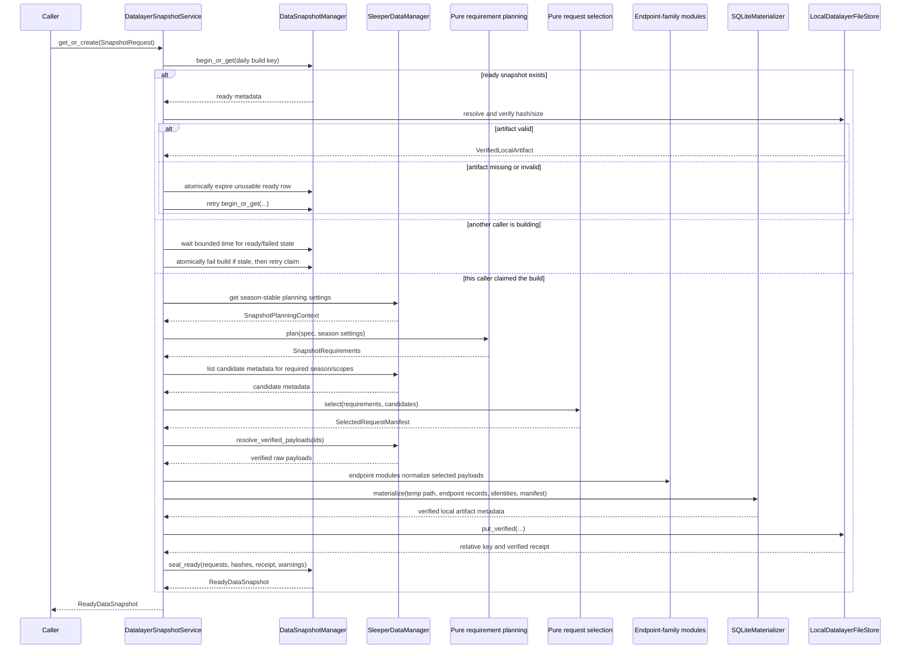

# Frozen Snapshots and Reporter Query Runtime

## Purpose

A data snapshot is the exact factual world available to one or more compatible
generations. It is not merely a SQL filter over the latest PostgreSQL tables. It
consists of:

- an explicit cutoff contract;
- one selected complete API request per required endpoint scope;
- one snapshot projection version covering normalization, derivation, and
  SQLite compatibility;
- a content-addressed, read-only SQLite artifact;
- completeness/reconstruction warnings;
- immutable per-request response hashes plus the final artifact hash.

PostgreSQL remains the source of truth. The SQLite file is a reproducibility and
future-data safety artifact. It also preserves the existing reporter query
schema without requiring every legacy derived table to become a persistent
PostgreSQL projection.

## Boundary Semantics

The datalayer accepts a week boundary and a daily reuse label, not a mode label:

- `through_week` is the last fantasy week whose week-scoped facts may appear;
- `as_of_date` groups compatible builds under one caller-chosen calendar date.

Generation policy translates user intent into those values:

| Generation intent | `through_week` | `as_of_date` |
| --- | --- | --- |
| Live/current | Current effective week | Current date |
| Historical replay | Requested historical week | Generation-selected reuse date |
| Retrospective correction | Requested earlier week | Present or another later date |

Two generation intents with identical week/date inputs can and should reuse
the same snapshot. Intent remains on the generation rather than creating
duplicate factual artifacts.

`as_of_date` is not a source-request eligibility boundary. After claiming a
build, the service selects the latest complete requests visible when each
candidate read executes, including later backfills for an earlier football
week. `through_week` remains the factual domain cutoff: a Week 9 matchup request
cannot enter a Week 8 snapshot.

The date is deliberately a coarse reuse bucket, not a claim about what the
system knew by the end of that date. During healthy reuse, the first ready
snapshot wins and observations completed after it became ready do not replace
it; callers normally choose another date label when they want another identity.
Recovery after failure or expiration may reselect within the same daily bucket;
that coarsening is an explicit tradeoff. Request start time may rank complete
candidates within one scope, but no request timestamp maps into `as_of_date` or
affects identity or eligibility.

Selection is endpoint-aware:

- week-scoped endpoints such as `matchups:8` and `transactions:8` describe a
  bounded domain week;
- current-state endpoints such as rosters, users, players, and league metadata
  describe what Sleeper returned when AIdam made that request;
- the materializer derives or suppresses current-state fields that would claim
  state after `through_week`. For example, Week 8 lineup membership
  comes from the selected Week 8 matchup payload, not from a Week 10 rosters
  response.

V1 does not accept an instant-based domain or observation cutoff. The source
data needed to reconstruct matchups, transactions, lineups, and standings is
week-scoped, and the datalayer does not need timestamp-level simulation
precision. Exact knowledge-time replay is deliberately outside this contract.

## Build Flow



If any step after claiming a build fails, the service marks the
snapshot failed with a sanitized category/summary. A failed build is never
reused. Temporary SQLite files are created in a task-specific temporary
directory and atomically moved into the configured local snapshot directory
after verification.

`begin_or_get()` is backed by a partial unique constraint for active `building`
and `ready` rows. If another local caller owns the same build, the service waits
for a bounded interval rather than starting duplicate work. When the row is
older than the service-owned stale threshold, the manager atomically changes it
to failed and the service retries the claim. A non-stale build that does not
finish within the request's wait budget produces `SnapshotUnavailable`; the
caller is never asked whether to steal, wait, or retry the build.

The manager operations that claim/reuse identity and seal readiness are atomic;
the overall build is intentionally not one database transaction. Candidate
reads, payload verification, normalization, SQLite work, and local-file writes
happen between those operations. If the content-addressed file write succeeds
but sealing fails, the file is a harmless unreferenced orphan. V1 retains it
rather than adding a reference-aware cleanup workflow.

## Required Request Set

V1 assumes structural league settings remain stable within one competition
season. `SleeperDataManager` returns a season-scoped `SnapshotPlanningContext`
from the current normalized league configuration; a pure planner expands that
context and the `SnapshotRequest` into explicit `SnapshotRequirements` using
the shared `EndpointKind` and `ScopeKey` vocabulary. These planning settings
decide obligations such as draft-pick and bracket scopes but are not represented
as historical cutoff facts. The selected league response still supplies the
artifact's league content and provenance.

The selector never infers that a conditional scope was optional merely because
no request candidate exists. Historical midseason settings changes are
deliberately unsupported in v1; supporting them later requires versioned
settings observations and a snapshot-projection-version change.

For the initial single-season artifact:

- one league response;
- one league-users response;
- one latest complete league-rosters response;
- one NFL-state response when required for provenance;
- one player-catalog response;
- one matchup response for every included week;
- one transaction response for every included week, including authoritative
  empty lists;
- the traded-picks response when the league has draft rounds;
- winners/losers bracket responses only when relevant under `through_week` and
  season-stable settings.

The request manifest assigns each selected request a stable selection role.
Requiredness comes from the snapshot request and league settings—not from
whichever scopes happen to exist.

If required scopes are missing, ordinary builds fail with
`SnapshotUnavailable` listing safe scope metadata. Missing required input is not
a configurable warning. Completeness warnings are reserved for known
reconstruction limits in otherwise valid snapshots.

## Request Selection

The selector is a pure function over candidate metadata. It never loads payload
bodies or queries current normalized tables.

Eligibility requires:

- request `status == succeeded`;
- `is_complete == true`;
- verified payload ID and matching response hash;
- exact scope/season agreement;
- endpoint week at or before `through_week`;
- bracket relevance compatible with `through_week` and season settings;
- global scope only for explicitly global endpoint kinds.

For current-state payloads fetched after `through_week`, eligibility does not
mean every field can be copied into the artifact. The materializer has an
explicit cutoff policy per target table:

- weekly membership and starter/bench roles come from matchup payloads;
- standings and scores are derived only through `through_week`;
- later roster membership and later record totals are not copied as cutoff
  truth;
- reference/display fields may be retained;
- unreconstructable volatile fields are null/absent and produce a structured
  warning rather than silently leaking later state.

This copy/derive/omit classification is defined only in the endpoint's snapshot
projection. Selection does not know field policy, and generic leakage checks do
not maintain a second field list. Projection unit tests and its emitted warnings
are the evidence for field-level safety.

Within a scope, the latest eligible observation is selected by request start
time, then request ID. Start time prevents out-of-order completions from
reversing source order.

The manifest contains a deterministic ordered entry for every selected request,
including request ID, scope key, selection role, response hash, and endpoint
kind. Those exact entries are sealed for audit/replay and embedded as
provenance. No aggregate selected-request-set hash is computed or used in
snapshot identity.

## Worked Week 8 Cases

A “Week 8 snapshot” is incomplete terminology. The caller must also provide a
daily reuse label.

### Week 8 data observed during Week 8

Assume AIdam captured league/users/rosters/player data and the Week 1–8 matchup
and transaction endpoints by Sunday night of Week 8.

For:

```text
through_week = 8
as_of_date = caller-chosen Week 8 reuse label
```

the selector chooses the latest complete request for every required scope that
is visible when the post-claim candidate read executes. The materializer builds
games and standings through Week 8, uses Week 8 matchup data for cutoff
roster/lineup membership, and omits all Week 9+ endpoint scopes.

### Week 8 endpoint fetched for the first time during Week 10

Suppose the only Week 8 matchup request is a Week 10 call to
`/league/.../matchups/8`.

- A new or recovery Week 8 build may use it because the response is explicitly
  scoped to the Week 8 domain; `as_of_date` does not pretend the request was
  observed earlier.
- A healthy ready snapshot with the same daily key is still reused rather than
  silently upgraded with the backfill.
- A request to `/matchups/10` can never substitute for `/matchups/8`, regardless
  of generation intent or calendar label.

### Only current-state roster data was captured during Week 10

A Week 10 `/rosters` response may provide current identities and
display/reference metadata to a Week 8 rebuild, but the snapshot must not copy
Week 10 membership or record totals as Week 8 truth.
Week 8 lineup membership comes from `matchups:8`; standings are derived through
Week 8.

If no eligible request supplies a required identity/reference scope, the
snapshot fails. There is no ordinary incomplete-build flag.

This is why raw request history is still useful: the build seals exact replay
provenance and can choose corrected week-scoped responses without treating the
latest PostgreSQL normalized row as historical truth.

## Snapshot Reuse

Before request selection, `get_or_create()` computes one canonical build key
from:

- primary competition season;
- validated `through_week`;
- `as_of_date`;
- snapshot projection version.

The database partially constrains that build key across active `building` and
`ready` rows. Failed and expired attempts remain auditable while allowing a
replacement build. A ready snapshot is reusable only while its artifact remains
available and hash-verifiable; otherwise the manager atomically expires it and
the service retries the claim. Code revision is stored for audit but is not part
of the key; code changes that affect output must bump the snapshot projection
version.

The key deliberately omits exact request membership. While a ready artifact is
healthy, later observations do not replace it; callers normally choose another
date label to request another identity. Failed or expired recovery may reselect
newer eligible membership under the same intentionally coarse daily identity.
Exact membership and individual response hashes remain immutable audit/replay
data on each ready row.
Changes to requirement planning or request-selection policy must bump the
snapshot projection version just like normalization, derivation, cutoff-policy,
or SQLite-schema changes.

Artifact SHA-256 verifies bytes but does not define the daily reuse identity. The
active-key constraint prevents concurrent duplicate rows/work instead of
declaring them harmless.

## Payload Replay

The service resolves only payloads listed in the selected manifest. Each payload
is verified against its recorded SHA-256 and byte length before parsing. Inline
JSON and locally file-stored payloads become the same `VerifiedPayload`
abstraction.

Snapshot replay uses the endpoint normalization and projection logic pinned by
the snapshot projection version; it does not reuse the version that happened to
populate the PostgreSQL current view. This
lets old raw payloads benefit from a corrected normalizer without pretending to
reproduce a prior buggy interpretation. Exact code/version inputs in the
generation manifest make that distinction auditable.

## SQLite Schema

The artifact intentionally retains legacy reporter table names and provider IDs
so existing curated SQL can be moved with minimal change:

- `leagues`;
- `season_context`;
- `users`;
- `rosters`;
- `roster_players`;
- `team_profiles`;
- `draft_picks`;
- `players`;
- `matchups`;
- `player_performances`;
- `games`;
- `standings`;
- `transactions`;
- `transaction_moves`;
- `playoff_matchups`;
- `snapshot_metadata` (new).

Internal UUID columns may be added alongside the existing `league_id`,
`roster_id`, and `player_id` columns:

- `competition_id`;
- `competition_season_id`;
- `franchise_id`;
- `season_roster_id`.

The initial curated queries continue to scope to one Sleeper league/season.
Internal IDs support unambiguous tool results and future queries without
silently combining multiple seasons now.

### Snapshot metadata table

The file contains exactly one `snapshot_metadata` row with:

- canonical build key, competition ID, and primary season ID;
- Sleeper league ID and season year;
- `through_week` and `as_of_date`;
- ordered selected-request provenance with individual response hashes;
- snapshot projection version;
- structured completeness warning JSON.

Snapshot-row UUID, creation time, and deployed code revision remain in
PostgreSQL and are deliberately omitted from the file. This lets equivalent
builds produce equivalent bytes while allowing the runtime to reject a valid
SQLite file with the wrong expected build key.

## Deterministic Materialization

The materializer:

1. creates a new file using the declared snapshot projection version;
2. inserts endpoint records in stable key order;
3. derives snapshot-only facts from explicit selected endpoint records;
4. inserts snapshot metadata;
5. runs integrity and leakage checks;
6. closes the connection and computes file hash/size;
7. reopens read-only for verification before returning.

It accepts no PostgreSQL manager or connection. Determinism excludes volatile
instance values such as snapshot UUID and creation time from the file.
The materializer's temporary-file hash and size prove its output; the local file
store independently verifies and moves those bytes, and its stored receipt is
the authoritative artifact metadata passed to `seal_ready()`. The manager owns
database membership/sealing, while the materializer only embeds the selector's
manifest as SQLite provenance.

### Snapshot-only derivations

The following legacy logic is retained and extracted into pure functions:

- pair matchup rows into `games` without assuming malformed groups have exactly
  two members;
- compute standings through `through_week`;
- interpret league-average-match record strings;
- derive cutoff-safe team/manager profiles from selected users and rosters;
- seed draft-pick coordinates and apply selected traded-pick ownership;
- derive starter/bench roster snapshots from weekly matchup payloads;
- record `effective_week` from the snapshot request rather than the machine's
  current Sleeper state.

Weekly matchup payloads support historically faithful starter/bench membership.
They do not establish exact taxi/IR or intra-week ownership. Such limitations
are explicit reconstruction warnings rather than invented precision.

## Leakage Verification

A snapshot is not ready until automated checks prove:

- no matchup, transaction, performance, game, standing, or bracket row exceeds
  `through_week`;
- every source-backed row traces to a selected request scope;
- the artifact contains only the primary competition season plus declared
  global resources;
- roster/franchise mappings belong to the same competition;
- required tables and the one metadata row exist;
- `PRAGMA integrity_check` succeeds before the file is sealed;
- the final content hash matches the atomically stored local-file receipt.

These are build-time checks. They complement, rather than replace, the
PostgreSQL constraints on ready snapshot metadata and membership.

## Artifact Resolution Inside the Snapshot Service

The reporter does not receive a database storage key. Before
`get_or_create()` returns, the snapshot service:

1. loads the ready snapshot resource in the generation's competition scope;
2. resolves the artifact's relative key under the configured local data root;
3. verifies byte length and SHA-256;
4. makes the verified immutable file available for the duration of the run;
5. returns `ReadyDataSnapshot` with a `VerifiedLocalArtifact`.

In v1 the content-addressed file is already local, so resolution does not copy or
download it. If API and worker processes are separated, they must share the
configured data directory. A future hosted deployment can replace this seam
with shared storage without changing snapshot identity or query runtime.

## `FrozenLeagueData`

`FrozenLeagueData.open(ready_snapshot)`:

- uses SQLite read-only immutable mode;
- validates snapshot projection version against supported versions;
- compares the internal build key and projection version with the expected
  values on `ReadyDataSnapshot`;
- opens one query connection for the context lifetime;
- exposes only curated methods and guarded SQL;
- closes deterministically at context exit.

It has no `load()`, `save_to_file()`, source client, or week override. The
effective week and all identity come from sealed metadata.

The existing `get_roster_current()` name should become
`get_roster_at_cutoff()` because “current” inside this runtime always means the
snapshot boundary, not current PostgreSQL state.

## Curated Query Compatibility

The current query modules are moved under `services/datalayer/query/curated/`
with focused changes:

- preserve familiar result shapes and `found` semantics;
- use snapshot metadata rather than facade configuration for league/week;
- include stable competition/franchise IDs where helpful and non-breaking;
- normalize `Decimal` values at the JSON/tool boundary;
- make every SQL statement explicitly single-season scoped;
- add query-contract tests against legacy fixture expectations.

Tool schemas and descriptions belong to the reporter. This prevents factual
query code from depending on the agent framework while still preserving the
tool behavior.

## Guarded SQL

The SQL escape hatch remains because it is a core reporter strength, but the
runtime boundary is hardened:

- connection is SQLite read-only/immutable;
- only one SQL statement is accepted;
- statement must be a read query (`SELECT` or approved `WITH ... SELECT`);
- attach/detach, pragma, DDL, DML, extension loading, and filesystem features are
  rejected;
- row limit and execution deadline are enforced by the runtime, not trusted to
  prompt instructions;
- returned rows are JSON-safe and the full tool result is recorded by reporting
  instrumentation.

The legacy keyword check is a useful starting point but is not by itself the
complete platform guard. Tests include comments, quoted strings, CTEs, multiple
statements, oversized results, and attempts to inspect attached databases.

## Retention

Ready snapshot membership and meaning are immutable. V1 performs no proactive
snapshot or orphan deletion: healthy ready artifacts and benign unreferenced
content-addressed files are retained. If a ready artifact is missing or corrupt,
the service marks its snapshot expired while preserving request membership,
hashes, versions, and the visible loss of availability for audit. The expired
row no longer participates in active build-key uniqueness, so a later
`get_or_create()` can reselect and produce a replacement artifact with the same
coarse daily key. Reference-aware retention can be added later as a separate
operator workflow.
