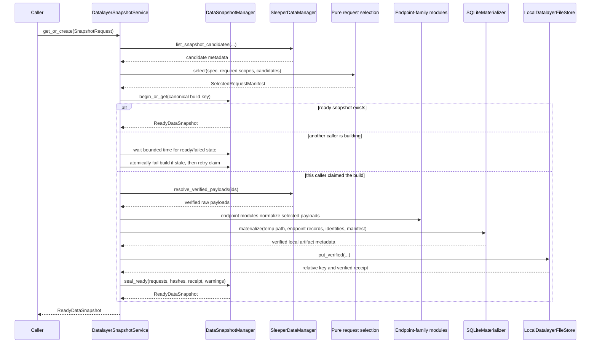

# Frozen Snapshots and Reporter Query Runtime

## Purpose

A data snapshot is the exact factual world available to one or more compatible
generations. It is not merely a SQL filter over the latest PostgreSQL tables. It
consists of:

- an explicit cutoff contract;
- one selected complete API request per required endpoint scope;
- one snapshot projection version covering normalization, derivation, and
  SQLite compatibility;
- a content-addressed, read-only SQLite artifact;
- completeness/reconstruction warnings;
- immutable hashes tying those pieces together.

PostgreSQL remains the source of truth. The SQLite file is a reproducibility and
future-data safety artifact. It also preserves the existing reporter query
schema without requiring every legacy derived table to become a persistent
PostgreSQL projection.

## Boundary Semantics

The datalayer accepts factual boundaries, not a mode label:

- `through_week` is the last fantasy week whose week-scoped facts may appear;
- `observed_through` is the latest time at which an API request could have
  completed and remained eligible.

Generation policy translates user intent into those values:

| Generation intent | `through_week` | `observed_through` |
| --- | --- | --- |
| Live/current | Current effective week | Current time |
| Historical replay | Requested historical week | Historical instant being simulated |
| Retrospective correction | Requested earlier week | Present or another later correction time |

Two generation intents with identical factual boundaries can and should reuse
the same snapshot. Intent remains on the generation rather than creating
duplicate factual artifacts.

Every snapshot excludes requests completed after `observed_through` and
endpoint scopes after `through_week`. A Week 9 matchup request cannot
enter a Week 8 snapshot. A Week 8 roster, user, player, or bracket response
observed after the observation boundary is also unavailable even if its rows
appear innocuous.

A week alone never implies an observation timestamp.

Selection is endpoint-aware:

- week-scoped endpoints such as `matchups:8` and `transactions:8` describe a
  bounded domain week;
- current-state endpoints such as rosters, users, players, and league metadata
  describe what Sleeper returned when AIdam made that request;
- the materializer derives or suppresses current-state fields that would claim
  state after `through_week`. For example, Week 8 lineup membership
  comes from the selected Week 8 matchup payload, not from a Week 10 rosters
  response.

V1 does not accept an instant-based domain cutoff. The source data needed to
reconstruct matchups, transactions, lineups, and standings is week-scoped, and
the datalayer does not yet have trustworthy intra-week rules. An instant
variant should be added only when the service can own those rules without
making callers choose projection details.

## Build Flow



If any step after claiming a build fails, the service marks the
snapshot failed with a sanitized category/summary. A failed build is never
reused. Temporary SQLite files are created in a task-specific temporary
directory and atomically moved into the configured local snapshot directory
after verification.

`begin_or_get()` is backed by a partial unique constraint for active `building`
and `ready` rows. If another local caller owns the same build, the service waits
for a bounded interval rather than starting duplicate work. When the row is
older than the service-owned stale threshold, the manager atomically changes it
to failed and the service retries the claim. A non-stale build that does not
finish within the request's wait budget produces `SnapshotUnavailable`; the
caller is never asked whether to steal, wait, or retry the build.

## Required Request Set

The selector expands a `SnapshotRequest` into explicit required scopes using
the shared `EndpointKind` and `ScopeKey` vocabulary.

For the initial single-season artifact:

- one league response;
- one league-users response;
- one league-rosters response eligible for the cutoff;
- one NFL-state response when required for provenance;
- one player-catalog response;
- one matchup response for every included week;
- one transaction response for every included week, including authoritative
  empty lists;
- the traded-picks response when the league has draft rounds;
- winners/losers bracket responses only when the bracket is relevant and could
  have been known by the cutoff.

The request manifest assigns each selected request a stable selection role.
Requiredness comes from the snapshot request and league settings—not from
whichever scopes happen to exist.

If required scopes are missing, ordinary builds fail with
`SnapshotUnavailable` listing safe scope metadata. Missing required input is not
a configurable warning. Completeness warnings are reserved for known
reconstruction limits in otherwise valid snapshots.

## Request Selection

The selector is a pure function over candidate metadata. It never loads payload
bodies or queries current normalized tables.

Eligibility requires:

- request `status == succeeded`;
- `is_complete == true`;
- verified payload ID and matching response hash;
- exact scope/season agreement;
- completion at or before `observed_through`;
- endpoint week at or before `through_week`;
- bracket timing compatible with `through_week` and `observed_through`;
- global scope only for explicitly global endpoint kinds.

For current-state payloads selected after `through_week` but before
`observed_through`, eligibility does not mean every field can be copied into
the artifact. The materializer has an explicit cutoff policy per target table:

- weekly membership and starter/bench roles come from matchup payloads;
- standings and scores are derived only through `through_week`;
- later roster membership and later record totals are not copied as cutoff
  truth;
- reference/display fields known by the observation boundary may be retained;
- unreconstructable volatile fields are null/absent and produce a structured
  warning rather than silently leaking later state.

This copy/derive/omit classification is defined only in the endpoint's snapshot
projection. Selection does not know field policy, and generic leakage checks do
not maintain a second field list. Projection unit tests and its emitted warnings
are the evidence for field-level safety.

Within a scope, the latest eligible observation is selected by request start
time, then request ID. Completion time remains the observation gate,
while start time prevents out-of-order completions from reversing source order.

The manifest is canonicalized and hashed from ordered entries containing at
least request ID, scope key, selection role, response hash, and endpoint kind.
This `selected_request_set_sha256` is not a hash of query results; it identifies
the exact source membership.

## Worked Week 8 Cases

A “Week 8 snapshot” is incomplete terminology. The caller must also provide an
observation boundary.

### Week 8 data observed during Week 8

Assume AIdam captured league/users/rosters/player data and the Week 1–8 matchup
and transaction endpoints by Sunday night of Week 8.

For:

```text
through_week = 8
observed_through = end of Week 8
```

the selector chooses the latest complete request for every required scope that
finished by that timestamp. The materializer builds games and standings through
Week 8, uses Week 8 matchup data for cutoff roster/lineup membership, and omits
all Week 9+ endpoint scopes.

### Week 8 endpoint fetched for the first time during Week 10

Suppose the only Week 8 matchup request is a Week 10 call to
`/league/.../matchups/8`.

- A snapshot observed only through the end of Week 8 cannot use
  it. The required `matchups:<season>:8` scope is missing, so an ordinary build
  fails rather than guessing from the PostgreSQL current view.
- A Week 8 snapshot observed through Week 10 may use
  it because the response is specifically scoped to the Week 8 domain.
- A request to `/matchups/10` can never substitute for `/matchups/8`, regardless
  of generation intent or observation boundary.

### Only current-state roster data was captured during Week 10

A Week 10 `/rosters` response is unavailable to a snapshot observed only through
Week 8. If the observation boundary is Week 10, the request may
provide identities and display/reference metadata that AIdam knew by then, but
the snapshot must not copy Week 10 membership or record totals as Week 8 truth.
Week 8 lineup membership comes from `matchups:8`; standings are derived through
Week 8.

If no eligible request supplies a required identity/reference scope, the
snapshot fails. There is no ordinary incomplete-build flag.

This is why raw request history is essential: the latest PostgreSQL normalized
row alone cannot answer when AIdam observed a value or whether it was safe for a
particular cutoff.

## Snapshot Reuse

`get_or_create()` computes one canonical build key from:

- primary competition season;
- validated `through_week` and `observed_through`;
- exact selected request-set hash;
- snapshot projection version.

The database partially constrains that build key across active `building` and
`ready` rows. Failed and expired attempts remain auditable while allowing a
replacement build. A ready snapshot is reusable only while its artifact remains
available and hash-verifiable; otherwise the manager atomically expires it and
the service retries the claim. Code revision is stored for audit but is not part
of the key; code changes that affect output must bump the snapshot projection
version.

Artifact SHA-256 verifies bytes but is not the semantic build identity. The
active-key constraint prevents concurrent duplicate rows/work instead of
declaring them harmless.

## Payload Replay

The service resolves only payloads listed in the selected manifest. Each payload
is verified against its recorded SHA-256 and byte length before parsing. Inline
JSON and locally file-stored payloads become the same `VerifiedPayload`
abstraction.

Snapshot replay uses the endpoint normalization and projection logic pinned by
the snapshot projection version; it does not reuse the version that happened to
populate the PostgreSQL current view. This
lets old raw payloads benefit from a corrected normalizer without pretending to
reproduce a prior buggy interpretation. Exact code/version inputs in the
generation manifest make that distinction auditable.

## SQLite Schema

The artifact intentionally retains legacy reporter table names and provider IDs
so existing curated SQL can be moved with minimal change:

- `leagues`;
- `season_context`;
- `users`;
- `rosters`;
- `roster_players`;
- `team_profiles`;
- `draft_picks`;
- `players`;
- `matchups`;
- `player_performances`;
- `games`;
- `standings`;
- `transactions`;
- `transaction_moves`;
- `playoff_matchups`;
- `snapshot_metadata` (new).

Internal UUID columns may be added alongside the existing `league_id`,
`roster_id`, and `player_id` columns:

- `competition_id`;
- `competition_season_id`;
- `franchise_id`;
- `season_roster_id`.

The initial curated queries continue to scope to one Sleeper league/season.
Internal IDs support unambiguous tool results and future queries without
silently combining multiple seasons now.

### Snapshot metadata table

The file contains exactly one `snapshot_metadata` row with:

- canonical build key, competition ID, and primary season ID;
- Sleeper league ID and season year;
- `through_week` and `observed_through`;
- selected-request-set hash;
- snapshot projection version;
- structured completeness warning JSON.

Snapshot-row UUID, creation time, and deployed code revision remain in
PostgreSQL and are deliberately omitted from the file. This lets equivalent
builds produce equivalent bytes while allowing the runtime to reject a valid
SQLite file with the wrong semantic build key.

## Deterministic Materialization

The materializer:

1. creates a new file using the declared snapshot projection version;
2. inserts endpoint records in stable key order;
3. derives snapshot-only facts from explicit selected endpoint records;
4. inserts snapshot metadata;
5. runs integrity and leakage checks;
6. closes the connection and computes file hash/size;
7. reopens read-only for verification before returning.

It accepts no PostgreSQL manager or connection. Determinism excludes volatile
instance values such as snapshot UUID and creation time from the file.

### Snapshot-only derivations

The following legacy logic is retained and extracted into pure functions:

- pair matchup rows into `games` without assuming malformed groups have exactly
  two members;
- compute standings through `through_week`;
- interpret league-average-match record strings;
- derive current-as-of-cutoff team/manager profiles from selected users and
  rosters;
- seed draft-pick coordinates and apply selected traded-pick ownership;
- derive starter/bench roster snapshots from weekly matchup payloads;
- record `effective_week` from the snapshot request rather than the machine's
  current Sleeper state.

Weekly matchup payloads support historically faithful starter/bench membership.
They do not establish exact taxi/IR or intra-week ownership. Such limitations
are explicit reconstruction warnings rather than invented precision.

## Leakage Verification

A snapshot is not ready until automated checks prove:

- no matchup, transaction, performance, game, standing, or bracket row exceeds
  `through_week`;
- every source-backed row traces to a selected request scope;
- no request completed after the snapshot's observation boundary;
- the artifact contains only the primary competition season plus declared
  global resources;
- roster/franchise mappings belong to the same competition;
- required tables and the one metadata row exist;
- `PRAGMA integrity_check` succeeds before the file is sealed;
- the final content hash matches the atomically stored local-file receipt.

These are build-time checks. They complement, rather than replace, the
PostgreSQL constraints on ready snapshot metadata and membership.

## Artifact Resolution Inside the Snapshot Service

The reporter does not receive a database storage key. Before
`get_or_create()` returns, the snapshot service:

1. loads the ready snapshot resource in the generation's competition scope;
2. resolves the artifact's relative key under the configured local data root;
3. verifies byte length and SHA-256;
4. makes the verified immutable file available for the duration of the run;
5. returns `ReadyDataSnapshot` with a `VerifiedLocalArtifact`.

In v1 the content-addressed file is already local, so resolution does not copy or
download it. If API and worker processes are separated, they must share the
configured data directory. A future hosted deployment can replace this seam
with shared storage without changing snapshot identity or query runtime.

## `FrozenLeagueData`

`FrozenLeagueData.open()`:

- uses SQLite read-only immutable mode;
- validates snapshot projection version against supported versions;
- compares the internal build key with `VerifiedLocalArtifact`;
- opens one query connection for the context lifetime;
- exposes only curated methods and guarded SQL;
- closes deterministically at context exit.

It has no `load()`, `save_to_file()`, source client, or week override. The
effective week and all identity come from sealed metadata.

The existing `get_roster_current()` name should become
`get_roster_at_cutoff()` because “current” inside this runtime always means the
snapshot boundary, not current PostgreSQL state.

## Curated Query Compatibility

The current query modules are moved under `services/datalayer/query/curated/`
with focused changes:

- preserve familiar result shapes and `found` semantics;
- use snapshot metadata rather than facade configuration for league/week;
- include stable competition/franchise IDs where helpful and non-breaking;
- normalize `Decimal` values at the JSON/tool boundary;
- make every SQL statement explicitly single-season scoped;
- add query-contract tests against legacy fixture expectations.

Tool schemas and descriptions belong to the reporter. This prevents factual
query code from depending on the agent framework while still preserving the
tool behavior.

## Guarded SQL

The SQL escape hatch remains because it is a core reporter strength, but the
runtime boundary is hardened:

- connection is SQLite read-only/immutable;
- only one SQL statement is accepted;
- statement must be a read query (`SELECT` or approved `WITH ... SELECT`);
- attach/detach, pragma, DDL, DML, extension loading, and filesystem features are
  rejected;
- row limit and execution deadline are enforced by the runtime, not trusted to
  prompt instructions;
- returned rows are JSON-safe and the full tool result is recorded by reporting
  instrumentation.

The legacy keyword check is a useful starting point but is not by itself the
complete platform guard. Tests include comments, quoted strings, CTEs, multiple
statements, oversized results, and attempts to inspect attached databases.

## Retention

Ready snapshot membership and meaning are immutable. An artifact remains
available while referenced by a generation. Retention may mark an unreferenced
snapshot expired and remove its artifact bytes, but request membership, hashes,
versions, and the visible loss of artifact availability remain auditable. The
expired row no longer participates in active build-key uniqueness, so a later
`get_or_create()` can produce a replacement artifact with the same semantic
key.
