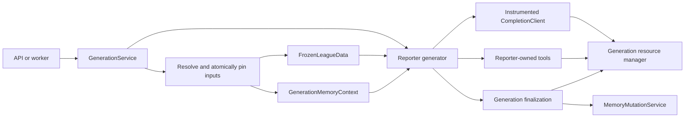

# Generation and Reporter Architecture Plan

**Status:** Proposed architecture contract for the generation implementation stack

**Scope:** `backend/services/generations`, `backend/services/reporter`, the
reporting resource layer, generation API/worker boundaries, and the adapters to
frozen datalayer and typed memory

**Authoritative persistence baseline:**
[`docs/database/reporting.md`](../database/reporting.md)

**Required upstream contracts:**
[`docs/datalayer/application-contracts.md`](../datalayer/application-contracts.md)
and [`docs/memory/application-contracts.md`](../memory/application-contracts.md)

## Purpose

This design copies Reporter V2 into a new platform reporter package without
redesigning the working generator loop. The legacy `reporter_v2` package remains
unchanged as a characterization baseline until the new path is proven and cut
over. The target is a thin platform shell around that proven behavior:

- `GenerationService` owns durable workflow and input policy;
- the reporter owns model-facing prompts, generic artifact tools, path-addressed
  Markdown artifacts, and the agent loop;
- a frozen `FrozenLeagueData` instance supplies all factual reads;
- one `GenerationMemoryContext` supplies pinned retrieval and buffered typed
  memory proposals;
- reporting resource managers persist generation state, provider attempts,
  tool executions, token usage, and artifact versions; and
- the API and worker remain process boundaries, not alternate workflow owners.

The compatibility goal is behavioral continuity. Existing model-facing tool
names and schemas remain unchanged where the new dependency has equivalent
semantics. An adapter must not pretend equivalence where typed memory or durable
identity changed the meaning of an operation.

## Documents

| Document | Owns |
| --- | --- |
| [`architecture.md`](architecture.md) | Component boundaries, package shape, dependencies, lifecycle, and observability placement |
| [`application-contracts.md`](application-contracts.md) | Generation, reporter, manager, adapter, artifact, model-call, and API contracts |
| [`transition.md`](transition.md) | Reporter V2 reuse map and tool-by-tool compatibility decisions |
| [`implementation-plan.md`](implementation-plan.md) | Ordered PR stack, dependencies, acceptance coverage, and blocking decisions |

## One-Sentence Model

A generation seals one factual snapshot and one memory revision, runs the
reporter through instrumented model and tool boundaries, then pins the exact
submitted artifact version on the generation and applies its buffered memory
proposals under the generation lifecycle.

## Settled Direction

- Keep `generate_article`, `Runner`, `CompletionClient`, `ToolRegistry`, prompts,
  procedures, and model-facing non-artifact/non-memory tool contracts
  behaviorally intact.
- Create a new reporter copy under `backend/services/reporter/` as the platform
  design already specifies. Copy and characterize first; do not retrofit the
  legacy `reporter_v2` package in place.
- Put generation lifecycle under one
  `backend/services/generations/GenerationService`. The reporter never creates,
  starts, succeeds, or fails a durable generation row.
- Keep tool definitions reporter-owned. The datalayer and memory services do
  not import reporter code.
- Give the reporter an already-open frozen data runtime and an already-pinned
  generation memory context. It does not refresh Sleeper, select a snapshot, or
  pin canonical memory.
- Extend the model adapter at the provider-attempt boundary so retries and
  fallbacks each produce their own AI-call record and token usage.
- Record tool execution at the runner boundary. Preserve `RunLog` for local
  diagnostics, but do not use its truncated summaries as durable audit data.
- Replace section-specific brief/article state with one path-addressed in-memory
  artifact store. The model-facing contract is `list_artifacts`,
  `read_artifact`, `create_artifact`, exact-match `edit_artifact`, and
  revision-checked `submit_artifact`.
- Use raw UTF-8 Markdown artifacts; coalesce successful mutations by artifact
  within each model turn and mirror the final turn snapshot to one immutable
  version. Finalize by selecting an existing version rather than writing a
  final copy. Paths such as `research_brief.md` and `article.md` are
  reporter-owned conventions, never application query keys.
- Store the exact submitted finalized artifact version on the generation. The
  application discovers generated articles through this pointer, independently
  of the logical path chosen inside the reporter loop.
- Keep every database transaction short. No database session stays open during
  Sleeper I/O, model calls, tool execution, or filesystem work.
- Use the existing resource-manager pattern. Services orchestrate managers and
  resource objects; neither the reporter nor `GenerationService` imports ORM
  models or opens SQLAlchemy sessions.

## Naming Boundary

`generation` and `reporter` are related but not interchangeable:

| Component | Meaning |
| --- | --- |
| Generation | Durable product execution: request, ownership/scope, input manifest, state, telemetry, artifacts, and finalization |
| Reporter | In-process content engine: prompts, loop, tools, path-addressed Markdown state, and model interaction |

For that reason the design belongs in `docs/generation/`, while the code remains
split between `services/generations/` and `services/reporter/`. Putting both
under `core` would blur identity, orchestration, and content-generation policy.

## Non-Goals

- Redesigning the single-loop reporter or replacing LiteLLM in the first port.
- Letting the reporter query PostgreSQL or resolve its own snapshot.
- Adding a generic workflow engine, job leases, heartbeats, event bus, or
  automatic crash resume.
- Storing model pricing or historical dollar cost.
- Reintroducing legacy memory as a second write authority.
- Preserving a memory tool name when its old behavior conflicts with typed,
  revision-pinned memory.
- Designing product-user identity by inference from Sleeper users.

## Known Contract Gaps

These are explicit design questions, not implied implementation details:

1. **Product users are not modeled.** `LocalUserActor` has no identifier,
   `reporting.generations` has no requester/owner field, and core explicitly
   says Sleeper users are not product users. Durable per-user generation history
   needs a separate identity/ownership decision.
2. **Typed memory cannot preserve every legacy tool one-to-one.** Access-history,
   generic event payloads, string-key upserts, and candidate expansion do not all
   exist in the new contract. The exact decisions are listed in
   [`transition.md`](transition.md#memory-tool-compatibility).
3. **Generation success uses one database transaction.** The generation
   finalizer reuses session-bound resource operations to commit canonical memory,
   finalize the selected existing artifact version, and succeed the generation
   atomically. Failure leaves all three success outputs uncommitted.
4. **The closed reporter-adapter PR is prior art, not an upstream dependency.**
   It proved the 18 frozen-data handlers can delegate to `FrozenLeagueData`, but
   the new integration must recreate that adapter under the new backend reporter
   package and verify it against current `main`.
