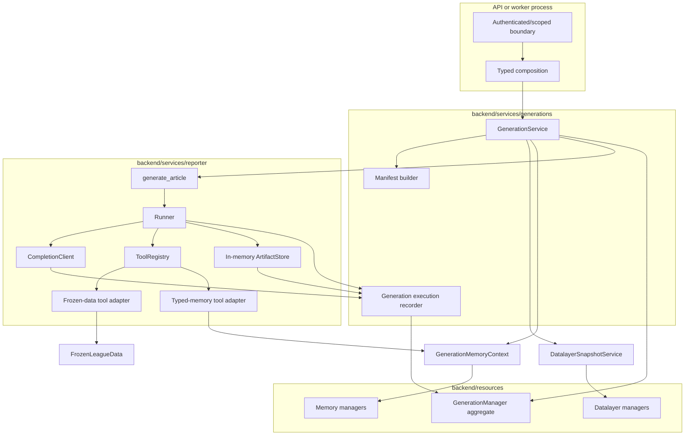

# Generation Component Architecture

## Goals

- Port the working Reporter V2 engine with minimal behavioral churn.
- Make one generation reproducible from immutable data, memory, prompt, tool,
  model, and runner inputs.
- Persist every provider attempt, full tool execution, token category, and
  versioned article mutation at the boundary where it occurs.
- Keep resource persistence, workflow policy, and reporter behavior in separate
  layers.
- Make live generation, explicit reruns, and later evaluation workspaces use the
  same reporter engine.
- Preserve narrow dependency direction and short transaction ownership.

## Architectural Shape



## Ownership Boundaries

### `GenerationService`

The generation service owns the durable application workflow:

- accept a validated generation request and create its pending record;
- derive live/backtest snapshot policy without pushing that policy into the
  datalayer;
- invoke refresh only when the selected policy requires it;
- call `DatalayerSnapshotService.get_or_create()`;
- pin the current canonical memory revision or the selected evaluation memory
  artifact;
- build and hash the complete input manifest;
- atomically transition the generation from pending to running with all resolved
  inputs;
- construct one frozen data runtime, one generation memory context, one
  execution recorder, and one reporter call;
- update progress through the generation manager;
- coordinate article finalization, memory proposal handling, and terminal
  generation state; and
- translate expected workflow failures into sanitized durable failure metadata.

It does not implement the model loop, tool schemas, SQLAlchemy operations,
Sleeper endpoint behavior, memory retrieval ranking, or memory mutation SQL.

### Reporter service

The reporter owns content generation:

- `generate_article` composition for one already-resolved run;
- prompt and user-message construction;
- runner loop and procedure replacement behavior;
- tool registration and model-facing schemas;
- in-memory brief and article state;
- model retry/fallback adapter behavior; and
- a local `RunLog` diagnostic view.

It receives capabilities; it does not discover platform state. Specifically, it
must not import snapshot or refresh services, memory managers, generation ORM
models, session factories, API dependencies, or worker code.

### Generation resource aggregate

The platform architecture permits one manager to own the generation aggregate,
including its child AI calls, tool calls, artifacts, and versions. That is the
simplest baseline:

```text
centralized reporting ORM models
    -> reporting resource objects
    -> GenerationManager
    -> GenerationService / execution recorder
```

`GenerationManager` owns short, scope-checked operations for:

- pending creation and reads;
- atomic input pin/start;
- progress and terminal transitions;
- AI-call attempt start/finish;
- tool-call start/finish;
- stable artifact creation and append-only artifact versions; and
- generation detail/history reads.

Separate public managers for AI calls, tool calls, and artifact versions are not
required while those rows have no lifecycle outside a generation. Internal
modules may split the SQL by child type without creating public repositories.

### Execution recorder

The execution recorder is a generation-scoped application adapter between the
reporter execution boundaries and `GenerationManager`. It is not a generic event
bus and does not own workflow policy.

It is needed in three places:

1. `CompletionClient` records every actual provider attempt because it alone can
   see retry and fallback attempts hidden from `Runner`.
2. `Runner` records every tool request/result because it owns dispatch and
   parallel execution.
3. Artifact tools record complete artifact content after each successful
   mutation because they know when in-memory state changed.

Tests and the temporary standalone CLI may use an in-memory/no-op recorder. The
production generation path always uses the durable recorder.

## Proposed Package Layout

```text
backend/
├── resources/
│   └── generations/
│       ├── __init__.py
│       ├── objects.py          # generation aggregate and child resource objects
│       ├── manager.py          # scoped lifecycle and aggregate persistence
│       └── shared.py           # only if cross-resource finalization needs it
├── services/
│   ├── generations/
│   │   ├── __init__.py
│   │   ├── contracts.py        # non-persisted request/outcome values
│   │   ├── generation_service.py
│   │   ├── manifest.py         # deterministic manifest/hash construction
│   │   ├── recorder.py         # reporter-to-reporting persistence adapter
│   │   └── progress.py
│   └── reporter/
│       ├── __init__.py
│       ├── config.py
│       ├── generator.py        # port of article_generator.generate_article
│       ├── runner/
│       │   ├── runner.py
│       │   ├── completion.py
│       │   ├── models.py
│       │   ├── schemas.py
│       │   ├── state.py
│       │   ├── run_log.py
│       │   └── tools/
│       │       ├── registry.py
│       │       ├── context.py
│       │       ├── brief.py
│       │       ├── article.py
│       │       ├── procedures.py
│       │       ├── datalayer.py
│       │       └── memory.py
│       ├── prompts/
│       └── procedures/
├── api/
│   ├── dependencies/generations.py
│   ├── schemas/generations.py
│   └── routes/generations.py
└── worker/
    ├── main.py
    └── dependencies.py
```

Exact filenames may be adjusted to repository conventions during the initial
copy. The legacy `reporter_v2` tree is not edited during that copy. The boundary
split is the contract: resources persist, generation service orchestrates,
reporter generates, and routes/workers invoke.

## End-to-End Lifecycle

### 1. Submission

The API authenticates the caller, authorizes the competition, constructs a
`ManagerContext`, validates transport input, and asks `GenerationService` to
submit. The service creates a pending generation before doing long-running
input resolution.

The unresolved product-user question affects requester attribution here but does
not change the rest of the reporter architecture.

### 2. Input resolution

The service translates generation intent into a datalayer `SnapshotRequest`.
If policy requires refresh, it invokes refresh first and interprets the typed
outcome. It then calls `get_or_create()` and receives a `ReadyDataSnapshot`.

In parallel policy terms—but not necessarily parallel code—it pins the canonical
memory revision and resolves model, fallback, prompt, procedure, tool, runner,
and code-version inputs.

### 3. Atomic start

One manager transaction changes pending to running and pins:

- data snapshot ID;
- exactly one memory input;
- resolved week/time cutoffs;
- requested model and complete settings;
- manifest schema version, canonical manifest, and hash; and
- initial progress state.

No model call starts before this transition succeeds. Once running, those inputs
are immutable.

### 4. Reporter execution

The service opens the frozen snapshot with a context manager, creates
`GenerationMemoryContext` at the pinned revision, and calls the reporter.

The reporter:

- registers brief, article, procedure, frozen-data, and typed-memory tools;
- seeds the same brief/config shape where equivalent metadata is available;
- runs the same turn loop and procedure replacement behavior;
- records every provider attempt before/after network I/O;
- records tool calls before/after handler execution;
- appends working article artifact versions after successful mutations; and
- returns only after `submit_article` succeeds, the loop ends, or a failure
  escapes.

### 5. Finalization

`submit_article` remains a reporter-level signal, not the durable generation
commit. After reporter success, `GenerationService`:

- obtains the complete memory proposal bundle exactly once;
- persists the final article artifact version;
- persists the final brief JSON artifact;
- applies or deliberately discards the memory bundle according to generation
  kind/policy; and
- transitions the generation to succeeded only when its required final outputs
  and memory outcome satisfy the selected finalization contract.

The all-or-nothing boundary between the reporting finalization and canonical
memory commit remains an explicit open decision.

### 6. Failure and cancellation

A pre-start failure leaves a terminal generation without pinned inputs and
records the failure stage. A running failure preserves completed AI calls, tool
calls, and working artifact versions, discards the uncommitted memory buffer,
and marks the generation failed. A terminal generation never reopens; a retry
creates a linked generation.

The baseline does not resume a crashed reporter loop. A stale-running
reconciliation operation marks it failed.

## Model and Token Observability

`CompletionClient` retains retry/fallback policy. Its return behavior to
`Runner` remains the same except for the smallest internal metadata needed to
associate tool calls with the successful AI-call row.

For every attempt, instrumentation records:

- requested and actual provider/model;
- generation turn and attempt number;
- exact input messages, tools, and request parameters;
- sanitized response or error;
- finish reason and provider IDs;
- input, cached-input, output, reasoning, and total tokens when reported;
- raw provider usage JSON; and
- timing and terminal attempt status.

Missing provider token categories remain `null`; they are not guessed. The raw
usage payload is retained so a later adapter version can interpret new fields.
Dollar pricing remains an application-time analytic over recorded usage.

## Artifact Model

The in-memory `ArtifactStore` remains the reporter's fast working state. Durable
reporting artifacts mirror it at meaningful mutation boundaries:

| Artifact | Durable behavior |
| --- | --- |
| `article/main` Markdown | append a complete `working` version after each successful write/rewrite/order mutation; append one complete `final` version at successful finalization |
| `brief/main` JSON | persist one complete final version; persisting every brief mutation is optional and not required by the database baseline |
| run log | do not treat as canonical; AI/tool/artifact tables are the full audit trail |

Artifact versions use their source AI call/tool call when available. Reads do
not append versions. Failed tool mutations do not append versions.

## Dependency Rules

Allowed:

```text
api / worker -> GenerationService
GenerationService -> generation manager, datalayer services, memory services,
                     reporter service
reporter generator -> Runner and reporter-owned tool adapters
reporter data adapter -> FrozenLeagueData
reporter memory adapter -> GenerationMemoryContext
execution recorder -> GenerationManager
GenerationManager -> reporting ORM models and database infrastructure
```

Forbidden:

- reporter -> PostgreSQL session, ORM model, refresh service, snapshot manager,
  memory resource manager, API, or worker;
- generation service -> ORM model or raw SQLAlchemy session;
- datalayer or memory packages -> reporter tool schemas;
- resource manager -> model provider or Sleeper network client;
- a transaction spanning a provider call, tool handler, or complete reporter
  run; and
- the standalone `RunLog` substituting for full persisted call results.

## Extension Paths

The boundaries allow later additions without changing the runner loop:

- a queue/worker can claim submitted generation IDs and call the same service;
- a second model provider is normalized inside the completion adapter;
- evaluation workspaces supply a different memory input/output policy to the
  same reporter;
- new reporter tools register through the existing registry and recorder;
- object storage can replace local snapshot/artifact storage behind the owning
  service; and
- user identity can be added at submission/manager scope once its resource
  contract is settled.
