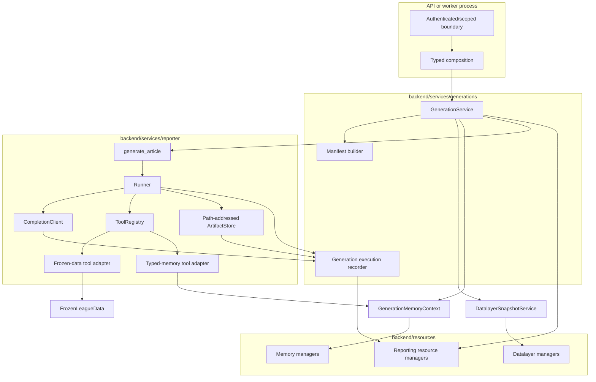

# Generation Component Architecture

## Goals

- Port the working Reporter V2 engine with minimal behavioral churn.
- Make one generation reproducible from immutable data, memory, prompt, tool,
  model, and runner inputs.
- Persist every provider attempt, full tool execution, token category, and
  versioned artifact mutation at the boundary where it occurs.
- Keep resource persistence, workflow policy, and reporter behavior in separate
  layers.
- Make live generation, explicit reruns, and later evaluation workspaces use the
  same reporter engine.
- Preserve narrow dependency direction and short transaction ownership.

## Architectural Shape



## Ownership Boundaries

### `GenerationService`

The generation service owns the durable application workflow:

- accept a validated generation request and create its pending record;
- derive live/backtest snapshot policy without pushing that policy into the
  datalayer;
- invoke refresh only when the selected policy requires it;
- call `DatalayerSnapshotService.get_or_create()`;
- pin the current canonical memory revision or the selected evaluation memory
  artifact;
- build and hash the complete input manifest;
- atomically transition the generation from pending to running with all resolved
  inputs;
- construct one frozen data runtime, one generation memory context, one
  execution recorder, and one reporter call;
- update progress through the generation manager;
- coordinate selected-version finalization, memory proposal handling, and terminal
  generation state; and
- translate expected workflow failures into sanitized durable failure metadata.

It does not implement the model loop, tool schemas, SQLAlchemy operations,
Sleeper endpoint behavior, memory retrieval ranking, or memory mutation SQL.

### Reporter service

The reporter owns content generation:

- `generate_article` composition for one already-resolved run;
- prompt and user-message construction;
- runner loop and procedure replacement behavior;
- tool registration and model-facing schemas;
- path-addressed in-memory Markdown artifact state;
- model retry/fallback adapter behavior; and
- a local `RunLog` diagnostic view.

It receives capabilities; it does not discover platform state. Specifically, it
must not import snapshot or refresh services, memory managers, generation ORM
models, session factories, API dependencies, or worker code.

### Reporting resource managers

Reporting persistence follows the resource-per-manager convention used by the
rest of the backend:

```text
centralized reporting ORM models
    -> reporting resource objects
    -> per-resource reporting managers
    -> GenerationService / execution recorder
```

`GenerationManager` owns short, scope-checked operations for pending creation,
atomic input pin/start, progress, terminal transitions, and generation reads.
Child persistence belongs to separate managers:

- `AICallManager` owns attempt start/finish and allocation;
- `ToolCallManager` owns provider-call start/finish and ordinal identity;
- `ArtifactManager` owns stable path identity and finalization; and
- `ArtifactVersionManager` owns append-only content revisions.

Application services compose these narrow operations when workflow policy spans
multiple resources.

### Execution recorder

The execution recorder is a generation-scoped application adapter between the
reporter execution boundaries and the reporting resource managers. It is not a
generic event bus and does not own workflow policy.

It is needed in three places:

1. `CompletionClient` records every actual provider attempt because it alone can
   see retry and fallback attempts hidden from `Runner`.
2. `Runner` records every tool request/result because it owns dispatch and
   parallel execution.
3. Artifact tools record complete artifact content after each successful
   mutation because they know when in-memory state changed.

Tests and the temporary standalone CLI may use an in-memory/no-op recorder. The
production generation path always uses the durable recorder.

## Proposed Package Layout

```text
backend/
├── resources/
│   └── reporting/
│       ├── generations/        # lifecycle contracts and GenerationManager
│       ├── ai_calls/           # AI-call contracts and AICallManager
│       ├── tool_calls/         # tool-call contracts and ToolCallManager
│       ├── artifacts/          # artifact contracts and ArtifactManager
│       └── artifact_versions/  # version contracts and ArtifactVersionManager
├── services/
│   ├── generations/
│   │   ├── __init__.py
│   │   ├── contracts.py        # non-persisted request/outcome values
│   │   ├── generation_service.py
│   │   ├── manifest.py         # deterministic manifest/hash construction
│   │   ├── recorder.py         # reporter-to-reporting persistence adapter
│   │   └── progress.py
│   └── reporter/
│       ├── __init__.py
│       ├── config.py
│       ├── generator.py        # port of article_generator.generate_article
│       ├── runner/
│       │   ├── runner.py
│       │   ├── completion.py
│       │   ├── models.py
│       │   ├── schemas.py
│       │   ├── state.py
│       │   ├── run_log.py
│       │   └── tools/
│       │       ├── registry.py
│       │       ├── context.py
│       │       ├── artifacts.py
│       │       ├── procedures.py
│       │       ├── datalayer.py
│       │       └── memory.py
│       ├── prompts/
│       └── procedures/
├── api/
│   ├── dependencies/generations.py
│   ├── schemas/generations.py
│   └── routes/generations.py
└── worker/
    ├── main.py
    └── dependencies.py
```

Exact filenames may be adjusted to repository conventions during the initial
copy. The legacy `reporter_v2` tree is not edited during that copy. The boundary
split is the contract: resources persist, generation service orchestrates,
reporter generates, and routes/workers invoke.

The initial process split is explicit: HTTP submission creates a pending
generation and schedules the shared worker execution function after the response
through FastAPI's local background-task facility. The callback runs in a
threadpool, constructs worker-scoped dependencies, and closes its runtime. The
same function remains available through the one-shot worker for manual execution.
A second worker command reconciles a bounded stale-running batch from an explicit
aware cutoff. This adds no durable queue, lease, heartbeat, or automatic resume;
a hard API-process failure can lose undispatched local background work.

## End-to-End Lifecycle

### 1. Submission

The API authenticates the caller, authorizes the competition, constructs a
`ManagerContext`, validates transport input, and asks `GenerationService` to
submit. The service creates a pending generation before doing long-running
input resolution.

Generation-11 uses the existing single-local-user actor and competition scope.
It deliberately makes no durable product-user ownership or membership claim;
that future decision does not change the rest of the reporter architecture.

### 2. Input resolution

The service translates generation intent into a datalayer `SnapshotRequest`.
If policy requires refresh, it invokes refresh first and interprets the typed
outcome. It then calls `get_or_create()` and receives a `ReadyDataSnapshot`.

The initial generation policy never refreshes implicitly. It uses already
recorded or backfilled inputs, `week_end` as the factual cutoff, and the
execution clock's UTC date as the snapshot build/reuse label. Backtests are
therefore retrospective cutoff reconstructions with completeness warnings,
not historical-observation simulations.

In parallel policy terms—but not necessarily parallel code—it pins the current
canonical memory revision for live runs. Backtests select the newest revision
for the same season at or before the cutoff week, with root fallback, and expose
it read-only. The service also resolves model, fallback, prompt, frozen
procedure content, tool, runner, and code-version inputs.

### 3. Atomic start

One manager transaction changes pending to running and pins:

- data snapshot ID;
- exactly one memory input;
- resolved week/time cutoffs;
- requested model and complete settings;
- manifest schema version, canonical manifest, and hash; and
- initial progress state.

No model call starts before this transition succeeds. Once running, those inputs
are immutable.

### 4. Reporter execution

The service opens the frozen snapshot with a context manager, creates
`GenerationMemoryContext` at the pinned revision, and calls the reporter.
Snapshot projection v2 also exposes typed roster/team-to-core identity
resolution from that same immutable runtime; memory tools do not consult a
separate live identity source.

The reporter:

- registers generic artifact, structured-brief, procedure, frozen-data, and
  typed-memory tools;
- initializes immutable structured request/style/bias context without creating
  a Markdown artifact;
- materializes the managed `research_brief.md` projection only after the first
  successful brief mutation;
- runs the same turn loop and procedure replacement behavior;
- records every provider attempt before/after network I/O;
- records tool calls before/after handler execution;
- appends complete artifact versions after successful mutations; and
- returns `ReporterOutput` with all current snapshots. `submitted_path` names
  the reporter-selected artifact only after `submit_artifact` succeeds and is
  otherwise `null`; an unsubmitted output cannot succeed the generation.

### 5. Finalization

`submit_artifact(path, expected_revision)` remains a reporter-level selection
and stop signal, not the durable generation commit. It accepts any current,
non-empty Markdown artifact only after the structured brief contains at least
one verified fact. `ReporterOutput` returns the nullable submitted path, the
typed research brief, and complete snapshots of every in-memory artifact.
Artifact paths remain inside the reporter contract and carry no
application-level role. Only a submitted output is eligible for success.
`GenerationService` then:

- obtains the complete memory proposal bundle exactly once;
- verifies that the submitted revision already exists durably and belongs to
  the generation;
- finalizes that artifact without appending a content-identical copy and pins
  its exact version in `generation.submitted_artifact_version_id`;
- applies or deliberately discards the memory bundle according to generation
  kind/policy; and
- transitions the generation to succeeded only when its required final outputs
  and memory outcome satisfy the selected finalization contract.

One PostgreSQL transaction owns the all-or-nothing boundary between canonical
memory commit, selected-artifact finalization, and generation success. Resource
modules retain their SQL and validation through session-bound operations; the
generation finalizer coordinates only their shared transaction. An exception at
any boundary rolls back all three success outputs while preserving telemetry and
working artifact versions committed before finalization began.

### 6. Failure and cancellation

A pre-start failure leaves a terminal generation without pinned inputs and
records the failure stage. A running failure preserves completed AI calls, tool
calls, and artifact versions, discards the uncommitted memory buffer,
and marks the generation failed. A terminal generation never reopens; a retry
creates a linked generation.

The baseline does not resume a crashed reporter loop. A bounded,
competition-scoped stale-running reconciliation operation marks it failed using
a caller-supplied cutoff. An explicit rerun creates a linked pending generation
that copies request intent and settings but resolves fresh immutable inputs.

## Model and Token Observability

`CompletionClient` retains retry/fallback policy. Its return behavior to
`Runner` remains the same except for the smallest internal metadata needed to
associate tool calls with the successful AI-call row.

For every attempt, instrumentation records:

- requested and actual provider/model;
- generation turn and attempt number;
- exact input messages, tools, and request parameters;
- sanitized response or error;
- finish reason and provider IDs;
- input, cached-input, output, reasoning, and total tokens when reported;
- raw provider usage JSON; and
- timing and terminal attempt status.

Missing provider token categories remain `null`; they are not guessed. The raw
usage payload is retained so a later adapter version can interpret new fields.
Dollar pricing remains an application-time analytic over recorded usage.

## Artifact Model

The in-memory `ArtifactStore` is the reporter's fast working state. It exposes
one generic model-facing contract for reporter-authored artifacts:

- `list_artifacts()` lists paths, media types, and current revisions;
- `read_artifact(path)` returns one current snapshot;
- `create_artifact(path, content)` creates revision 1;
- `edit_artifact(path, old_text, new_text, expected_revision)` requires the
  expected current revision and exactly one occurrence of `old_text`; and
- `submit_artifact(path, expected_revision)` selects the current revision of
  any non-empty artifact and ends the reporter loop.

All reporter artifacts are raw UTF-8 Markdown in the initial platform slice.
Their paths are reporter-owned logical names except for the reserved,
runtime-managed `research_brief.md` projection. Generic create, edit, and submit
operations cannot target managed paths; brief tools synchronize that projection
atomically with structured state. Persistence and application queries do not
infer semantic roles from artifact names. Durable reporting artifacts mirror
complete snapshots at successful mutation boundaries:

| Artifact | Durable behavior |
| --- | --- |
| managed research brief projection (`text/markdown`) | append a complete immutable version after each changed structured brief mutation |
| other research or planning artifact (`text/markdown`) | append a complete immutable version after each successful create/edit mutation |
| publishable draft artifact (`text/markdown`) | append a complete immutable version after each successful create/edit mutation; `submit_artifact` selects one existing revision regardless of path |
| run log | do not treat as canonical; AI/tool/artifact tables are the full audit trail |

The initial structured brief is revision 0 and does not create an artifact.
The first successful brief mutation creates `research_brief.md` revision 1
with the source AI/tool provenance of that mutation. Later changed mutations
advance the structured revision and projection revision together; identical
upserts are no-ops.

Artifact versions use their source AI call/tool call when available. Reads do
not append versions. Failed and content-identical mutations do not append
versions. Durable finalization pins the selected version both on its artifact
and on the generation; it does not create another artifact version. The
generation pointer is the application-level article output and supports article
queries without inspecting reporter-controlled paths.
The resource query `GenerationQuery(submitted_only=True)` uses that pointer,
returns newest completed outputs first, and is backed by the partial
competition/completion index. Product-user aggregation remains above this
competition-scoped resource boundary until ownership is defined.

## Dependency Rules

Allowed:

```text
api / worker -> GenerationService
GenerationService -> reporting resource managers, datalayer services,
                     memory services, reporter service
reporter generator -> Runner and reporter-owned tool adapters
reporter data adapter -> FrozenLeagueData
reporter memory adapter -> GenerationMemoryContext
execution recorder -> reporting resource managers
reporting resource managers -> reporting ORM models and database infrastructure
```

Forbidden:

- reporter -> PostgreSQL session, ORM model, refresh service, snapshot manager,
  memory resource manager, API, or worker;
- generation service -> ORM model or raw SQLAlchemy session;
- datalayer or memory packages -> reporter tool schemas;
- resource manager -> model provider or Sleeper network client;
- a transaction spanning a provider call, tool handler, or complete reporter
  run; and
- the standalone `RunLog` substituting for full persisted call results.

## Extension Paths

The boundaries allow later additions without changing the runner loop:

- a queue/worker can claim submitted generation IDs and call the same service;
- a second model provider is normalized inside the completion adapter;
- evaluation workspaces supply a different memory input/output policy to the
  same reporter;
- new reporter tools register through the existing registry and recorder;
- object storage can replace local snapshot/artifact storage behind the owning
  service; and
- user identity can be added at submission/manager scope once its resource
  contract is settled.
