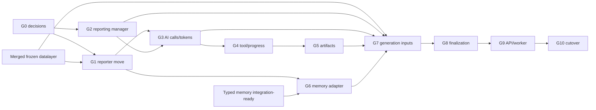

# Generation Implementation Plan

## Objective

Build the platform generation lifecycle around the existing Reporter V2 engine,
using the datalayer's frozen reporter adapter and memory's pinned typed context,
while adding durable execution telemetry and versioned artifacts.

The stack should begin from current `main`, where the datalayer frozen runtime
and core typed-memory stack are merged. Their integration tails remain
outstanding. The closed datalayer reporter-adapter PR is not a parent; its
compatibility tests and direct-delegation approach may be used as prior art in
the new reporter copy. Do not reimplement either core dependency in the
generation stack.

## Stack Coordination

The datalayer and memory stacks now have only integration tails outstanding.
Those tails and this plan must converge on one implementation path, not create
competing `GenerationService` or reporter foundations. When this plan is
adopted:

- the datalayer integration tail supplies the snapshot-policy/resolution portion
  of the generation service and the frozen reporter adapter in the new package;
- this generation stack supplies reporting resources, reporter execution,
  observability, artifacts, memory lifecycle, API, and worker integration; and
- neither stack introduces a second generation manager or alternate start path.

Memory's reporter-retrieval and reporter-mutation tail likewise lands through
the single reporter memory adapter and `GenerationService` finalization path.

## Implementation Rules

- Each PR has one deep boundary and leaves the repository runnable.
- First ports preserve behavior; later PRs add platform capabilities.
- Tool compatibility is proven with schema and result-shape golden tests.
- All manager tests use real disposable PostgreSQL.
- Service/reporter tests inject fake managers, external clients, and recorders.
- No PR fills an upstream contract gap with private connection access or a
  guessed identity mapping.
- Mutable stack status and PR bodies may live under gitignored
  `.context/generation/`; durable decisions stay in `docs/generation/`.

## Pull Request Stack

### `generation-0` — architecture and contract decisions

- Add the durable generation design set.
- Reconcile ownership with datalayer Layer 12 and memory integration layers.
- Resolve or explicitly defer the four blocking questions listed below.
- Make no production behavior change.

**Exit gate:** one agreed owner exists for generation lifecycle, reporter
adapters, execution persistence, and finalization.

### `generation-1` — new reporter service copy

- Copy `reporter_v2` generator, runner, configuration, prompts, procedures, and
  relevant tests under `backend/services/reporter/`.
- Preserve the current public generator/runner behavior.
- Recreate the closed PR's `FrozenLeagueData` direct-delegation adapter in the
  new package, based on current `main`.
- Add import-boundary tests for the target package.
- Do not change `reporter_v2`; it remains the characterization oracle until
  cutover.

**Exit gate:** side-by-side characterization passes, the legacy tree is
unchanged, and new reporter code has no source/PostgreSQL/resource-manager
imports.

### `generation-2` — reporting resource contracts and manager

- Add resource objects for generation summary/detail, AI calls, tool calls,
  artifacts, and artifact versions.
- Add `GenerationManager` with scoped pending/start/progress/fail/cancel/read
  operations.
- Add child-call and append-only artifact operations under the same aggregate.
- Add typed lifecycle/concurrency errors and ORM-to-resource conversion.
- Prove existing reporting schema constraints through real manager behavior.

**Exit gate:** pending-to-running input pinning is atomic, inputs are immutable,
terminal rows cannot reopen, and concurrent call/artifact allocation is safe.

### `generation-3` — manifest and model-call instrumentation

- Add immutable manifest contracts, canonical serialization, versioning, and
  hash golden vectors.
- Extend `CompletionClient` with generation-scoped attempt recording.
- Record retries and fallbacks as distinct AI calls.
- Normalize LiteLLM/provider usage into the existing token columns while
  retaining raw usage.
- Sanitize provider responses/errors before persistence.

**Exit gate:** success, retry exhaustion, fallback success, fatal error,
cancellation, missing usage, cached tokens, and reasoning tokens all produce
the expected durable attempt rows without changing model-call behavior.

### `generation-4` — tool-call and progress instrumentation

- Add the generation execution recorder.
- Instrument `Runner` around every tool handler, including unknown tools,
  exceptions, and parallel batches.
- Persist exact arguments, full result, structured JSON when available,
  implementation version, duration, and source AI call.
- Emit bounded generation progress updates without making every local log event
  a database write.
- Preserve `RunLog` as a local diagnostic.

**Exit gate:** tool results sent to the model and persisted results are
equivalent; provider order remains the tool ordinal under parallel completion.

### `generation-5` — artifact persistence

- Add artifact-recorder access to `ToolContext` without changing model-facing
  tool schemas.
- Persist complete working article Markdown after successful article mutations.
- Persist the final article and final brief JSON through generation
  finalization.
- Attach source AI/tool provenance and content hashes.
- Avoid versions for reads, failed mutations, and identical consecutive content.

**Exit gate:** article history can be reconstructed from artifact versions and
one final article exists for a succeeded generation.

### `generation-6` — typed memory reporter adapter

- Implement only the memory tool mappings settled in `generation-0`.
- Register tools over `GenerationMemoryContext`, never over managers or legacy
  `ContextStore`.
- Add authoritative roster/team-to-core identity resolution from the agreed
  datalayer seam.
- Keep searches pinned and writes buffered.
- Update prompts/procedures to the approved typed tool vocabulary.
- Remove legacy memory registration in the target package.

**Exit gate:** a run cannot observe its own buffered proposals, invalid typed
proposals return safe tool errors, and no legacy store is read or written.

### `generation-7` — input lifecycle and reporter execution

- Add `GenerationService.submit()` and `execute()`.
- Implement generation-owned live/backtest cutoff policy.
- Invoke refresh only under explicit policy.
- Resolve/reuse a ready snapshot through
  `DatalayerSnapshotService.get_or_create()`.
- Pin memory input, construct/hash the manifest, and atomically start.
- Open `FrozenLeagueData`, create `GenerationMemoryContext` and recorder, and
  call the reporter once.
- Close the SQLite runtime deterministically on success or failure.

**Exit gate:** no model call can occur before complete input pinning, and the run
cannot switch data snapshot or memory revision mid-flight.

### `generation-8` — finalization and failure recovery

- Implement the settled article/memory/generation finalization boundary.
- Apply one completed memory bundle after successful reporter submission or
  discard it on failure/cancellation.
- Preserve partial AI/tool/working-artifact telemetry on failure.
- Add stale-running reconciliation and explicit rerun behavior.
- Prove terminal immutability and sanitized failure metadata.

**Exit gate:** failure at every boundary has a deterministic generation state,
does not leak an open resource, and cannot silently commit partial memory under
the chosen contract.

### `generation-9` — API, worker, and composition

- Add typed generation dependencies to `backend/composition.py`.
- Add submission, polling, history, call, token, tool-result, artifact, and
  final-article routes.
- Add a thin worker/process entry point calling the same service.
- Add authentication/permission seams using the settled local/multi-user
  decision.
- Keep routes and worker free of workflow logic and sessions.

**Exit gate:** API and worker tests prove scoping, polling, error translation,
and one shared service path.

### `generation-10` — cutover and legacy removal

- Switch all production entry points to the backend generation service.
- Remove temporary compatibility imports and direct legacy CLI composition.
- Remove `reporter_v2` and legacy `reporter_memory` production paths once their
  behavior is covered.
- Update root setup/docs/commands and enforce forbidden-import tests.
- Run complete repository, live PostgreSQL, snapshot, memory, and reporter
  compatibility gates.

**Exit gate:** production has one generation path, one frozen data authority,
one canonical memory authority, and one reporting audit history.

## Dependency Graph

## Decisions Required Before Implementation

### 1. Product-user scope

Current code cannot satisfy durable user tracking. Choose whether the first
generation stack is:

- explicitly single-local-user, with no claim of per-user history; or
- blocked on a separate product-user/competition-membership design and schema
  amendment.

Do not use Sleeper user IDs as authenticated product-user IDs.

### 2. Memory tool contract

Approve a final model-facing set for typed memory, including decisions for:

- exact candidate hydration;
- generic versus typed event writes;
- explicit create/replace versus legacy upsert;
- `mark_memory_used` after removal of access-history state; and
- verification planning/recording ownership.

The matrix in [`transition.md`](transition.md#memory-tool-compatibility) is the
starting point.

### 3. Frozen identity resolution

The datalayer contract must expose the stable identity needed to translate a
model-facing roster/team reference into typed memory entity IDs. Confirm the
authoritative method and return shape with the datalayer design owner. Do not
reach into `FrozenLeagueData._connection` or query a PostgreSQL manager from a
reporter tool.

### 4. Finalization atomicity

Choose one documented invariant:

- a composed short transaction atomically seals final reporting output,
  commits the memory revision, and succeeds the generation; or
- a deliberately ordered multi-transaction workflow with durable intermediate
  state and an explicit reconciliation operation.

The current memory service's transaction ownership means the first choice may
require a narrow shared transaction helper or revised ownership contract. That
change must be agreed with the memory design rather than bypassed.

### 5. Brief artifact granularity

This plan recommends one final JSON brief artifact and complete working article
versions. Confirm whether working brief versions are valuable enough to store;
the reporting database design explicitly leaves them optional.

## Required Acceptance Coverage

The complete stack must prove:

1. a generation records its request before external input resolution;
2. no provider call starts before data and memory inputs plus manifest are
   atomically pinned;
3. one run cannot change snapshot or memory revision;
4. all 18 frozen data tools execute only against the pinned artifact;
5. every actual retry/fallback attempt has its own AI-call row;
6. provider token categories and raw usage round-trip without guesses;
7. every tool call retains exact input, full output, status, timing, and
   provider ordinal;
8. parallel tool completion does not corrupt ordering or provenance;
9. article mutations create reconstructable immutable versions;
10. one succeeded generation has one final article;
11. searches remain pinned and buffered memory proposals remain invisible;
12. failed/cancelled generations discard buffered proposals;
13. the chosen success finalization contract survives injected failure at each
    boundary;
14. stale running generations become terminal and are never auto-resumed;
15. explicit reruns link to but never mutate the original generation;
16. routes and worker use the same service and enforce competition scope; and
17. production contains no legacy datalayer loading or legacy memory write path.

## Test Layers

- reporter characterization tests for prompt, tool schema, brief, article,
  procedure, and runner compatibility;
- pure manifest and token-normalization golden tests;
- completion adapter tests for retry/fallback/usage/error permutations;
- runner tests with fake recorder and parallel tools;
- generation-manager tests against disposable PostgreSQL;
- artifact concurrency/hash/finality tests against PostgreSQL;
- generation-service tests with fake managers and real fixture frozen SQLite;
- typed-memory adapter tests with fake and real `GenerationMemoryContext`;
- cross-resource failure-injection tests for finalization;
- API tests through dependency overrides;
- worker tests proving thin delegation; and
- import-boundary tests enforcing the dependency rules.

## Deliberate Deferrals

- durable job queue, leases, heartbeats, and automatic resume;
- SSE/event-stream persistence;
- model pricing tables and stored dollar cost;
- generalized experiment variants or evaluation scoring;
- specialized relational brief/article tables;
- content-addressed model-message deduplication;
- candidate-level RAG telemetry;
- multi-provider data sources; and
- hosted multi-user behavior unless the product-user decision explicitly adds
  it to this stack.
