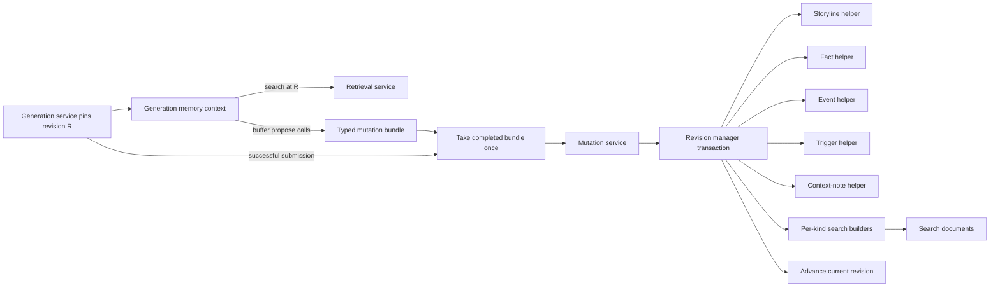

# Typed Memory Application Implementation Plan

**Status:** Proposed implementation plan  
**Stack position:** `memory-0`  
**Scope:** Application contracts, resource managers, canonical mutations,
retrieval, API integration, and reporter integration

## Purpose

This document turns the accepted typed-memory design into an incremental
implementation plan. It builds on the canonical PostgreSQL schema already in
place and preserves the boundaries established in:

- [`application-contracts.md`](application-contracts.md);
- [`canonical-schema.md`](canonical-schema.md);
- [`retrieval.md`](retrieval.md);
- [`lifecycle.md`](lifecycle.md);
- [`transition.md`](transition.md); and
- [`../platform-architecture.md`](../platform-architecture.md).

The main structural refinement is that “the memory manager” is an application
boundary, not one class that owns every memory kind. Storylines, facts, events,
triggers, context notes, canonical revisions, and search documents are distinct
resources with distinct objects and managers.

## Goals

1. Represent every canonical memory kind with a complete Pydantic content
   contract.
2. Give each resource a narrow manager responsible only for that resource.
3. Preserve one atomic, linear canonical revision history across resource
   mutations.
4. Maintain deterministic search documents with every accepted version.
5. Retrieve candidates through the projection and hydrate canonical typed
   versions before returning them to callers.
6. Switch the reporter from the legacy SQLite memory store without introducing
   a dual-write period.
7. Keep every pull request small, testable, and independently reviewable.

## Non-Goals

- Vector embeddings before lexical and entity retrieval are implemented and
  measured.
- Importing legacy `reporter_memory` data into the canonical PostgreSQL model.
- A generic memory CRUD repository or a public graph abstraction.
- Branching or merging canonical memory history.
- Combining all memory kinds into a single manager or caller-facing object.

## Target File Structure

The target structure groups memory resources for discoverability while keeping
each resource's objects and manager separate.

```text
backend/
├── database/
│   └── models/
│       └── memory/
│           ├── items.py
│           ├── revisions.py
│           ├── storylines.py
│           ├── facts.py
│           ├── events.py
│           ├── triggers.py
│           ├── context_notes.py
│           └── search_documents.py
│
├── resources/
│   ├── context.py
│   └── memory/
│       ├── common/
│       │   ├── kinds.py
│       │   ├── references.py
│       │   ├── versioning.py
│       │   └── errors.py
│       │
│       ├── revisions/
│       │   ├── objects.py
│       │   ├── manager.py
│       │   ├── shared.py
│       │   └── writers.py
│       │
│       ├── storylines/
│       │   ├── objects.py
│       │   ├── codec.py
│       │   ├── validation.py
│       │   ├── manager.py
│       │   └── shared.py
│       │
│       ├── facts/
│       │   ├── objects.py
│       │   ├── codec.py
│       │   ├── validation.py
│       │   ├── manager.py
│       │   └── shared.py
│       │
│       ├── events/
│       │   ├── objects.py
│       │   ├── payloads/
│       │   │   ├── trade.py
│       │   │   └── matchup.py
│       │   ├── codec.py
│       │   ├── validation.py
│       │   ├── manager.py
│       │   └── shared.py
│       │
│       ├── triggers/
│       │   ├── objects.py
│       │   ├── conditions/
│       │   ├── codec.py
│       │   ├── validation.py
│       │   ├── manager.py
│       │   └── shared.py
│       │
│       ├── context_notes/
│       │   ├── objects.py
│       │   ├── codec.py
│       │   ├── validation.py
│       │   ├── manager.py
│       │   └── shared.py
│       │
│       └── search_documents/
│           ├── objects.py
│           ├── manager.py
│           ├── query.py
│           └── builders/
│               ├── storyline.py
│               ├── fact.py
│               ├── event.py
│               ├── trigger.py
│               └── context_note.py
│
├── services/
│   └── memory/
│       ├── generation_context.py
│       ├── proposals.py
│       ├── mutation_service.py
│       └── retrieval_service.py
│
└── api/
    └── routes/
        └── memory/
            ├── common.py
            ├── revisions.py
            ├── storylines.py
            ├── facts.py
            ├── events.py
            ├── triggers.py
            ├── context_notes.py
            └── search.py
```

Tests mirror these boundaries under `backend/tests/resources/memory/`,
`backend/tests/services/memory/`, and `backend/tests/api/memory/`.

Memory transport models remain co-located with their routes while each module
is small. They can move to a separate schema package if reuse or module size
creates a concrete boundary later.

Not every package needs every helper on its first commit. `objects.py` and
`manager.py` define the stable resource boundary. `codec.py`, `validation.py`,
and `shared.py` should only be introduced when they contain real logic.

## Resource Objects

Each resource separates its complete mutable content from its stable identity
and immutable version metadata.

### Shared objects

The common package contains only concepts genuinely shared across memory kinds:

- `MemoryKind`;
- low-level entity identity primitives;
- version and mutation provenance metadata; and
- typed application errors.

Semantic roles remain resource-local. For example, storyline subject roles do
not become a generic role bag shared with facts or events.

### Storyline

The storyline resource owns:

- `StorylineContent`;
- narrowed storyline entity references;
- exact `EvidenceRef` values targeting fact or event versions;
- stable related-storyline references; and
- the hydrated storyline aggregate and history entries.

### Fact

The fact resource owns:

- `FactContent`;
- narrowed fact subject references;
- exact originating-event version IDs;
- reporting and Sleeper receipt fields; and
- the hydrated fact aggregate and history entries.

### Event

The event resource owns `EventContent` and its discriminated payload union.
Initial implementation should support the fully illustrated `trade` and
`matchup` payloads. Later event types should be additive modules under
`events/payloads/` and must not weaken existing payload validation.

### Trigger

The trigger resource owns `TriggerContent`, its condition union, and stable
storyline/event targets. Trigger condition variants must be settled before the
trigger manager is implemented.

### Context note

The context-note resource is an aggregate containing both its stable scope/key
identity and versioned content. It does not require separate managers for the
identity and version tables.

### Revision and search document

Canonical revisions and search documents are independent resources:

- a revision object represents one competition-wide atomic state transition;
- a search-document object represents derived candidate-discovery data; and
- neither object substitutes for a typed storyline, fact, event, trigger, or
  context note.

## Manager Responsibilities

### Typed resource managers

`StorylineManager`, `FactManager`, `EventManager`, `TriggerManager`, and
`ContextNoteManager` each own:

- competition-scoped queries for one resource;
- exact-version hydration and item history;
- validation and conversion of complete create and replacement payloads;
- ORM-to-resource conversion; and
- resource-local basic SQL helpers used during composed canonical writes.

They do not make model calls, Sleeper requests, expose ORM rows, or implement
queries for other memory kinds. They also do not expose standalone canonical
create or replace operations: a resource write is only durable as part of a
service-owned mutation unit of work.

### Revision manager

`RevisionManager` owns only the canonical revision aggregate:

- current-revision lookup and pinning;
- current-pointer locking and stale-writer detection;
- canonical sequence allocation;
- version introduction and retirement envelopes;
- resulting-state hashing; and
- commit or rollback of the complete mutation bundle.

It must not contain kind-specific payload parsing, fields, or SQL. During a
composed write it invokes narrow resource-local helpers from each resource's
`shared.py`. Those helpers receive an existing session, never open or commit a
transaction, and are not public application APIs.

### Search-document manager

`SearchDocumentManager` owns:

- revision-grounded candidate queries;
- exact entity, evidence, related-item, tag, and full-text matching;
- compact candidates with named match reasons; and
- deterministic projection rebuilds.

It returns candidate version IDs, not canonical content. Per-kind builders are
separate modules so adding a new event payload or memory kind does not grow one
large builder file.

## Service Responsibilities

### Generation memory context

`GenerationMemoryContext` is a generation-scoped facade, not a long-lived
service or resource manager. `GenerationService` creates one after it seals the
generation's competition, generation ID, and pinned canonical revision. The
reporter memory tools receive this context instead of independently composing
retrieval and mutation services.

The context:

- exposes search methods grounded at its immutable pinned revision;
- buffers typed fact, event, storyline, trigger, and context-note proposals;
- returns proposal-local references for same-bundle relationships;
- exposes the completed mutation bundle to the generation workflow; and
- contains no SQLAlchemy session or canonical database state.

Calls such as `save_fact` or `save_memory_event` therefore stage typed proposals;
they do not immediately write canonical memory. Searches made later in the same
generation still read the pinned canonical revision and do not see the buffered
proposals as established memory.

### Mutation service

`MemoryMutationService` accepts the completed typed bundle, coordinates resource
validation, and hands the accepted changes to `RevisionManager`. It owns bundle
and business semantics such as complete create/replacement operations,
same-batch references, and which accepted changes form one atomic unit of work.
It has no SQLAlchemy sessions or ORM imports: `RevisionManager` owns the short
database transaction, locking, hashing, pointer advancement, and commit or
rollback mechanics. The service does not decide when a generation commits.

### Retrieval service

`MemoryRetrievalService` queries `SearchDocumentManager`, dispatches each
candidate to its typed manager, expands requested exact and stable references,
and returns hydrated aggregates with match reasons. It is read-only, receives an
explicit pinned revision on every search, and knows nothing about the current
generation's mutation buffer.

### Generation service

The existing `GenerationService` owns the run lifecycle. It:

- pins the canonical input revision;
- constructs `GenerationMemoryContext` with immutable scope, the retrieval
  dependency, and an empty proposal buffer;
- gives that context to the reporter tools;
- hands the context's completed bundle to `MemoryMutationService` once after
  successful article submission; and
- discards the buffer when the generation fails or is abandoned.

There is no separate `MemoryLifecycleService`. Introducing one would split
ownership of the generation lifecycle without creating a distinct application
capability.

## Atomic Mutation Flow



All model calls, external requests, and expensive work finish before this
transaction starts. A failure rolls back the revision, versions, typed rows,
search documents, retirements, and current pointer together.

## Pull Request Stack

The implementation uses the repository's `gh stack` workflow. Every branch is
based on the preceding branch and each PR shows only its incremental changes.

### `memory-0` — implementation plan

**Branch:** `codex/memory-0-implementation-plan`

- Add this implementation plan.
- Make no application or database changes.
- Establish the intended resource and stack boundaries before implementation.

### `memory-1` — split memory ORM modules

**Branch:** `codex/memory-1-orm-modules`

- Split the existing memory ORM file into per-resource modules.
- Keep table names, columns, constraints, and metadata unchanged.
- Update exports and prove Alembic detects no schema diff.

### `memory-2` — typed resource contracts

**Branch:** `codex/memory-2-contracts`

- Add manager context and shared reference/version primitives.
- Add separate Pydantic contracts for all five memory resources.
- Settle role enums, cardinalities, initial event payloads, and initial trigger
  conditions.
- Use lean contract tests for public discriminator branches, meaningful semantic
  boundaries, and every retained schema version; do not mirror implementation
  details or enumerate low-value permutations.

### `memory-3` — revisions and critical query proofs

**Branch:** `codex/memory-3-revisions`

- Add `RevisionManager` current, pin, history, and visibility reads.
- Add the canonical transaction skeleton and typed stale-revision errors.
- Prove active-storyline entity lookup, storyline history, exact-evidence
  lookup, and pinned-revision exclusion using seeded canonical rows.

### `memory-4` — facts

**Branch:** `codex/memory-4-facts`

- Add `FactManager`, codec, validation, basic SQL helper, and search builder.
- Support exact-version hydration, history, and package-internal SQL preparation
  for complete create and replacement proposals.
- Cover subject, receipt, originating-event, status, and confidence policies.

### `memory-5` — events

**Branch:** `codex/memory-5-events`

- Add `EventManager`, codecs, basic SQL helper, and search builder.
- Implement trade and matchup payloads first.
- Reject mismatched event-type and payload discriminators.
- Prove adding another payload does not change unrelated contracts.

### `memory-6` — storylines

**Branch:** `codex/memory-6-storylines`

- Add `StorylineManager`, codec, basic SQL helper, and search builder.
- Validate exact fact/event evidence and stable storyline relationships.
- Cover complete replacement, historical evidence stability, and history.

### `memory-7` — triggers

**Branch:** `codex/memory-7-triggers`

- Add `TriggerManager`, condition models, codec, basic SQL helper, and builder.
- Validate stable storyline/event targets and competition scope.
- Cover trigger status, fire policy, target time/week, and condition rules.

### `memory-8` — context notes

**Branch:** `codex/memory-8-context-notes`

- Add `ContextNoteManager`, codec, basic SQL helper, and builder.
- Treat scope/key identity and versioned content as one resource aggregate.
- Cover competition, competition-season, and franchise scopes.

### `memory-9` — atomic mutation bundles

**Branch:** `codex/memory-9-mutation-bundles`

- Add `GenerationMemoryContext`, its typed proposal buffer, and
  `MemoryMutationService`.
- Expose complete public create and replacement operations through the mutation
  service; typed resource managers remain read/basic-SQL boundaries.
- Keep context searches pinned to canonical input and exclude buffered proposals
  from retrieval.
- Commit the completed multi-resource bundle through one explicit finalization
  call.
- Batch-load and validate reference targets.
- Support same-batch references without weakening type or scope validation.
- Insert search documents atomically and verify the resulting-state hash.
- Test stale writers and rollback at every failure point.

### `memory-10` — search projection and rebuild

**Branch:** `codex/memory-10-search-projection`

- Complete entity, evidence, related-item, tag, status, and full-text candidate
  queries.
- Preserve named score components and match reasons.
- Add deterministic projection rebuild behavior.
- Prove rebuilds do not create or alter canonical revisions.

### `memory-11` — retrieval and hydration

**Branch:** `codex/memory-11-retrieval`

- Add `MemoryRetrievalService`.
- Search at a pinned revision and hydrate through typed managers.
- Optionally expand exact evidence and visible stable references.
- Prove search documents are never returned as authoritative memory.

### `memory-12` — HTTP API

**Branch:** `codex/memory-12-api`

- Add resource-specific request and response schemas.
- Add separate routes for each resource and search.
- Translate typed application errors into stable HTTP responses.
- Keep sessions, ORM rows, and multi-step workflow logic out of routes.

### `memory-13` — reporter retrieval

**Branch:** `codex/memory-13-reporter-retrieval`

- Have `GenerationService` pin canonical input and construct one
  `GenerationMemoryContext` per run.
- Replace legacy reporter search and candidate expansion with context methods
  backed by the new retrieval service.
- Preserve the rule that remembered facts are research leads requiring
  verification against the frozen Sleeper snapshot.

### `memory-14` — reporter mutation lifecycle

**Branch:** `codex/memory-14-reporter-mutations`

- Replace legacy reporter writes with context-buffered typed mutation proposals.
- Have `GenerationService` apply the completed bundle once after successful
  article submission or discard it on failure.
- Remove the legacy canonical write path rather than dual-writing both stores.
- Cover successful commit, no-op proposal, invalid proposal, and stale
  generation behavior.

PRs `memory-1` through `memory-11` form the core application stack. PRs
`memory-12` through `memory-14` are the integration tail and may be published as
a second stack based on `memory-11` if review throughput benefits from it.

## Required Acceptance Coverage

The complete stack must prove:

1. active storylines can be found by franchise or player at pinned revision
   `R`;
2. every version of one item is returned in item-local order;
3. storylines can be found and hydrated through exact fact-version evidence;
4. evidence versions remain exact while stable thematic references resolve at
   the pinned revision;
5. event-specific text is searchable without losing structured payload data;
6. a generation pinned to `R` cannot retrieve content introduced at `R + 1`;
7. a projection rebuild does not change canonical history;
8. a new event payload is additive and does not weaken existing contracts;
9. several `save_*` calls in one generation create at most one canonical
   revision;
10. failed or abandoned generations discard their buffered proposals;
11. searches within a generation do not treat its buffered proposals as
    canonical memory;
12. stale canonical writers produce no revision or partial projection; and
13. all retained content-schema versions remain decodable.

## Settled Implementation Constraints

- Public mutations accept complete content replacements, not patches.
- Exact evidence references target immutable version IDs.
- Thematic and operational references target stable item IDs.
- Typed-manager read methods return resource objects and own their short read
  sessions; `RevisionManager` owns the short write session and transaction.
- Services orchestrate managers but do not import ORM models or open sessions.
- `GenerationMemoryContext` is created once per generation and owns only pinned
  retrieval scope plus an in-memory proposal buffer.
- `GenerationService`, not a separate memory lifecycle service, decides when to
  commit or discard that buffer.
- Buffered proposals are not visible to retrieval during the producing
  generation.
- Search documents are rebuildable derived data and never canonical content.
- The initial event implementation contains trade and matchup payloads.
- Embeddings remain a later, independently rebuildable enhancement.
- The legacy memory store is switched off in one integration layer; it is not a
  second canonical authority during the transition.

## Decisions Required in `memory-2`

The contracts PR must explicitly settle:

- allowed entity roles and cardinalities for storylines and facts;
- evidence and related-storyline duplicate policy;
- the first supported trigger-condition discriminators and their fields;
- whether source hints accept only mappings or a broader JSON value;
- normalization rules for tags and display names; and
- the exact resource aggregate returned by history and hydration operations.

These decisions belong in the typed contracts before manager behavior depends
on them.
