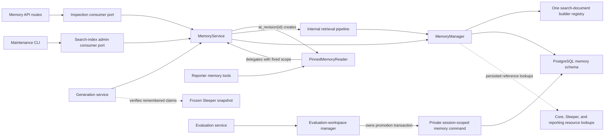

# Memory Service Architecture

**Status:** Accepted application design; implementation pending

**Scope:** Application components, caller-facing contracts, dependency direction,
and transaction boundaries for canonical reporter memory

## Purpose

The existing memory documents define canonical data, typed content, retrieval,
and lifecycle behavior. This document turns those decisions into an application
service with explicit boundaries.

The memory service is a cohesive module inside the AIdam modular monolith. It is
not a separately deployed microservice and does not own a separate database. Its
primary public contract is a typed Python API. FastAPI routes, reporter tools,
workers, and CLIs are adapters around that contract rather than alternative
implementations of memory policy.

The service owns narrative memory. It does not own football truth, generation
lifecycle, model execution, authentication, or evaluation-workspace storage.

## Goals

1. Give every caller a small, typed contract that does not expose SQLAlchemy,
   PostgreSQL search rows, or storage-shaped JSON.
2. Make revision pinning unavoidable for generation-time reads.
3. Keep canonical mutation atomic while keeping model and network work outside
   database transactions.
4. Separate authoritative typed memory from rebuildable retrieval projections.
5. Let API, worker, CLI, and reporter consumers share the same behavior without
   sharing transport concerns.
6. Keep the baseline implementation small: introduce a new class only when it
   owns state, enforces a boundary, or provides a meaningful substitution seam.

## Boundary Map



Dependency direction points inward: adapters depend on service contracts;
services depend on resource objects and managers; managers depend on ORM models.
The memory package never imports API schemas, reporter tool definitions, or
worker code.

The port boxes are static consumer views, not a requirement for separate runtime
classes. The baseline needs only two coordinating application objects:

- `MemoryService`, which exposes the supported operations and owns orchestration;
- `MemoryManager`, which owns persistence and ordinary memory transactions.

`PinnedMemoryReader` is a small immutable wrapper containing a `MemoryService`
read delegate and one validated `MemoryRevisionRef`. Retrieval, mutation,
inspection, and projection behavior may begin as methods or internal functions.
They should become separate coordinator classes only if they later acquire
independent dependencies or substantial state.

### Terms that sound similar

| Term | Reads or changes | Intended caller |
| --- | --- | --- |
| Pinned retrieval | Reads relevant canonical memory visible at one fixed revision | Reporter tools |
| History inspection | Reads canonical items, versions, revisions, and provenance | Basic UI or audit code |
| Search projection | Derived index used to find candidate canonical versions | Internal retrieval pipeline |
| Search-index administration | Reports index status or rebuilds that derived projection | Maintenance CLI |
| Workspace promotion | Creates one canonical revision from an eligible evaluation workspace | Evaluation service |

Inspection and pinned retrieval read the same canonical authority for different
purposes. Search-index administration operates only on a disposable projection.
Promotion is a write workflow and is unrelated to the word “projection.”

## Public Contract Model

The signatures below define responsibilities and result shapes. Exact Python
names may change during implementation, but the scoping and ownership rules are
contractual.

### Shared values

```python
@dataclass(frozen=True)
class MemoryRevisionRef:
    id: UUID
    competition_id: UUID
    sequence_number: int
    state_content_hash: str


class MemoryQuery(BaseModel):
    text: str | None = None
    entities: tuple[EntityKey, ...] = ()
    kinds: set[MemoryKind] = Field(default_factory=set)
    statuses: set[MemoryStatus] = Field(default_factory=set)
    season_id: UUID | None = None
    week: int | None = None
    limit: int = 20
    expansion: ExpansionPolicy = Field(default_factory=ExpansionPolicy)
```

`MemoryRevisionRef` contains the validated semantic replay boundary. Knowledge
and domain cutoffs remain on the generation manifest; the memory service is
given the exact revision already selected for that generation. Callers pass only
the revision ID to `at_revision`; the service loads its competition and sequence
rather than asking the caller to restate them.

A retrieved entry contains:

- the exact stable item and immutable version identifiers;
- the decoded kind-specific current resource object;
- requested exact evidence and visible stable-item expansions;
- named match reasons and rank components;
- the pinned revision used for visibility.

Search-document text and ORM rows are never part of this result.

### Read contract

```python
class MemoryReader(Protocol):
    def current_revision(self, competition_id: UUID) -> MemoryRevisionRef: ...

    def pin_current(self, competition_id: UUID) -> PinnedMemoryReader: ...

    def at_revision(self, revision_id: UUID) -> PinnedMemoryReader: ...


class PinnedMemoryReader(Protocol):
    @property
    def revision(self) -> MemoryRevisionRef: ...

    def retrieve(self, query: MemoryQuery) -> RetrievedMemory: ...

    def get_version(
        self,
        version_id: UUID,
        expansion: ExpansionPolicy = DEFAULT_EXPANSION,
    ) -> HydratedMemoryVersion: ...

    def get_item(
        self,
        item_id: UUID,
        expansion: ExpansionPolicy = DEFAULT_EXPANSION,
    ) -> HydratedMemoryVersion: ...
```

`MemoryService.pin_current` resolves the current revision and creates the
lightweight capability-bound reader in one service operation. `at_revision`
does the same for an exact persisted revision ID. The internal retrieval
pipeline does not create the reader. Calls on the reader delegate back to
`MemoryService` with the fixed revision reference:

```python
class _PinnedMemoryReader:
    def retrieve(self, query: MemoryQuery) -> RetrievedMemory:
        return self._memory_service._retrieve_at(self._revision, query)
```

The wrapper is not an open database session. The reporter receives it so its
tools cannot silently switch competition or revision. Every delegated operation
still acquires and closes its own short read session through the manager.

`get_item` resolves the version visible at the pinned revision. `get_version`
accepts an exact version only when that version is visible in the same scope,
unless a separate inspection contract is used by an authorized audit surface.

### Mutation contract

```python
class MemoryMutationBundle(BaseModel):
    producing_generation_id: UUID
    operations: list[CreateItem | ReplaceItem]


class MemoryWriter(Protocol):
    def apply(self, bundle: MemoryMutationBundle) -> MutationResult: ...
```

The memory manager loads the producing generation inside the mutation operation
and derives its competition, season, domain week, knowledge cutoff, and pinned
input memory revision. A live canonical mutation is allowed only when that
generation has a canonical revision input; callers cannot restate or override
those persisted facts.

Each create operation contains complete typed content. Each replacement contains
the stable item ID, complete replacement content, and an optional change reason.
Create operations receive item and version UUIDs when their immutable resource
object is constructed. Those IDs let later creates in the same bundle use the
ordinary exact-version and stable-item reference contracts; client keys remain
result-correlation labels rather than a second reference system.
The generation's pinned base revision is the only optimistic concurrency token.
Under the locked base, the visible version of every target item is unambiguous.
Archiving, resolving, firing, or superseding an item is a typed replacement
rather than an unversioned side effect.

`MutationResult` is one of:

- `NoChange`, retaining the base revision and explaining why no accepted
  operations remained; or
- `RevisionCommitted`, returning the new revision reference and the item/version
  IDs produced by each client operation key.

An empty bundle, an identical replacement, or a repeated transition already
represented by current content returns `NoChange` without creating a revision.
Retrying a generation whose revision was already committed returns the existing
`RevisionCommitted` result. Contradictory operations and invalid references
remain errors.

The reporter does not receive `MemoryWriter`. It may produce a typed proposal,
but the generation service decides whether to accept and commit that proposal.
This keeps canonical writes tied to generation finalization and provenance.

### Basic inspection contract

UI and audit reads use a narrow read-only contract rather than weakening pinned
reporter reads. The initial surface supports viewing current or historical state
and does not attempt to predict a full memory-management UI:

```python
class MemoryInspector(Protocol):
    def list_items(self, query: MemoryListQuery) -> MemoryPage: ...

    def get_item(
        self,
        competition_id: UUID,
        item_id: UUID,
        revision_id: UUID | None = None,
    ) -> HydratedMemoryVersion: ...

    def item_history(self, competition_id: UUID, item_id: UUID) -> ItemHistory: ...

    def list_revisions(
        self,
        competition_id: UUID,
        cursor: str | None = None,
        limit: int = 50,
    ) -> RevisionPage: ...
```

Inspection may expose historical versions and mutation provenance, but it still
returns resource objects and applies competition scope. It is not available to
ordinary reporter tools. Advanced diffs, analytics, bulk editing, restoration,
and UI-specific projections are intentionally absent until a user workflow
requires them.

`MemoryListQuery` groups the optional kind, typed status, cursor, and limit
filters. If no revision is supplied, the service resolves current state once and
returns that `MemoryRevisionRef` on `MemoryPage`; the caller does not need to
coordinate current-revision lookup with pagination.

### Search-index administration contract

```python
class MemorySearchIndexAdmin(Protocol):
    def search_index_status(self, competition_id: UUID) -> SearchIndexStatus: ...

    def rebuild_search_index(self, competition_id: UUID) -> RebuildResult: ...
```

Here, projection means the derived `memory_search_documents` index. It is
different from history inspection, which reads authoritative canonical
revisions and versions. `search_index_status` reports only actionable basics
such as builder version and missing or stale document counts.
`rebuild_search_index` deterministically recreates those documents from canonical
versions.

Search-index administration never creates a canonical memory revision. The normal
mutation path synchronously inserts lexical/entity search documents; it does not
invoke this administrative API for each write. It does not edit canonical
content, tune ranking policy, transform memory, or restore historical state.

The first implementation runs status and rebuild synchronously from a CLI. An
operator API, durable job system, and embedding backfill are deferred until a UI
or operational need makes them concrete.

### Promotion boundary

Promotion is unrelated to search-index administration. It means
fast-forwarding the final state of a reporting-owned evaluation workspace into
one new canonical memory revision.

`EvaluationService.promote_workspace` owns the public workflow because it must
validate the workspace and final reporting artifact. The evaluation-workspace
manager then owns one private cross-resource transaction. Within that
transaction it locks the workspace and canonical current revision, invokes a
session-scoped internal memory command to apply the already-validated final
diff, records the promoted revision, and marks the workspace promoted.

The session-scoped command is not a public memory service and never opens or
commits a transaction. Promotion has no merge, rebase, historical restoration,
or transformation modes. Retrying an already promoted workspace returns its
existing promoted revision.

## Component Responsibilities

### 1. Memory contracts and resource objects

`backend/resources/memory/objects.py` owns:

- typed content and discriminated reference models;
- revision, item, version, query, result, and pagination objects;
- mutation commands and outcomes;
- content-schema decoding and conversion entry points.

`backend/resources/memory/errors.py` owns stable application errors. These
objects are shared by services and adapters, but contain no HTTP status codes or
provider-specific errors.

Contracts validate local shape and semantic rules such as legal role values,
event discriminator agreement, required event participants, and duplicate
references. They do not query the database.

Validation ownership is deliberately singular:

| Validation | Owner |
| --- | --- |
| Content shape, discriminators, and pure per-object invariants | Pydantic resource objects |
| Same-bundle client keys, generated IDs, references, contradictions, and an empty-bundle no-op | `MemoryService.apply` |
| Persisted target existence, kind/scope, generation provenance, identical-content no-ops, and concurrency | `MemoryManager` transaction |

The manager translates expected database constraint failures at the point where
it still has query and transaction context. The service does not use a catch-all
exception mapper to disguise unexpected operational faults.

### 2. Memory resource manager

`backend/resources/memory/manager.py` is the only ordinary application component
that reads or writes the memory ORM model. It owns:

- competition-scoped canonical revision, item, and version queries;
- ORM-to-resource conversion and content-schema decoding;
- revision visibility queries;
- candidate search against `memory_search_documents`;
- batched canonical hydration;
- the short canonical mutation transaction;
- atomic search-document insertion with new versions;
- search-index status and replacement primitives used by the admin view.

The manager returns typed resource objects and internal candidate records, never
ORM instances. It performs no model calls, HTTP calls, embedding calls, or
long-running work.

No generic `Repository[T]` sits beneath the manager. Memory is an aggregate with
revision-wide invariants; table-by-table CRUD would expose invalid intermediate
states.

### 3. Memory service and pinned read view

`backend/services/memory/service.py` is the composition root visible to other
backend capabilities. One concrete `MemoryService` implements the initial
reader, writer, inspector, and search-index-administration operations, while each
consumer is typed against only the narrow protocol it needs.

The facade owns:

- revision validation and creation of `PinnedMemoryReader` values;
- coordination of retrieval, mutation, basic inspection, and rebuild operations;
- normalization of bundle-level no-ops and stable service outcomes;
- explicit resource context and correlation propagation;
- operation-level observability;
- exposing narrow consumer ports for composition to inject.

The facade does not contain SQL and does not make memory a global service
locator.

The pinned reader has no policy of its own beyond retaining its validated scope.
It delegates retrieval and direct visible-item reads to the same service. It
exists because preventing scope drift during reporter execution is a real safety
boundary, not because retrieval needs another orchestration layer.

### 4. Mutation path

The baseline mutation path may live directly in `MemoryService.apply`. It owns
workflow policy around a submitted bundle:

- decode and validate complete typed operations;
- validate unique client keys and generated IDs, including same-batch references;
- return `NoChange` for an empty plan;
- reject only internally contradictory plans before opening a transaction;
- call the manager once to apply the complete bundle;
- propagate the manager's typed persisted-reference and stale-write outcomes.

Within the manager-owned transaction, the implementation locks the current
revision, requires it to equal the producing generation's input revision,
batch-validates stored references and provenance, invokes the authoritative
search-document builder, inserts the canonical revision and complete versions,
retires replaced versions, verifies the resulting hash, and advances the current
pointer.

Reference lookups into core, Sleeper, and reporting resources use narrow
transaction helpers or scoped lookup adapters. They are internal validation
ports, not public mutation APIs, and they never open or commit the transaction.

Split this path into a separate coordinator only if mutation preparation later
acquires substantial independent policy or dependencies.

### 5. Internal retrieval pipeline

`backend/services/memory/search.py` owns internal candidate policy rather than
canonical state:

- translate a `MemoryQuery` into exact filters and signal queries;
- search, deduplicate, rank, hydrate, expand, and cap results;
- retain named candidate and score-component values.

Candidate discovery and hydration are separate steps. The manager applies
competition and pinned-revision visibility before a candidate is eligible.
Ranking receives only eligible candidates. The retrieval pipeline then
batch-hydrates the selected exact versions and returns typed aggregates through
the pinned reader.

This is an internal pipeline, not a public service and not initially a stateful
class. `MemoryService` invokes it for a fixed scope; `PinnedMemoryReader` is the
safe caller-facing handle to that invocation.

Retrieval treats remembered claims as narrative leads. It does not verify them
against Sleeper data; that remains the generation/reporting workflow's
responsibility using its frozen factual snapshot.

### 6. Search-document construction and maintenance

`backend/resources/memory/search_documents.py` is the only owner of search-
document construction. It exposes one general dispatcher over the discriminated
typed memory union and keeps per-kind builders private. Both canonical mutation
and full rebuild call this same dispatcher; the manager persists its output.

Builders are pure functions. They use only immutable canonical version content,
including any display-name snapshot stored on the subject reference. They never
resolve current external names during rebuild. If a stored label is absent, the
document uses the stable entity key. Given the same typed version, builder
version, and normalization rules, they produce the same document text, flattened
keys, reference IDs, and content hash.

`MemoryService.search_index_status` and
`MemoryService.rebuild_search_index` apply caller scope, stable result contracts,
and operation observability around deep manager operations. The manager scans
canonical versions, decodes every retained content schema, calls the
authoritative dispatcher, and replaces projection rows in bounded batches.
There is no second rebuild-specific builder.

Optional embeddings are a later adapter behind a narrow `EmbeddingProvider`
port. Embedding availability cannot be required for canonical writes or baseline
retrieval.

### 7. Adapters

- Memory API routes authenticate, parse HTTP schemas, construct resource
  context, call the facade, and translate stable errors to HTTP responses.
- Reporter memory tools translate compact model-facing tool arguments into
  `PinnedMemoryReader` calls and serialize bounded results.
- The generation service pins the revision, supplies the reader to the reporter,
  receives any typed mutation proposal, and invokes `MemoryWriter` only during
  finalization.
- CLI maintenance commands invoke the basic `MemorySearchIndexAdmin` status and
  rebuild methods; they do not query ORM models directly.
- The evaluation service owns workspace promotion and composes its reporting
  manager transaction with the private session-scoped memory command.

Adapters own presentation limits and transport details. They do not duplicate
visibility SQL, ranking policy, mutation validation, or transaction logic.

## Transaction and Consistency Boundaries

### Reads

Each service call owns a short read session through the manager. A
`PinnedMemoryReader` carries IDs, not a live transaction. Revision rows and
versions are immutable, so separate candidate and hydration reads are safe when
both explicitly enforce the same pinned revision. Batch hydration should be
preferred to per-result queries.

### Canonical writes

One ordinary live mutation bundle produces zero or one canonical revision in one
`MemoryManager` transaction. The current revision lock serializes writers for a
competition. There are no partial item commits, sibling canonical states, or
projection rows committed without their source versions.

No model call, Sleeper request, embedding call, filesystem operation, or reporter
execution occurs inside that transaction.

Workspace promotion is the one documented cross-resource exception. Its
evaluation-workspace manager owns the transaction and invokes private reporting
and memory commands with the existing session. Public services and adapters
still never receive or pass database sessions.

### Projection rebuilds

A rebuild reads immutable canonical versions and writes only derived projection
rows. It is restartable and idempotent for the same builder version. Normal
canonical writes remain available; a production implementation must replace
rows in bounded transactions and avoid deleting a valid old projection before
its replacement is ready.

Ordinary retrieval does not expose a repairable search-index failure to callers.
It continues with the last valid builder version when present, otherwise falls
back to exact entity/reference signals and a bounded scan of visible canonical
versions. The service records degraded operation for the status/rebuild path.

## Error Contract

Stable error categories are part of the service boundary:

| Error | Meaning |
| --- | --- |
| `MemoryNotFound` | Scoped item, version, or revision does not exist |
| `MemoryScopeViolation` | A target belongs to another competition or is outside caller scope |
| `InvalidMemoryContent` | Typed content, role, discriminator, or reference policy is invalid |
| `InvalidMemoryReference` | Referenced target is missing, duplicated, or the wrong kind |
| `StaleCanonicalRevision` | The competition advanced beyond the submitted base revision |

Adapters translate these errors for their transports. Callers never inspect
constraint names, SQLAlchemy exceptions, or raw PostgreSQL messages. Unexpected
database faults remain operational errors and are not mislabeled as user input.

## Proposed Package Shape

```text
backend/
├── resources/memory/
│   ├── __init__.py
│   ├── objects.py
│   ├── errors.py
│   ├── manager.py
│   └── search_documents.py
├── services/memory/
│   ├── __init__.py
│   ├── contracts.py
│   ├── service.py
│   └── search.py
├── api/routes/memory.py
└── services/reporter/tools/memory.py
```

`contracts.py` contains the narrow consumer protocols, not duplicate data
models. Resource objects stay in `resources/memory/objects.py` so managers,
services, routes, and tools agree on one application representation.

The private session-scoped promotion command is added only with promotion
integration and receives a name that describes the invariant it owns. The
baseline does not reserve a generic `shared.py` module.

This is a starting shape, not a mandate to pre-create empty modules. Keep
mutation orchestration in `service.py` initially. Split ranking or mutation
planning into submodules only when their implementation size and dependencies
justify it. Search-document construction remains singular even if its private
per-kind functions later move into a subpackage.

## Implementation Slices

1. **Contracts and conversion:** implement content/reference objects, stable
   errors, schema-version decoders, and contract tests.
2. **Canonical reads:** implement revision, visible-item, exact-version, history,
   and batch-hydration manager queries.
3. **Search-document builder:** implement one deterministic dispatcher with
   private per-kind builders and golden tests for every initial memory kind.
4. **Canonical mutation:** implement complete-bundle validation and the single
   manager-owned transaction, including atomic projection insertion.
5. **Retrieval:** implement `MemoryService.at_revision`, the pinned reader,
   pinned filtering, signal queries, named ranking, hydration, and bounded
   reporter results.
6. **Basic operational surfaces and replacement:** add canonical viewing and
   item history, search-index status/rebuild CLI operations, wire generation and
   reporter consumers, and delete corresponding legacy `reporter_memory`
   retrieval/ranking paths as each behavior reaches parity. Defer UI-specific
   API shapes.
7. **Optional retrieval extensions:** add embeddings only after baseline
   lexical/entity retrieval is measured.

Each slice should leave one usable abstraction in place. Reporter integration
should depend on the public reader/writer contracts rather than reaching into an
incomplete manager or projection implementation.

## Acceptance Boundaries

The service boundary is complete when:

- no concrete reader/writer/inspector/admin wrapper exists unless it enforces an
  invariant beyond direct delegation;
- every `MemoryService` method owns at least scope resolution, normalization,
  stable result/error policy, observability, or multi-step orchestration;
- a reporter run can retrieve only from its pinned competition and revision;
- every returned memory is a decoded canonical type with named match reasons;
- a complete mutation bundle produces zero or one revision atomically;
- empty, identical, and already-applied mutation bundles do not create revisions;
- stale canonical writers receive a stable application error;
- same-batch and stored references are kind- and competition-validated;
- new canonical versions are immediately available to lexical/entity retrieval;
- projection rebuild changes no canonical revision or content;
- API and reporter adapters contain no ORM queries or memory policy;
- a new event payload type can be added without changing unrelated service
  contracts.
