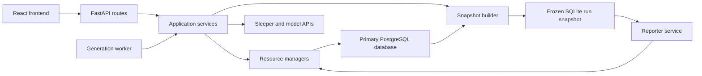

# AIdam Platform Architecture

**Status:** Proposed

**Scope:** Product structure, backend boundaries, persistence, and execution

**Database target:** PostgreSQL, with optional frozen SQLite run snapshots

## Summary

AIdam is evolving from a command-line reporter with an ephemeral factual data
layer and a separately persisted memory file into a complete local-first
product. The product needs to persist and connect:

- Sleeper source observations and normalized fantasy-football facts;
- dynasty leagues whose identity spans multiple Sleeper league IDs;
- reporter storylines, facts, events, triggers, and their history;
- generation requests, configurations, articles, briefs, and intermediate
  artifacts;
- model calls, tool calls, token usage, latency, and cost;
- reproducible data and memory inputs for comparisons and backtests.

The proposed architecture is a **modular monolith** with two primary source
directories:

```text
backend/
frontend/
```

The backend uses one primary PostgreSQL database, one migration history, and
clear resource and service boundaries. A generated, cutoff-safe SQLite database
may still be used as a read-only input to an individual reporter run. It is a
reproducibility artifact and safety boundary, not a second source of truth.

This change intentionally preserves the reporter's current strengths: the
single-loop runner, brief-first research, persistent narrative continuity,
curated data tools, and guarded SQL exploration. The goal is to place those
capabilities inside a durable product rather than redesign the agent loop.

## Motivation

The current architecture works well for proving the reporter behavior, but its
storage boundaries make the next stage of the product difficult.

### Persistent state is fragmented

Sleeper data is loaded into a new in-memory SQLite database for each execution.
Reporter memory is stored in a separate SQLite file, while articles, briefs,
and run logs are written as files named primarily by week. There is no durable
identity connecting an article to its exact data snapshot, memory state, model
calls, tool evidence, and cost.

This makes it unnecessarily difficult to answer questions such as:

- Which run created or changed this storyline?
- Which facts and tool results support this article?
- What model actually handled each turn after retries or fallbacks?
- How much did the generation cost?
- Are two articles comparable, or did they use different data or memory?
- What could the reporter have known at a particular historical point?

### The product needs identities that Sleeper does not provide directly

A dynasty league is a continuous product concept, while Sleeper represents its
seasons with different league IDs. Team identity can also outlive a particular
season roster ID, manager, or display name. AIdam therefore needs durable
competition, season, and franchise identities of its own, with mappings to
provider identifiers.

### Backtesting needs explicit temporal boundaries

Filtering events to a football week is not the same as recreating what was
known at that time. Current roster membership, player status, league settings,
and pick ownership may reveal information from later in the season. Memory has
the same problem when its latest state is read during an older-week replay.

Every run needs immutable input metadata, including a domain cutoff, a
knowledge cutoff, a factual data snapshot, and a memory checkpoint or branch.
The reporter should execute against a physically constrained data view so that
curated tools and free-form SQL cannot reveal future data.

### The product needs more than a CLI

The desired UI needs to trigger and configure runs, inspect memory, audit tool
behavior, render prior articles, compare outputs, and analyze quality against
cost. Those capabilities need durable run and resource APIs rather than a
collection of output files.

## Architectural Goals

1. Create one durable source of truth for application state.
2. Preserve strong boundaries between persistence, resource access, business
   workflows, transport, and reporter execution.
3. Make every generation reproducible and auditable.
4. Support dynasty identity across seasons and provider league IDs.
5. Support current runs, retrospective analysis, historically faithful replay,
   and controlled model comparisons.
6. Keep the application easy to run locally while leaving a straightforward
   path to managed cloud infrastructure.
7. Keep the current reporter loop largely unchanged behind stable interfaces.

## Non-Goals

- Splitting the application into microservices.
- Designing every database table and column in this document.
- Building enterprise authentication or RBAC for the initial local product.
- Rewriting the reporter loop as part of the persistence restructuring.
- Migrating ephemeral or easily regenerated local data into the new schema.
- Building a general-purpose event-sourcing framework.

## System Shape



The application remains one codebase and one deployable system. The API and
worker may run as separate processes, but they share services, resource
managers, migrations, and the primary database.

## Repository Structure

```text
backend/
├── __init__.py
├── config.py
├── composition.py
│
├── database/
│   ├── base.py
│   ├── engine.py
│   ├── sessions.py
│   └── registry.py
│
├── migrations/
│   ├── env.py
│   ├── script.py.mako
│   └── versions/
│
├── resources/
│   ├── context.py
│   ├── competitions/
│   │   ├── models.py
│   │   ├── objects.py
│   │   └── manager.py
│   ├── sleeper_observations/
│   │   ├── models.py
│   │   ├── objects.py
│   │   └── manager.py
│   ├── player_catalog/
│   │   ├── models.py
│   │   ├── objects.py
│   │   └── manager.py
│   ├── league_state/
│   │   ├── models.py
│   │   ├── objects.py
│   │   ├── manager.py
│   │   └── shared.py
│   ├── data_snapshots/
│   │   ├── models.py
│   │   ├── objects.py
│   │   └── manager.py
│   ├── memory/
│   │   ├── models.py
│   │   ├── objects.py
│   │   ├── manager.py
│   │   └── shared.py
│   ├── runs/
│   │   ├── models.py
│   │   ├── objects.py
│   │   ├── manager.py
│   │   └── shared.py
│   ├── experiments/
│   │   ├── models.py
│   │   ├── objects.py
│   │   └── manager.py
│   └── audit/
│       ├── objects.py
│       └── manager.py
│
├── services/
│   ├── league/
│   │   ├── identity_service.py
│   │   └── mapping_service.py
│   ├── sleeper/
│   │   ├── client.py
│   │   ├── normalization/
│   │   ├── ingestion_service.py
│   │   └── snapshot_service.py
│   ├── memory/
│   │   ├── memory_service.py
│   │   └── search/
│   ├── runs/
│   │   ├── generation_service.py
│   │   ├── run_observer.py
│   │   └── pricing.py
│   ├── experiments/
│   │   └── comparison_service.py
│   └── reporter/
│       ├── config.py
│       ├── generator.py
│       ├── runner/
│       ├── tools/
│       ├── prompts/
│       └── procedures/
│
├── api/
│   ├── app.py
│   ├── dependencies/
│   │   ├── context.py
│   │   └── services.py
│   ├── schemas/
│   └── routes/
│       ├── runs.py
│       ├── memory.py
│       ├── data.py
│       └── experiments.py
│
├── worker/
│   ├── main.py
│   └── dependencies.py
│
└── tests/
    ├── resources/
    ├── services/
    ├── api/
    └── worker/

frontend/
├── package.json
├── src/
│   ├── api/
│   ├── components/
│   ├── features/
│   │   ├── runs/
│   │   ├── memory/
│   │   ├── comparisons/
│   │   └── experiments/
│   └── pages/
└── tests/
```

The `services/` name is intentional. These packages contain more than small
domain modules: the reporter alone contains a runner, tool system, procedures,
prompts, artifact state, and model integration. A service represents a cohesive
application capability and may contain several internal submodules.

## Resource Abstraction

Persistent resources follow four layers:

```text
SQLAlchemy model -> resource object -> manager -> service
```

### SQLAlchemy Models

`resources/<resource>/models.py` describes the persistence representation:

- tables and columns;
- relationships and foreign keys;
- uniqueness and consistency constraints;
- indexes and database queryability;
- compatibility with the migration history.

ORM objects are storage types. They must not be returned to routes, workers,
reporter tools, or services.

### Resource Objects

`resources/<resource>/objects.py` contains stable caller-facing Python objects.
They represent the resource as the rest of the application understands it and
may include serialization helpers, derived properties, and small object-local
behavior.

Resource objects insulate callers from database-only fields, lazy loading,
session lifetimes, and changes made solely for storage optimization.

API schemas remain separate when an HTTP request or response requires different
validation or presentation. Pure workflow values that are not persisted, such
as a run manifest or snapshot specification, belong in the relevant service.

### Resource Managers

`resources/<resource>/manager.py` is the safe read and write boundary for the
resource. Managers own:

- SQLAlchemy queries and mutations;
- session lifecycle and short transactions;
- resource and competition scoping;
- mutation provenance and audit context;
- ORM-to-object conversion;
- resource-local consistency rules;
- resource-local query and mutation APIs.

Managers must not perform Sleeper requests, model calls, or long-running work.
They return resource objects rather than ORM rows.

A manager normally owns an aggregate rather than one table. For example, the
run resource may include its model calls, tool calls, artifacts, and lifecycle
events. Revision and child rows that have no useful independent lifecycle do
not need separate public managers.

### Shared Transaction Helpers

An optional `shared.py` exists only when a transaction must compose writes
across resource boundaries. These helpers accept an existing session, never
open or commit it, perform no authorization, and are not called by routes,
workers, or services.

For example, finalizing a submitted article and applying its memory mutations
may need one transaction. A run manager can own that transaction and call
narrow helpers from the run and memory resources. The service passes a result
bundle, not a database session.

## Service Responsibilities

`services/` contains higher-level application behavior:

- orchestration across multiple managers;
- calls to Sleeper, model providers, and other external clients;
- normalization and merge policy;
- generation and backtest workflows;
- snapshot selection and construction;
- memory lifecycle policy;
- model pricing and experiment policy;
- the reporter agent and its internal execution machinery.

Services receive managers and external clients through explicit constructor or
function dependencies. They do not import ORM models, construct raw SQLAlchemy
sessions, or return ORM rows.

Protocols are used for meaningful substitution boundaries, such as Sleeper and
model clients, artifact storage, clocks, or price sources. They are not required
for every manager when one concrete implementation and ordinary constructor
injection are sufficient.

`composition.py` contains typed construction functions for services and their
dependencies. It must not become a mutable global service locator.

## API Responsibilities

`api/` is the HTTP boundary. Routes own:

- authentication;
- request parsing and HTTP-specific validation;
- construction of the appropriate manager context;
- dependency wiring;
- translation of results and errors into HTTP responses.

Routes may call a manager directly for a narrow resource read or CRUD operation.
They call a service for multi-resource or external workflows such as starting a
generation, synchronizing Sleeper, or running an experiment.

Routes do not contain business workflows, raw SQL, sessions, model calls, or
data merge logic.

## Authentication, Authorization, and Scope

Authentication belongs at the route or process boundary. Managers do not parse
tokens, cookies, headers, or HTTP sessions.

The responsibilities are split as follows:

| Concern | Owner |
| --- | --- |
| Identify the caller | API authentication dependency |
| Allow invocation of an endpoint | API permission dependency |
| Restrict access to a competition or resource | Resource manager |
| Enforce multi-step workflow policy | Service |

Every manager receives an already-resolved context describing the actor,
resource scope, and relevant correlation identifiers. Initially, actors may be
the local user, a system job, or a generation run. Competition-scoped managers
must apply that scope to their reads and writes. Truly global operations, such
as player-catalog ingestion, require an explicit global scope with a reason.

The initial local product does not need enterprise RBAC. The manager context is
still valuable for league isolation, generation provenance, worker attribution,
and a future hosted authorization seam.

Backtest cutoffs, data snapshot IDs, and memory checkpoint IDs are not generic
authorization context. They change generation semantics and therefore remain
explicit fields in the run manifest and relevant service APIs.

## Worker Responsibilities

The worker owns job execution mechanics:

- claiming queued work;
- status heartbeats;
- retry scheduling;
- interruption and recovery behavior;
- calling the appropriate service.

It does not own generation policy, memory policy, data normalization, or
resource SQL. Like an API route, it constructs an explicit actor and scope at
the process boundary and calls services or managers.

## Database Responsibilities

`database/` contains shared persistence mechanics only:

- the common SQLAlchemy declarative base;
- constraint and index naming conventions;
- engine construction from configuration;
- read and write session factories;
- common database types when genuinely shared;
- registration of resource models for migrations.

It does not contain application resource definitions, business operations, a
generic CRUD repository, or cross-domain helper functions.

The backend uses one physical PostgreSQL database because the product's most
valuable audit paths cross its logical domains. A single database makes it
possible to connect an article to its run, model costs, tool evidence, memory
mutations, and factual observations without distributed consistency or service
integration overhead.

Logical ownership remains explicit even though storage is shared. The expected
database domains are:

### League identity

Durable AIdam identities for competitions, seasons, franchises, managers, and
their provider mappings. This domain lets a dynasty continue across Sleeper
league IDs and separates franchise identity from a season roster or manager.

### Sleeper observations and league facts

Append-only records of source fetches, normalized canonical facts, mutable state
observations, and rebuildable projections. Raw or changed provider responses
retain hashes and provenance so refreshes are explainable and idempotent.

The player catalog is global and can retain flexible provider metadata while
promoting frequently queried attributes into structured fields. League-specific
lineups, scores, transactions, and roster history remain scoped to a competition
season.

### Reporter memory

Stable storyline identities with immutable revisions, facts, evidence events,
triggers, access history, branches, and checkpoints. Memory can be scoped to a
competition or franchise while individual facts and events can refer to a
particular season and week.

Memory records retain both domain time and observation time, along with the run
or human actor that created the change.

### Reporting and execution

Durable generation jobs and runs, model calls, tool calls, artifacts, articles,
briefs, token usage, costs, comparisons, ratings, and lifecycle events. Every
article is addressed by a run identity rather than a week-based filename.

The reporting domain records both requested and actual model behavior, including
retries and fallbacks. Historical costs are persisted using the price information
available at execution time rather than recalculated from current pricing.

## Database Construction

The database should be built around the following components before individual
resource schemas are finalized.

### Shared Base and Naming

All ORM resources use one SQLAlchemy declarative base and one naming convention
for primary keys, foreign keys, unique constraints, checks, and indexes. This
keeps Alembic output deterministic and makes constraints operable in production.

### Real Constraints

The persistent product database should use explicit primary keys, foreign keys,
uniqueness constraints, and indexes. The current in-memory assumption that only
one league or one snapshot exists must not carry into the product database.

### Stable Internal Identities

Product-level UUIDs should identify competitions, seasons, franchises, runs,
storylines, snapshots, and other durable resources. Sleeper IDs are external
identifiers associated with those resources rather than the product's universal
identity scheme.

### Source Provenance

Ingestion must retain enough information to explain where canonical data came
from and when it was observed. Full provider endpoints can be fetched repeatedly;
payload and row hashes make normalization idempotent without requiring a complex
incremental API.

### Immutable Revisions and Artifacts

History-sensitive data should be appended as revisions rather than overwritten
without provenance. Articles, briefs, prompt bundles, and other generation
artifacts are immutable versions associated with a run.

### Two Time Dimensions

Temporal records that participate in replay should distinguish:

- when an event or state belongs in the fantasy-football domain; and
- when AIdam observed, derived, or created it.

This is sufficient for point-in-time reads without introducing a generic event
store.

### Run Manifest

Every generation records an immutable manifest containing its competition and
season, article coverage, domain and knowledge cutoffs, factual snapshot,
memory branch or checkpoint, configuration, prompt and procedure versions,
model request, and code version.

The manifest is the foundation for comparison and reproducibility.

### Short Transaction Ownership

Every public manager operation owns its session. Write methods use short
transactions and finish before returning. Services never hold a database
transaction open during Sleeper requests, model calls, reporter execution, or
filesystem work.

### Full Execution Observability

Model and tool instrumentation is captured at the execution boundary. Each
model-provider attempt, including retries and fallbacks, is recorded separately.
Tool inputs and complete results are retained directly or through immutable
content-addressed artifacts.

### Resource-Safe Read Models

Cross-domain UI projections are exposed through context-aware read-only managers,
not raw SQL called from routes. Run detail, cost dashboards, article comparisons,
and memory audit views may join across logical database domains while still
returning stable resource objects.

## Migrations

`migrations/` owns the single ordered history for the entire primary database.
It imports all resource ORM models through `database/registry.py` and uses the
shared metadata as its target.

The application must not use `metadata.create_all()` as a production migration
mechanism, and resources must not implement their own runtime schema-version
checks. All structural changes are represented as reviewed migration revisions.

Migration files should be named to communicate their primary resource or
domain, even though they share one sequence. Cross-domain foreign keys and
atomic product workflows are reasons to retain one migration graph rather than
independent migration systems.

Because existing data is ephemeral and reproducible, the new database can begin
with a clean baseline. Migration complexity should optimize for the future
product rather than preserve the existing local SQLite schemas.

## Frozen Run Snapshots

The primary PostgreSQL database contains observations and facts across all
seasons and time periods. Pointing the reporter's guarded SQL tool directly at
that database would create a future-data leakage path.

Before a generation starts, the snapshot service builds or selects a frozen,
cutoff-safe read model containing only the facts visible to that run. A SQLite
file is a useful implementation because it preserves the existing datalayer
query behavior and physically prevents the reporter from accessing excluded
rows.

Weekly matchup payloads can reconstruct historical game-week roster membership
and starter/bench roles. Transactions and archived observations supplement that
view. Fields that cannot be reconstructed exactly should retain provenance and
an explicit confidence or reconstruction classification.

The snapshot is linked to the run manifest and may be content-addressed for
reuse. It is read-only and disposable or reproducible; PostgreSQL remains the
source of truth.

## Dependency Rules

Allowed dependencies:

```text
api and worker -> services
api -> resource managers for narrow resource operations
services -> resource managers and resource objects
services -> external-client protocols
resource managers -> database infrastructure
resource managers -> their own models and objects
database registry -> resource models
migrations -> database registry
composition -> concrete services, managers, and clients
```

Forbidden dependencies:

- Routes, workers, or services importing ORM models.
- Routes, workers, or services opening raw SQLAlchemy sessions.
- Managers returning ORM rows.
- Managers making Sleeper or model-provider requests.
- API schemas becoming the internal persistence contract.
- Public generic CRUD repositories that bypass resource policy.
- Arbitrary code resolving dependencies from a global service locator.
- Reporter SQL pointing at the primary product database.
- Cross-domain dashboard SQL bypassing a context-aware manager.
- Transactions remaining open during external or long-running work.

## Testing Strategy

Tests should follow the designed boundary:

- Resource manager tests use real disposable database sessions and explicit
  manager contexts.
- Service tests inject fake managers and fake external clients rather than
  patching internal helpers.
- API tests use dependency overrides and focus on authentication, validation,
  and response translation.
- Worker tests inject fake services and verify job lifecycle and retry behavior.
- Snapshot tests use real SQLite fixtures and verify that future facts are
  physically absent.
- Scope tests prove competition isolation and deliberate global access.
- Transaction tests verify that composed finalization writes commit or roll
  back together.
- Temporal tests verify domain-time and observation-time projections.

## Migration from the Current Codebase

The restructuring should proceed in increments while preserving the working
reporter behavior.

1. Create the `backend/` and `frontend/` roots and shared backend configuration.
2. Establish database infrastructure, PostgreSQL, Alembic, and the clean
   migration baseline.
3. Create competition identity and durable run resource boundaries.
4. Move the existing reporter into `services/reporter/` without redesigning its
   loop.
5. Route generation through a run service and persist articles, briefs, model
   calls, tool calls, and costs.
6. Replace the current context store with revisioned memory resources and
   manager APIs.
7. Add persistent Sleeper observations, canonical reconciliation, and frozen
   run snapshot construction.
8. Add read-only API routes and the initial run and memory UI.
9. Add durable job execution, live progress, article comparison, experiments,
   and rolling backtests.

The existing SQLite context database and output files do not constrain the new
schema. Useful behavior and test fixtures should be preserved; ephemeral data
can be regenerated.

## Key Decisions

- Use a modular monolith rather than microservices.
- Use `backend/` and `frontend/` as the two primary source roots.
- Use `services/` rather than `modules/` for application capabilities.
- Use one PostgreSQL database and one Alembic migration history.
- Keep database mechanics separate from persistent resource definitions.
- Organize persistent boundaries as model, object, manager, and optional shared
  transaction helpers.
- Authenticate at API/process boundaries and enforce resource scope in managers.
- Keep transactions short and owned by managers.
- Store full run provenance, model/tool telemetry, artifacts, and historical
  cost.
- Version memory and mutable factual observations instead of silently
  overwriting history.
- Give every run an immutable manifest and frozen factual input.
- Retain SQLite only as a cutoff-safe run snapshot and testing format, not as
  the primary product store.
